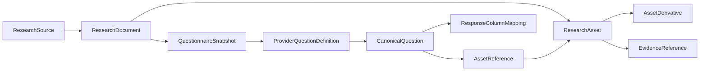
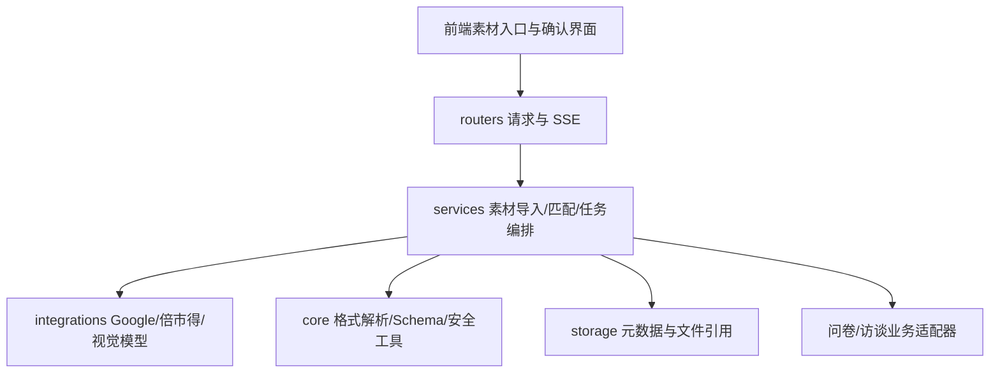
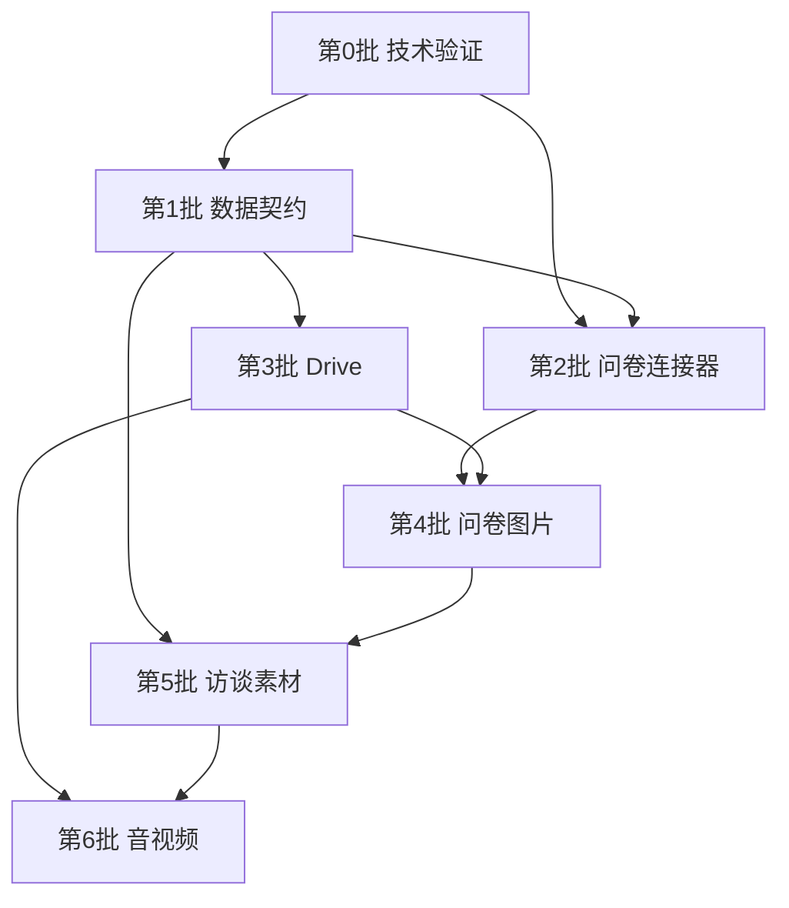

# 多模态调研素材基建开发设计

> 文档性质：跨任务实施依据，不代表功能已经实现。
> 编写日期：2026-08-12
> 适用项目：`survey-web`
> 实施要求：任何批次开始前，仍须遵守 `AGENTS.md` 与 `harness-workbench/RULES.md`，列出准确文件、改动、原因和验证方式并取得用户确认。

---

## 一、文档目的

本文档定义平台级“调研素材接入与图片理解基建”的产品范围、领域模型、架构边界、外部连接器、处理流程、分批计划和验收标准。后续开发任务应以本文档为共同基线，而不依赖产生本文档的历史对话。

这项基建服务于多个业务，而非只服务访谈：

- 定性问卷中的题干图、选项图和测试素材；
- 定量问卷中的方案图、概念图和媒体刺激物；
- 访谈 Excel 中的嵌入图片、素材文件名和链接；
- 可选的访谈 PPT 补充材料；
- Google Drive、YouTube 或本地文件形式的视频、音频和图片；
- 未来评论分析、数据标注和报告引用对素材的复用。

核心目标是：

> 将不同平台、文件和链接中的调研素材，转化为具有业务上下文、来源定位、权限状态、版本信息和处理结果的统一资产；图片优先进行内容理解，音视频本期优先完成发现与关联。

---

## 二、背景与现状

### 2.1 当前业务事实

1. 问卷配图通常不能从回答数据中恢复，需要访问问卷定义或受访者实际看到的页面。
2. 平台需同时覆盖 Google Forms 和倍市得，不能将任一平台当作唯一标准。
3. 生成报告时问卷通常已经停止收集，发布链接可能只显示停止收集提示。
4. 执行报告的人通常拥有编辑问卷的权限，但编辑链接涉及平台登录、OAuth 和资源授权。
5. 倍市得现有“上传原问卷”可可靠提供题型、选项和矩阵结构，应继续作为保底输入。
6. Google Forms 也需要可上传的问卷材料或平台快照入口，但具体受支持格式必须经过技术验证。
7. 访谈的主要入口仍是记录 Excel；图片通常直接嵌在 Excel 中，视频或音频常以文件、文件名或链接出现，PPT 只是可选补充。
8. 本期所说的音频主要是让测试者试听并评价的刺激素材，不是访谈录音。

### 2.2 当前系统边界

- `app/core/parsing.py` 将 CSV/XLSX 解析为二维文本，不保留图片和版面。
- `app/services/questionnaire_import.py` 已支持倍市得原问卷的确定性结构导入。
- `app/routers/survey.py` 当前接收回答文件和可选问卷文件，没有问卷 URL 输入。
- `app/core/interview_parsing.py` 当前读取全部 Sheet 的非空文本单元格并保留 `Sheet!Cell` 引用，不提取嵌入图片。
- `app/services/interview_service.py` 当前主要把序列化文本作为访谈分析输入。
- 系统使用本地 JSON 和文件目录存储，没有数据库；session 是临时工作区，history 是报告归档。

### 2.3 为什么不能只扩展现有表格解析器

表格值解析、多媒体资产管理和外部平台连接是不同职责。后续不得把 Forms、Drive、PPT、图片和视频分支不断加入 `_parse_file()`。应保留现有文本解析能力，在旁边建设独立素材层：

```text
业务入口
  → 来源连接器
  → 获取与快照
  → 容器解析
  → 素材理解
  → 统一引用/证据
  → 问卷或访谈业务适配
```

---

## 三、目标、非目标与成功标准

### 3.1 总体目标

1. 支持从问卷链接、问卷材料、回答数据和访谈 Excel 中发现调研素材。
2. 将素材准确绑定到题干、说明、选项、访谈位置或研究员材料。
3. 同时保留平台原始定义和平台无关的统一定义。
4. 优先完成图片 OCR、客观描述、上下文说明和人工确认。
5. 对视频和音频先完成名称、来源、元数据与业务关联。
6. 支持部分成功；单个素材失败不能阻塞整份问卷或访谈。
7. 保证每个分析输入均可追溯到原始来源和获取版本。
8. 保持现有纯文本问卷、定量和访谈流程向后兼容。

### 3.2 本期非目标

- 访谈录音转写；
- 说话人分离；
- 根据语气或停顿推断态度；
- 音频内容摘要、分类或情绪识别；
- 完整长视频逐帧分析；
- 玩家操作行为自动编码；
- 任意 Google Drive 文件夹递归导入；
- 通用向量素材库或跨项目图片检索；
- 自动理解所有办公文档格式；
- 绕过 Google、倍市得或文件所有者的权限控制；
- 默认将原始素材插入外发报告；
- 让图片或视频模型独立产生“玩家观点”。

### 3.3 成功标准

- Google Forms 与倍市得均能输出统一问卷结构，同时保留各自原始字段。
- 问卷关闭或链接不可见时存在明确降级路径，不阻塞回答数据分析。
- 题干图、说明图和选项图不会混绑；不确定时进入人工确认。
- 访谈 Excel 内嵌图片可回溯到文件、Sheet 和锚点。
- 媒体文件或链接能与问卷题目、选项或访谈位置关联。
- 图片理解结果区分机器提取、客观观察、上下文解释与研究推断。
- 无权限、已删除、格式不支持和下载失败被区分展示。
- 新素材能力关闭或未提供输入时，旧流程行为不变。

---

## 四、已确认的产品决策

| 编号 | 决策 | 实施含义 |
|---|---|---|
| D1 | 平台级基建 | 素材能力不能绑定访谈服务，问卷与访谈通过业务适配器消费 |
| D2 | 图片优先 | 图片做 OCR 和视觉理解；音视频首先做识别、命名和关联 |
| D3 | 双平台支持 | Google Forms 与倍市得均为一等来源 |
| D4 | 不依赖发布页 | 问卷关闭后发布页可能不可见，发布链接不能是唯一数据源 |
| D5 | 编辑权限可用 | 优先探索正式 API/OAuth 或授权编辑来源，不复制 Cookie、不手填 token |
| D6 | 轻量保底提示 | 若发布页因停止收集不可见，可提示用户临时开启收集后重试；这只是保底，不作为主流程 |
| D7 | 保留原问卷上传 | 倍市得上传继续作为稳定保底，连接器不能在未经验证前替代它 |
| D8 | Google 增加上传 | Google 侧增加问卷备份/材料上传，但可接受格式和可信等级由技术验证确定 |
| D9 | 快照优先 | 成功导入后保存问卷定义和素材快照，报告阶段优先使用快照 |
| D10 | 双层问卷模型 | 保留 Provider 原始结构，再映射为 Canonical 结构 |
| D11 | 禁止静默猜测 | 平台差异、题目匹配和素材绑定不确定时必须形成具体提醒 |
| D12 | 访谈 Excel 主入口 | 自动从 Excel 发现图片、链接和文件名，补充文件/PPT 均为可选 |
| D13 | 音频是刺激素材 | 本期仅记录名称、链接、格式、时长和上下文，不处理访谈录音 |
| D14 | 视频按需理解 | 默认仅元数据和缩略图；用户选择后才做少量关键帧分析 |
| D15 | 部分成功 | 素材失败不阻塞主体分析，报告明确说明缺失影响 |

---

## 五、来源优先级与降级策略

### 5.1 问卷定义来源

不存在一种来源在所有平台和状态下都绝对可靠。系统应合并多来源，并记录每个字段的来源。

推荐优先级：

1. 平台此前保存的 `QuestionnaireSnapshot`；
2. 官方 API 或经过 OAuth 授权的编辑来源；
3. 用户上传的原问卷/结构化备份；
4. 当前仍可查看内容的发布链接；
5. 回答导出文件中的题目文本；
6. 用户人工补充。

优先级不是简单的整份覆盖规则。不同来源可分别成为不同字段的权威来源：

| 信息 | 建议权威来源 |
|---|---|
| 题型、选项、矩阵 | 结构化原问卷、官方 API |
| 稳定题目 ID | 官方 API/编辑来源 |
| 跳转逻辑 | 官方 API/编辑来源；原问卷能提供时交叉验证 |
| 图片与页面展示关系 | 编辑/API 素材对象或可见发布页 |
| 受访者实际展示 | 发布页快照 |
| 实际回收列 | 回答导出文件 |

### 5.2 已停止收集的问卷

处理顺序：

```text
是否已有快照？
  ├─ 是 → 使用快照并检查回答文件匹配
  └─ 否 → 尝试授权编辑来源
          ├─ 成功 → 导入并创建快照
          └─ 失败 → 尝试上传原问卷/材料
                    ├─ 成功 → 导入可用结构与素材
                    └─ 失败 → 尝试发布链接
                              ├─ 可见 → 导入
                              └─ 只显示停止收集 → 提示临时开启收集或继续降级
```

建议保底提示文案：

> 当前发布链接未显示问卷内容，可能因为问卷已停止收集。你可以使用有编辑权限的账号连接问卷、上传原问卷/问卷材料，或临时开启收集后重试。也可以跳过素材导入并继续分析回答数据，但涉及配图的题目可能无法完整解释。

### 5.3 多来源冲突

冲突不得静默覆盖。每个冲突需包含：

- 冲突字段；
- 来源 A 与来源 B；
- 系统建议采用值；
- 建议依据；
- 是否阻塞；
- 用户最终选择。

---

## 六、领域模型

### 6.1 总体关系



### 6.2 `ResearchSource`

表示用户最初提供的入口。

```json
{
  "source_id": "src_xxx",
  "source_kind": "remote_url",
  "provider": "google_forms",
  "original_name": "角色概念测试",
  "original_url": "https://...",
  "owner_ref": "platform_user_ref",
  "created_at": "2026-08-12T00:00:00Z",
  "acquisition_status": "completed"
}
```

`source_kind` 初始支持：

- `local_upload`；
- `remote_url`；
- `provider_connection`；
- `embedded_document_object`；
- `generated_snapshot`。

### 6.3 `ResearchDocument`

表示具有内部结构的逻辑文档，如问卷、Excel、PPT 或视频。

关键字段：

- `document_id`；
- `source_id`；
- `document_type`；
- `filename/title`；
- `mime_type`；
- `size_bytes`；
- `content_hash`；
- `provider_modified_at`；
- `retrieved_at`；
- `snapshot_policy`；
- `parse_status`。

### 6.4 `QuestionnaireSnapshot`

表示某一时点可复现的问卷定义。

```json
{
  "snapshot_id": "qsn_xxx",
  "provider": "google_forms",
  "provider_form_id": "provider-id",
  "source_mode": "authorized_edit",
  "title": "角色概念测试",
  "retrieved_at": "2026-08-12T00:00:00Z",
  "provider_modified_at": null,
  "content_hash": "sha256",
  "collection_state": "closed",
  "question_count": 28,
  "asset_count": 9,
  "mapping_status": "partial",
  "warnings": []
}
```

`source_mode` 建议值：

- `official_api`；
- `authorized_edit`；
- `published_page`；
- `original_questionnaire_upload`；
- `material_upload`；
- `platform_snapshot`；
- `response_export_fallback`。

### 6.5 Provider 与 Canonical 双层题目

#### Provider 原始定义

```json
{
  "provider": "bested",
  "provider_question_id": "raw-id",
  "provider_question_type": "raw-type",
  "provider_position": 12,
  "raw_definition": {},
  "source_locator": {}
}
```

#### Canonical 统一定义

```json
{
  "question_id": "q_xxx",
  "canonical_type": "matrix_single",
  "title": "题目文本",
  "description": "",
  "required": true,
  "rows": [],
  "options": [],
  "branching": [],
  "asset_references": [],
  "mapping_status": "exact",
  "mapping_confidence": 1.0,
  "warnings": []
}
```

`mapping_status`：

| 状态 | 含义 |
|---|---|
| `exact` | 无损映射 |
| `normalized` | 经过已知、安全的标准化 |
| `partial` | 部分平台能力无法表达 |
| `needs_review` | 关联或映射不确定 |
| `unsupported` | 当前不支持 |
| `source_missing` | 必要来源缺失 |

### 6.6 `ResearchAsset`

表示可独立引用的实际素材。

```json
{
  "asset_id": "asset_xxx",
  "document_id": "doc_xxx",
  "media_type": "image",
  "mime_type": "image/png",
  "filename": "concept_a.png",
  "display_name": "角色方案 A",
  "size_bytes": 284930,
  "content_hash": "sha256",
  "provider": "google_forms",
  "provider_resource_id": null,
  "access_status": "accessible",
  "processing_status": "ready",
  "sensitivity_status": "unknown",
  "export_policy": "manual_confirmation"
}
```

`media_type` 初始支持：

- `image`；
- `video`；
- `audio`；
- `slide`；
- `document`；
- `external_link`。

### 6.7 `AssetReference`

素材本体与业务位置必须分离。同一素材可以被多个问题引用。

```json
{
  "reference_id": "aref_xxx",
  "asset_id": "asset_xxx",
  "context_type": "survey_question",
  "context_id": "q_xxx",
  "role": "option_stimulus",
  "option_key": "A",
  "source_locator": {
    "provider_question_id": "raw-id",
    "question_position": 12
  },
  "binding_status": "confirmed",
  "binding_confidence": 1.0
}
```

素材角色：

- `question_stimulus`：题干测试素材；
- `question_instruction`：说明素材；
- `option_stimulus`：选项素材；
- `participant_response`：受访者上传内容；
- `interview_evidence`：访谈证据；
- `researcher_material`：研究员补充材料；
- `analysis_target`：明确要求分析的素材；
- `report_attachment`：经确认可进入报告的素材。

### 6.8 `SourceLocator`

定位结构按来源类型扩展，但序列化方式统一：

| 来源 | 必要定位 |
|---|---|
| Google Forms | Form ID、题目 ID、选项/位置 |
| 倍市得 | 问卷 ID、题目 ID、选项/页面位置 |
| Excel 文本 | 文件 ID、Sheet、Cell |
| Excel 图片 | 文件 ID、Sheet、锚点、覆盖范围 |
| PPT | 文件 ID、页码、对象 ID/页面区域 |
| Drive | File ID、版本/修改时间 |
| YouTube | Video ID、可选时间区间 |
| 本地媒体 | 文件 ID、可选时间区间 |

### 6.9 `AssetDerivative`

```json
{
  "derivative_id": "der_xxx",
  "asset_id": "asset_xxx",
  "derivative_type": "image_understanding",
  "status": "completed",
  "model": "configured-model",
  "model_version": null,
  "created_at": "2026-08-12T00:00:00Z",
  "payload": {
    "ocr_text": "",
    "objective_description": "",
    "contextual_description": ""
  },
  "review_status": "pending"
}
```

派生内容不可覆盖原始素材，也不可覆盖人工修订。人工修订应保存为独立版本，并记录修订人和时间。

### 6.10 统一处理、访问与错误状态

处理状态：

- `pending`；
- `acquiring`；
- `parsing`；
- `processing`；
- `needs_review`；
- `completed`；
- `partial`；
- `failed`；
- `skipped`。

访问状态：

- `accessible`；
- `login_required`；
- `permission_required`；
- `not_found`；
- `deleted`；
- `unsupported_type`；
- `too_large`；
- `download_failed`。

错误不得只保存自由文本；至少包含稳定错误码、用户可读信息、是否可重试、建议操作和底层安全日志引用。

---

## 七、架构设计与模块边界

### 7.1 分层



### 7.2 职责

- `routers/`：接收 URL、上传文件、授权回调和确认操作；不解析文档、不下载资源、不写业务判断。
- `services/`：编排获取、解析、映射、确认和业务接入。
- `integrations/`：封装 Forms、Drive、倍市得、YouTube 元数据和多模态模型协议。
- `core/`：无状态 Schema、MIME/URL 校验、Excel/PPT 解析工具、哈希和通用标准化。
- `storage/`：只负责素材元数据、快照、派生物和文件的读写。
- `schemas/`：请求、响应和领域 DTO，不写业务流程。
- `static/js/core/`：通用请求、SSE、素材状态组件所需基础能力。
- `static/js/features/`：问卷和访谈具体交互。

### 7.3 候选模块（实施时再确认准确文件）

```text
app/core/research_assets.py
app/core/questionnaire_schema.py
app/core/media_parsing.py
app/integrations/google_forms_client.py
app/integrations/google_drive_client.py
app/integrations/bested_questionnaire_client.py
app/integrations/media_understanding_client.py
app/services/research_asset_service.py
app/services/questionnaire_source_service.py
app/services/questionnaire_mapping.py
app/storage/research_assets.py
app/routers/research_assets.py
```

这些只是规划名称，不是预先批准的文件清单。每批实施前须重新查看仓库，避免重复模块或破坏已有边界。

---

## 八、外部来源连接器

### 8.1 统一连接器输出

不同连接器可以采用不同协议，但必须返回：

- Provider 原始数据；
- Canonical 映射结果；
- 发现的素材及引用关系；
- 获取方式与时间；
- 平台资源版本或内容哈希；
- 映射警告；
- 访问/授权状态；
- 可重试与降级建议。

### 8.2 Google Forms

在第 0 批技术验证完成前，不预设 Forms API 一定能完整提供图片、视频和跳转逻辑，也不预设存在等价于倍市得的标准离线原问卷格式。

需要验证：

- 停止收集后官方 API/编辑权限是否仍能读取完整定义；
- 题目、选项、图片、视频、Section 和跳转逻辑的 API 表达；
- 稳定题目 ID 与回答导出列的匹配能力；
- 发布页关闭时的内容；
- Google Workspace 管理策略对 OAuth 的影响；
- 可用的备份、打印、PDF 或平台自有快照格式。

产品入口最终至少支持：

1. 连接 Google 问卷；
2. 粘贴发布/编辑链接；
3. 上传问卷备份或材料；
4. 仅上传回答数据并接受素材缺失提示。

### 8.3 倍市得

连接器需验证是否存在正式 API、稳定 ID、登录要求、页面动态加载和停止收集行为。无论连接器结果如何，现有原问卷上传在早期版本中保留。

推荐合并规则：

- 原问卷：题型、选项、矩阵结构的可靠来源；
- 编辑来源/连接器：素材与跳转逻辑来源；
- 发布页：受访者实际展示验证；
- 回答数据：实际回收列来源。

### 8.4 Google Drive

平台只可使用用户本来拥有的权限。OAuth 可以代表用户读取已有权限文件，但不能自动批准访问。

权限流程：

```text
发现 Drive 链接
→ 检查当前平台用户是否绑定 Google
→ 未绑定：引导 OAuth
→ 已绑定：使用该用户身份读取
→ 无权限：前往原链接申请 / 切换账号 / 上传副本 / 跳过
→ 用户获批后：重新检查
```

“自动发起访问申请”仅在官方能力和安全边界经过第 0 批确认后考虑；不能成为第一版的阻塞依赖。

OAuth 要求：

- 最小 scope；
- token 与普通 session 分离存储；
- token 不进入日志、历史报告或模型输入；
- 授权按平台用户隔离；
- 支持刷新、失效和解绑；
- 配置只走 `.env` 与 `app/core/config.py`。

### 8.5 YouTube

第一阶段只获取可合法访问的元数据：Video ID、标题、缩略图、时长、可访问状态和题目关联。关键帧分析后置且需用户选择。所有引用应保留 Video ID 和可选时间区间。

### 8.6 任意 URL

第一版不做通用网页下载器。必须采用 Provider allowlist，并防范 SSRF：

- 校验域名及每次重定向目标；
- 禁止本机、内网、链路本地和云元数据地址；
- 限制重定向次数、超时和响应大小；
- 验证 MIME 与文件签名；
- 不执行宏、脚本或嵌入程序；
- 不将远程错误响应当作媒体文件保存。

---

## 九、问卷素材业务流程

### 9.1 推荐流程

```text
提供问卷链接/连接平台/上传问卷材料
→ 获取问卷定义
→ 发现图片与媒体引用
→ 映射 Provider 结构到 Canonical 结构
→ 展示素材、权限和映射警告
→ 用户确认关键关联
→ 保存问卷快照
→ 上传回答数据
→ 匹配回答列与问卷题目
→ 问卷分析使用统一结构和已确认素材
```

### 9.2 直接上传问卷链接并自动发现素材

这是正式支持的产品入口。系统应自动识别 Google Forms 或倍市得，扫描题干、说明、选项和 Section 中的素材引用，并产生清单，而不是要求用户逐个粘贴素材链接。

示例结果：

```text
已读取 28 道题
✓ 发现 9 张图片
✓ 发现 2 个 YouTube 视频
⚠ 1 个 Drive 文件需要权限
⚠ 2 道题与回答列匹配不确定
```

### 9.3 问卷与回答匹配

匹配优先级：

1. 稳定 Provider 题目 ID；
2. 平台导出中明确的结构标识；
3. 标准化题目文本、选项和顺序的组合；
4. 人工确认。

禁止仅按题目标题做静默匹配，因为重复标题、多语言、矩阵拆列和编辑后标题变化都会造成误绑。

每个匹配结果保存：

- `mapping_method`；
- `mapping_status`；
- `confidence`；
- 问卷题目 ID；
- 回答列索引/表头；
- 警告；
- 人工确认记录。

### 9.4 素材与题目关系

必须区分：

- 题干配图；
- 说明配图；
- 选项 A/B/C 各自配图；
- 整个 Section 的背景素材；
- 外部视频或音频刺激物；
- 受访者文件上传回答。

系统不能只记录“发现了 N 张图”。后续分析需要知道用户选择的选项对应哪一个素材。

### 9.5 问卷报告使用规则

- 定量数字始终来自确定性统计，图片只辅助解释题目与方案。
- 定性分析可联合使用题目素材说明与开放题回答。
- 素材客观描述不能被写成玩家意见。
- 未确认的选项图片绑定不能用于自动报告解释。
- 素材缺失时允许继续，但在相关题目和最终报告中说明限制。

---

## 十、访谈素材业务流程

### 10.1 用户入口

保持简单：

```text
必填：上传访谈记录 Excel
→ 自动发现嵌入图片、链接和文件名
→ 展示发现结果及缺失文件
→ 可选：补传媒体、连接 Drive、上传 PPT
→ 确认关联后生成证据型报告
```

不要求用户预先创建复杂素材集。

### 10.2 Excel 图片提取

每张图片至少保存：

- 文件 ID；
- Sheet 名；
- 起止锚点或覆盖范围；
- 原始格式；
- 图片尺寸；
- 内容哈希；
- 邻近非空单元格引用；
- 可能关联的问题/玩家；
- 绑定状态与置信度。

图片锚点不一定等同于唯一单元格，解析器不能假设“一张图就是一个 cell value”。

### 10.3 文件名和链接发现

从单元格文本中识别：

- Google Drive 链接；
- YouTube 链接；
- 明确允许的图片 URL；
- 图片、视频、音频和 PPT 文件名。

如果 Excel 只提到 `battle_video_v3.mp4`，用户补传同名文件后可以自动建议关联；同名、模糊或多候选时必须确认。

### 10.4 PPT

PPT 是可选材料，不是访谈生成的必需输入。首次实现可采用：

- PPTX 页级文本提取；
- 页面渲染预览；
- 页码定位；
- 页面内图片发现；
- 允许用户把页绑定到访谈模块。

不要求第一版精细理解所有形状、动画和嵌入对象。

### 10.5 访谈证据接入

图片与媒体记录需进入统一证据结构，并保留：

- 受访者（能确定时）；
- 问题/模块；
- 原始文字；
- 素材引用；
- 图片客观描述；
- 来源文件、Sheet、Cell/Anchor；
- 人工确认；
- AI 推断（如有，必须单列）。

音频或视频素材的存在只说明“测试者看/听了什么”，玩家评价仍须来自访谈记录文字。

---

## 十一、媒体处理边界

### 11.1 图片

```text
获取原图
→ 格式/大小/像素校验
→ 内容哈希与去重
→ 缩略图
→ OCR
→ 客观视觉描述
→ 结合题目/访谈上下文的素材说明
→ 人工确认
→ 业务使用
```

必须分开保存：

1. 原始图片；
2. OCR 原始结果；
3. 客观视觉观察；
4. 上下文解释；
5. 研究推断；
6. 人工修订。

### 11.2 视频

默认只保存：

- 文件名/标题；
- Provider 与资源 ID；
- MIME/格式；
- 时长；
- 缩略图；
- 所属题目/选项/访谈位置；
- 可访问状态。

用户明确选择“理解画面”后，才抽取少量关键帧并生成客观描述。不默认下载或逐帧分析长视频。

### 11.3 音频

本期只保存：

- 文件名和显示名称；
- Provider/链接；
- 格式和可选时长；
- 所属题目、选项或访谈位置；
- 可访问状态。

本期不生成转写，不做说话人、情绪、音乐类型或内容摘要。

### 11.4 访谈录音

明确排除。未来如立项，应作为独立阶段在 `ResearchAsset` 上增加 ASR、时间戳和说话人派生结果，不得把其需求提前混入当前音频刺激素材流程。

---

## 十二、存储、生命周期与历史追溯

### 12.1 保存层级

1. **原始素材**：二进制文件或受控远程引用，不写入 JSON 正文。
2. **处理派生物**：缩略图、OCR、视觉描述、关键帧和页面预览。
3. **结构化引用/证据**：业务分析主要消费对象。
4. **报告引用快照**：报告历史需要的安全摘要、来源定位、内容哈希和可访问状态。

### 12.2 生命周期必须显式配置

实施存储前必须确定：

- 原始素材保存多久；
- 大视频是否只临时保存；
- 问卷快照保存多久；
- session 过期后哪些引用仍保留；
- history 是否保存缩略图；
- 原始素材删除后报告怎样显示；
- 用户是否能主动删除素材；
- 删除是否影响已经生成的报告。

### 12.3 保护现有 `data/`

- 不删除、覆盖、格式化任何现有真实数据。
- 不在未确认情况下运行会清理 session 的应用启动或测试。
- 新目录、索引、清理策略和迁移必须在对应批次单独说明。
- 测试优先使用临时目录或内存，不把构造样例写进真实运行目录。

### 12.4 快照与复现

远程内容可能被修改、删除或取消共享。获取时至少保存：

- Provider 与稳定资源 ID；
- 原始 URL（展示时注意敏感参数）；
- 获取时间；
- Provider 修改时间/版本（可得时）；
- 内容哈希；
- 元数据快照；
- 获取身份的非敏感引用；
- 本地快照策略。

---

## 十三、安全、权限和隐私

### 13.1 授权

- 不复制用户浏览器 Cookie。
- 不接受用户手填 OAuth token。
- token 不进入普通 session、审计详情、报告或 LLM。
- 每次素材访问都按当前平台用户鉴权。
- 一个用户的 Google 权限不能供其他用户复用。
- 无权限与文件不存在必须区分。

### 13.2 文件安全

- allowlist 文件类型和 Provider；
- 限制单文件大小、总数量、总时长和像素；
- 校验扩展名、MIME 和文件签名；
- Office 文件不执行宏；
- 压缩容器限制解压后大小和文件数，防止压缩炸弹；
- 图片解码限制最大像素；
- 外部下载设置超时、重定向和带宽限制。

### 13.3 隐私与外发

素材可能包含姓名、账号、聊天、未发布界面和内部信息。默认策略：

- 原图作为内部证据；
- 默认不进入外发报告；
- 用户明确确认后才插图；
- 报告引用优先使用安全名称和证据编号；
- 未来自动打码应单独立项，不假定第一版已有。

### 13.4 模型外发

产品需要说明：

- 哪些原图会发送给模型；
- 是否只发送缩略图/关键帧；
- 是否发送上下文文字；
- 使用什么用途和处理深度；
- 用户能否跳过。

---

## 十四、前端体验与接口原则

### 14.1 素材导入界面

统一展示：

- 来源和连接状态；
- 发现的题目/素材数量；
- 正在获取、解析、识别的进度；
- 需要权限的素材；
- 无法匹配的题目或文件；
- 可继续、重试、跳过和人工关联操作。

### 14.2 部分成功

示例：

```text
共发现 20 个素材
✓ 16 个处理成功
⚠ 2 个需要权限
⚠ 1 个链接失效
⚠ 1 个格式暂不支持

可以继续生成报告；相关题目的素材解释可能不完整。
```

### 14.3 异步任务

图片批处理和远程获取应采用统一任务状态，并可通过现有 SSE 思路反馈进度。接口不能依赖浏览器一直保持单一上传请求完成长任务。重试应尽量幂等，并基于资源 ID/哈希避免重复处理。

### 14.4 人工确认最小范围

优先让用户确认高风险关联：

- 选项 A/B/C 的图片对应；
- 回答列和问卷题目对应；
- Excel 图片属于哪个玩家/问题；
- 模糊文件名匹配；
- 素材是否可用于报告；
- 平台结构冲突。

不要求用户逐张确认已由稳定 ID 无损映射的素材。

---

## 十五、分批开发计划

### 第 0 批：外部平台技术验证

#### 目标

用非生产样例确认 Google Forms、倍市得和 Drive 的真实能力，避免依据猜测设计生产连接器。

#### 工作项

1. 构造 Google Forms 样例：开放/停止收集、编辑链接、题干图、选项图、YouTube、Drive 链接、分页、跳转、网格题。
2. 构造倍市得样例：开放/停止收集、编辑/发布链接、原问卷、图片、媒体链接、矩阵和跳转。
3. 验证 Google Forms API、OAuth scope、题目 ID、图片/视频/跳转表达和回答列关联。
4. 验证 Google 是否存在适合上传的原问卷/备份格式；区分结构化备份、PDF 和截图的可信等级。
5. 验证倍市得正式 API、稳定 ID、登录要求、页面动态加载与停止收集行为。
6. 验证 Drive 已有权限、无权限、Shared Drive、文件上传题资源和访问申请路径。
7. 验证“临时开启收集后重试”的保底提示是否可行且不造成数据风险。

#### 交付物

- 外部平台能力验证报告；
- 脱敏样例矩阵；
- 支持/不支持/需授权场景表；
- 连接器 Go/No-Go 决策；
- Google 问卷上传格式决策；
- OAuth scope 与部署配置清单。

#### 验收

- 停止收集场景有实际结果；
- 每个关键字段注明可从哪个来源稳定获得；
- 不确定能力留作明确未决项，不写成已支持；
- 没有把真实用户素材写入仓库或测试目录。

### 第 1 批：统一数据契约与本地框架

#### 目标

实现本文第六章的核心对象、状态、序列化和校验，不接入生产外部平台。

#### 工作项

- Provider/Canonical 双层问卷结构；
- ResearchSource、Document、Asset、Reference、Derivative；
- SourceLocator、ImportWarning 和错误码；
- 哈希、去重键和幂等规则；
- 构造样例与单元测试；
- 明确存储接口但不迁移真实数据。

#### 验收

- 能表达 Google、倍市得、Excel、Drive 和 YouTube 来源；
- 同一素材可多处引用；
- 平台差异不被抹平；
- Schema 往返序列化无损；
- 边界检查通过。

### 第 2 批：问卷快照与连接器

#### 目标

打通“问卷来源 → 定义 → 素材发现 → Canonical 映射 → 快照”。

#### 工作项

- 按第 0 批结果实现 Google Forms 连接器；
- 按第 0 批结果实现倍市得连接器；
- 保留倍市得原问卷上传；
- 增加 Google 问卷备份/材料上传；
- 保存 Provider 原始结构和 Canonical 结果；
- 多来源合并与冲突提示；
- 停止收集和发布页不可见的降级流程；
- 保存可复现问卷快照。

#### 验收

- 两个平台都能产生统一输出；
- 已关闭问卷至少有连接、上传或降级路径；
- 图片能定位到题目/选项；
- 连接器失败不破坏现有文件上传；
- 快照完成后不依赖发布页持续可访问。

### 第 3 批：Google Drive 授权与远程素材获取

#### 目标

安全读取用户已有权限的 Drive 素材，明确处理无权限和失效。

#### 工作项

- Google OAuth、token 隔离、刷新、解绑；
- Drive 文件元数据、下载和版本快照；
- 权限状态和重试流程；
- 无权限时跳转申请、上传副本或跳过；
- Provider allowlist、SSRF 防护、大小/MIME 校验；
- 哈希去重和幂等下载。

#### 验收

- 授权严格按用户隔离；
- token 不进入普通 JSON、日志或 LLM；
- 无权限不会误报不存在；
- 单个文件失败不阻塞问卷；
- 配置无硬编码。

### 第 4 批：问卷图片理解与报告接入

#### 目标

将已确认的题目图片用于定性与定量问卷分析。

#### 工作项

- 图片预处理、缩略图、哈希和去重；
- OCR、客观描述、上下文说明；
- 人工修订和版本记录；
- 问卷题目/选项确认界面；
- 回答列与问卷定义匹配；
- 报告输入选择和引用规则；
- 素材缺失限制说明。

#### 验收

- 选项图不串绑；
- Google 与倍市得通过统一业务输入生成分析；
- 定量统计不受图片模型影响；
- 图片描述不被写成玩家观点；
- 旧问卷流程回归通过。

### 第 5 批：访谈 Excel 图片与补充文件

#### 目标

保持单 Excel 主入口，同时发现图片、链接和媒体文件名并进入证据链。

#### 工作项

- 非只读模式或安全容器解析方式提取 Excel 图片；
- 保存 Sheet/Anchor/邻近文本；
- URL 和媒体文件名发现；
- 多文件补传及精确/模糊匹配；
- Drive/YouTube 复用统一资产能力；
- 图片理解接入访谈证据归并；
- PPT 页级补充入口（可按真实需求拆为后续小批次）。

#### 验收

- 纯文本访谈行为不变；
- 图片可回溯至原文件位置；
- 模糊关联需确认；
- 缺失媒体不阻塞报告；
- 图片观察、玩家原话和 AI 推断严格分层。

### 第 6 批：音视频素材与体验收尾

#### 目标

让刺激素材被正确命名和关联，视频可按需理解关键画面。

#### 工作项

- 音频名称、格式、时长和上下文；
- 视频标题、时长、缩略图和上下文；
- YouTube 元数据；
- 可选关键帧提取与描述；
- 任务进度、重试、跳过、重新授权；
- 成本和大文件提示；
- 报告插图确认与隐私提示。

#### 验收

- 音频不被自动转写；
- 视频不被默认全量分析；
- 素材正确定位到题目/访谈位置；
- 失败支持部分成功；
- 访谈录音处理仍未进入范围。

---

## 十六、发布里程碑与依赖

### 16.1 里程碑

| 里程碑 | 包含批次 | 用户价值 |
|---|---|---|
| A：问卷素材基础版 | 0、1、2、本地图片能力 | 导入/上传问卷定义，发现并绑定配图 |
| B：远程问卷素材版 | 3、4 | Drive 图片和已确认图片描述进入问卷分析 |
| C：访谈素材版 | 5 | Excel 图片、链接和补传文件进入访谈证据 |
| D：媒体素材版 | 6 | 音视频正确命名、关联，视频可选关键帧 |

### 16.2 依赖



第 0 批可能改变第 2、3 批的具体实现，不得跳过验证直接固化外部协议。

---

## 十七、测试与验收策略

### 17.1 固定脱敏样例矩阵

至少准备：

- 2 份 Google Forms（含一份停止收集）；
- 2 份倍市得问卷（含原问卷文件）；
- 1 份含题干图和选项图的问卷；
- 1 份含无权限 Drive 文件的问卷；
- 1 份含 YouTube/音频刺激物的问卷；
- 1 份纯文本访谈 Excel；
- 1 份含多 Sheet 和嵌入图片的访谈 Excel；
- 1 份含媒体文件名及链接的访谈 Excel；
- 1 份可选 PPTX。

真实业务文件仅用于人工验收，不复制敏感原文或素材到仓库。

### 17.2 每批通用程序检查

后端改动优先运行：

```bash
python scripts/check_boundaries.py
python -m compileall app
```

除此之外按批次运行：

- 领域 Schema 单元测试；
- 连接器 fixture 测试；
- URL/MIME/大小/权限安全测试；
- Provider → Canonical 映射测试；
- 回答列匹配测试；
- Excel 图片锚点测试；
- 前端页面冒烟和浏览器截图；
- 旧问卷、定量、访谈流程回归。

注意：不得为了测试方便导入 `app.main` 或启动服务而触发 `data/` 清理；若需要此类验证，必须提前说明风险并取得确认。

### 17.3 关键不变量

1. 原始素材不可被派生结果覆盖。
2. Provider 原始定义不可因 Canonical 映射丢失。
3. 未确认的低置信关联不可进入自动报告解释。
4. 一个用户的授权不能被另一用户使用。
5. 单素材失败不能使主体分析失败。
6. 无素材输入时旧流程行为不变。
7. 定量数字只来自确定性统计。
8. 媒体描述不能冒充受访者观点。

### 17.4 人工验收

- 对照真实问卷页面逐题核对图片与选项；
- 对照回答导出核对题目列；
- 对照 Excel 页面核对图片锚点和邻近文本；
- 使用无权限账号验证 Drive 提示；
- 关闭问卷后验证降级流程；
- 检查最终报告是否清楚区分统计、原话和素材说明。

---

## 十八、可观测性与运维

### 18.1 指标

建议记录非敏感聚合指标：

- 各 Provider 导入成功率；
- 问卷题目映射状态分布；
- 素材获取成功/权限失败/失效比例；
- 图片 OCR/描述成功率；
- 人工改绑率；
- 单任务素材数量、总字节和处理耗时；
- 降级继续报告的次数。

### 18.2 日志

日志只记录：

- 稳定任务 ID；
- 非敏感资源引用；
- 阶段、错误码、耗时；
- 是否重试和最终状态。

不得记录 token、Cookie、带敏感查询参数的 URL、用户图片内容、OCR 原文或访谈原文。

### 18.3 成本控制

- 图片先去重再调用模型；
- 默认缩放至合理尺寸；
- 仅对业务会使用的图片做理解；
- 视频默认只做元数据；
- 关键帧需用户选择；
- 在执行昂贵任务前展示预计数量/处理深度。

---

## 十九、迁移与兼容策略

1. 新字段采用可选字段，旧 session/history 读取不能报错。
2. 未提供问卷链接时沿用现有上传逻辑。
3. 倍市得原问卷上传不能因连接器上线而移除。
4. 旧访谈 Excel 没有图片时输出应与改造前等价。
5. 新素材索引不得要求一次性改写全部历史 JSON。
6. 历史记录若没有素材快照，界面显示“旧报告未保存素材证据”，不得伪造关联。
7. 任何真实数据迁移都需单独方案、备份与用户确认。

---

## 二十、未决事项与决策门

### Gate A：Google Forms

- 官方 API 能否读取全部目标素材与跳转？
- 停止收集是否影响 API/编辑读取？
- Google 原问卷上传最终支持什么格式？
- 回答列能否稳定通过题目 ID 匹配？

### Gate B：倍市得

- 是否有稳定 API 和授权方式？
- 原问卷是否包含跳转逻辑？
- 编辑链接的结构和图片绑定是否稳定？
- 是否允许合规自动化访问？

### Gate C：Drive

- 最小 OAuth scope 是什么？
- 无权限时官方是否支持发起访问申请？
- Forms 文件上传题的文件归属与访问规则是什么？
- token 应使用现有文件存储还是独立加密方案？

### Gate D：存储

- 原图、缩略图、视频和问卷快照分别保存多久？
- history 需要保存到什么追溯深度？
- 部署磁盘容量和单用户配额是多少？
- 清理任务如何避免影响正在运行的报告？

未通过对应 Gate 前，不得把假设写成生产承诺。

---

## 二十一、后续任务执行模板

每个后续开发任务开始前必须输出并获得确认：

```markdown
## 本次批次
- 对应本文：第 N 批 / 具体子任务
- 本次目标：
- 明确不做：

## 文件范围
- `path/file.py`：具体改动
- `path/file.js`：具体改动

## 原因
- 为什么这些改动是当前目标必需的

## 数据和部署影响
- 是否触及 `data/`
- 是否触及 `.env`、`config.py`、安全、启动或部署文件
- 是否新增依赖

## 验证
- 静态/单元/集成/人工命令和预期
- 是否会启动应用或触发运行时数据写入
```

执行过程中发现额外 bug、风险或优化点，只报告，不扩大本次范围。

任务完成后必须记录：

- 实际修改文件；
- 与本文设计的偏差及原因；
- 测试命令与结果；
- 未运行项目及原因；
- 仍未解决的 Gate/风险；
- commit 与 PR 信息（仅在用户/上层指令要求时）。

---

## 二十二、与现有文档的关系

### `harness-workbench/RULES.md`

始终具有行为约束优先级。本文不能替代改动前确认、范围控制、`data/` 保护、分层、配置和验证规则。

### `harness-workbench/ARCHITECTURE.md`

是当前已实现系统的架构说明。本文包含未来设计，实施后才应同步更新架构文档。

### `docs/访谈记录结构化MVP开发计划.md`

该文档把 PPT、图片和视频排除在其结构化 MVP 之外，代表当时 MVP 的范围；本文负责其后的跨业务素材基建。两者不冲突：

- 原文档保证访谈文本正确读取、归人和追溯；
- 本文在不破坏文本证据的前提下增加素材发现、引用和理解；
- 后续任务不得为了实现本文而擅自改写旧 MVP 的历史决策记录。

---

## 二十三、最终范围摘要

本基建最终应实现：

> 从 Google Forms、倍市得、问卷材料、回答数据和访谈 Excel 等来源发现调研素材，保留平台原始结构并映射为统一模型，将图片、视频、音频及外部文件准确绑定到题目、选项或访谈位置；优先完成图片理解，音视频以识别、命名、元数据和关联为主；通过权限隔离、快照、人工确认、部分成功和证据分层，安全地为问卷与访谈报告提供可追溯的多模态上下文。

实现顺序固定遵循：

1. 外部平台真实验证；
2. 统一数据契约；
3. 问卷快照与双平台连接器；
4. Drive 授权和远程素材；
5. 问卷图片理解与报告接入；
6. 访谈 Excel 图片和补充文件；
7. 音视频关联和体验收尾。

本文未声明上述功能已经实现。每一批必须在重新核对仓库、外部平台能力和部署条件后独立确认、开发、测试和交付。
