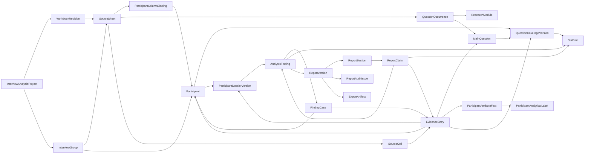
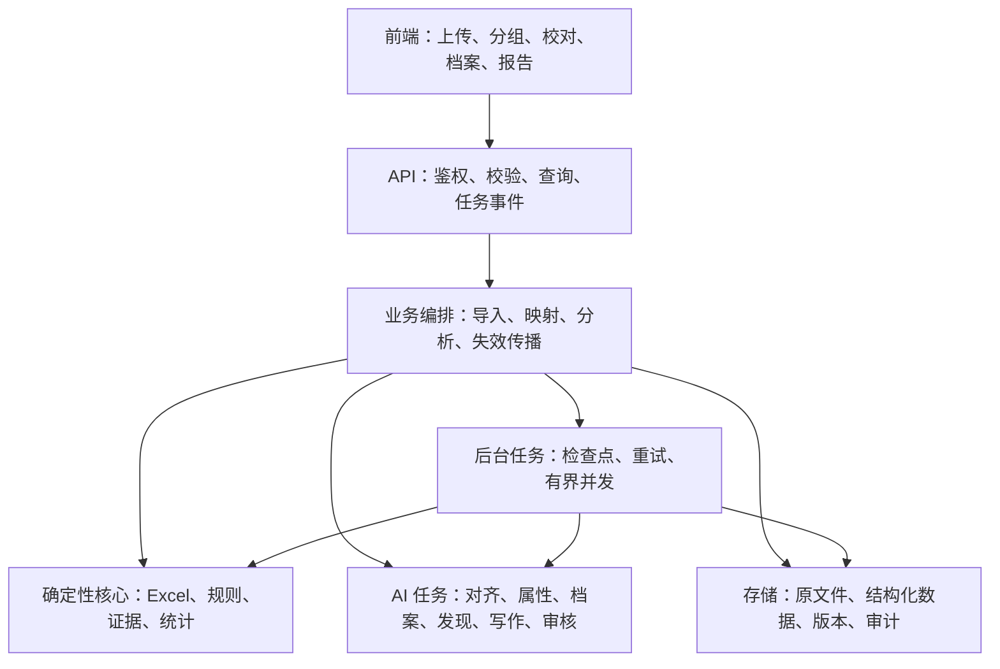
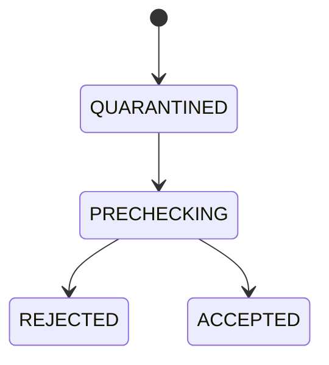
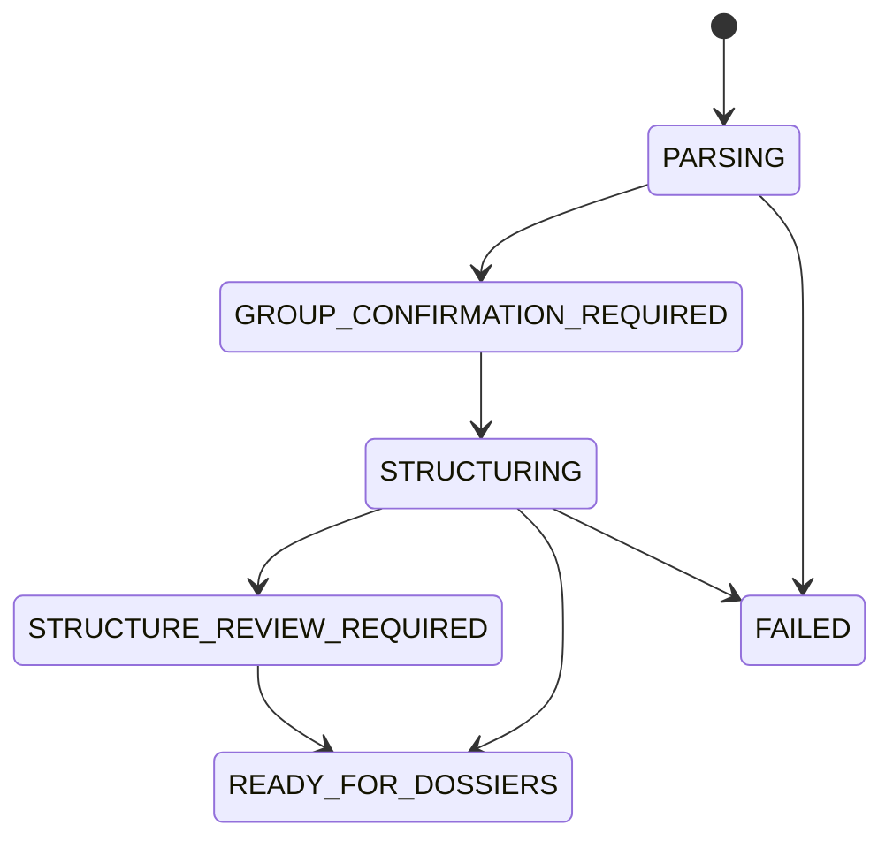
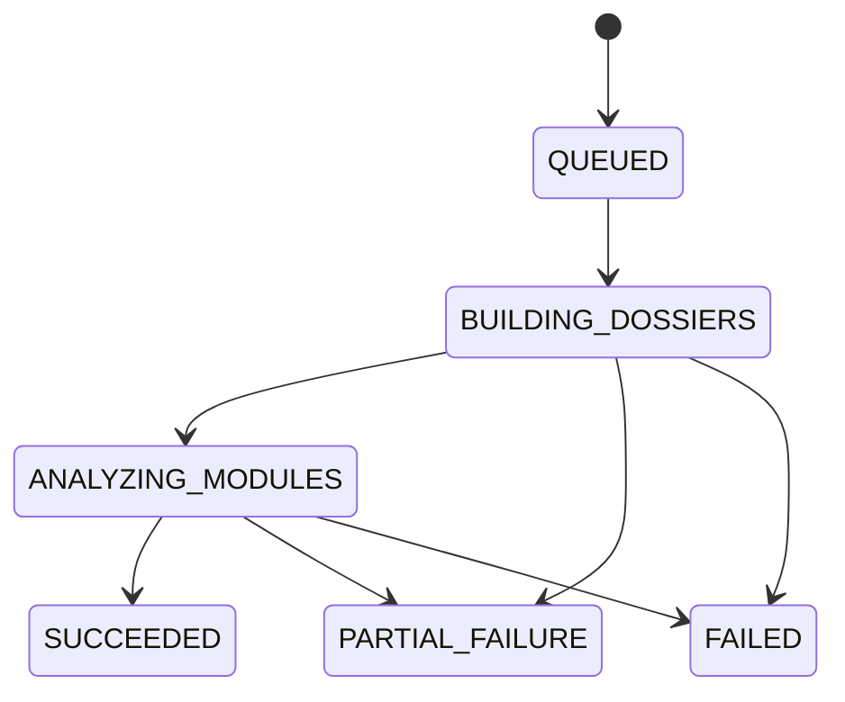
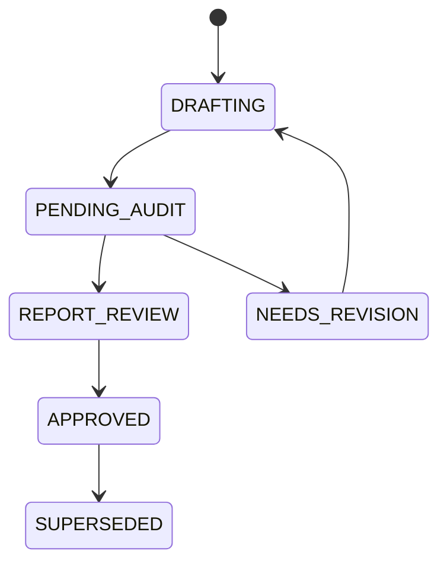

# 访谈记录到研究报告详细开发设计

> 文档性质：跨任务实施依据，不代表功能已经实现。
> 编写日期：2026-08-13
> 适用范围：“访谈已结束、记录 Excel 已形成”之后的资料整理、研究分析与报告生成。
> 设计方法：文档结构和内容类型参考《多模态调研素材基建开发设计》；本功能的产品、数据和技术方案基于当前业务规则独立设计，不以现有实现或旧访谈方案为基线。

---

## 一、文档目的

本文档定义“从访谈记录 Excel 到访谈研究报告”的完整产品与技术方案，包括：

- 产品职责边界和 V1 范围；
- 用户在上传前必须知道的文件条件；
- Sheet 分组、记录员、玩家列及同一玩家的归并规则；
- 功能模块、主问题、追问、观察备注和玩家属性的解析方法；
- 不同记录员重复、互补或冲突内容的保留方式；
- 单玩家完整逻辑、跨玩家比较和研究发现的生成流程；
- 报告结构、证据协议、人数口径、审核与局部修订；
- 领域模型、逻辑架构、任务状态、API 草案和版本模型；
- 存储、隐私、性能、可观测性、测试、分批开发与上线门槛。

后续产品、设计、开发和 QA 任务应以本文档为共同业务基线，不依赖产生本文档的历史对话。实施前仍需根据真实样本和实际技术环境通过本文第二十一章的决策门。

---

## 二、背景与业务事实

### 2.1 当前业务事实

1. 一场访谈可能有多个记录员，他们同时记录同一批玩家，但关注点、追问和笔记详细程度不同。
2. 记录 Sheet 稳定采用“一列一个玩家”，但多个 Sheet 可能对应同一批玩家，也可能对应不同访谈组的不同玩家。
3. 一个 Excel 内可以存在多个访谈组。例如：`1组记录1`、`1组记录2`对应同一批玩家；`2组记录`对应另一批玩家。
4. 不同访谈组可能重复使用 `P01`、`P02` 等列名，但它们不是同一玩家。
5. 同一访谈组的两名记录员会记下重复信息，也会分别记下互补细节。重复不是应被删除的噪音，互补内容也不能被主记录覆盖。
6. 同一 Excel 一定针对同一份基础访谈提纲，但三天访谈期间可能临时修改主问题、增加问题或停止询问某些内容。
7. 发给每名记录员的提纲主要统一主问题；不同记录员的现场追问可以完全不同，也可以部分重复。
8. 现场新问题可能写在表格底部，或临时借用其他题目的空白玩家格。
9. 主问题下可能提前预留多行追问，最终没有使用的行会保持空白。
10. 观察备注是“记录员或研究员的现场发现”，不是玩家主动表达。观察备注的问题栏可以为空，并可以在同一主问题下连续记录多行。
11. 玩家属性通常出现在访谈开头的自我介绍、背景问题或基础情况区，不一定存在独立属性表。
12. 玩家的反馈与其属性、经历、游戏阶段和使用场景强相关。研究分析必须先重建单个玩家的完整逻辑，再做跨玩家比较。

### 2.2 产品职责边界

本功能从“访谈已结束且记录 Excel 已形成”开始。

平台负责：

- 接收一份访谈记录 Excel；
- 确认 Sheet 之间的访谈组、记录员和玩家关系；
- 提取功能模块、主问题、追问、观察备注和玩家属性；
- 建立可回溯的玩家级研究资料；
- 向用户展示会影响报告准确性的高风险异常；
- 生成单玩家档案、跨玩家研究发现和访谈报告；
- 提供证据审核、局部修订、版本与导出。

平台不负责：

- 创建、编辑或管理访谈提纲；
- 根据项目生成访谈记录模板；
- 管理招募、排期、翻译和访谈执行过程；
- 要求用户在访谈前配置功能模块或玩家属性字段；
- 要求用户额外上传印尼语提纲；
- 替代策划设计详细产品方案、优先级和排期。

如原 Excel 内已经包含翻译参考页、空白模板或说明页，系统可建议标记为“非记录 Sheet”并忽略；这不等于要求用户单独上传这些材料。

### 2.3 为什么不能“整个 Excel 直接丢给模型写报告”

一次性写报告无法稳定保证：

- 同组和异组玩家没有被串联；
- 两名记录员的重复内容没有导致玩家人数翻倍；
- 互补内容没有被遗漏；
- 追问和观察备注没有归到错误主问题；
- 空白预留行没有被当作“漏问”；
- 没有记录不会被写成“玩家没有需求”；
- 研究员观察不会被改写为玩家原话；
- 每个判断都能回到原始 Sheet 和单元格；
- 对资料的人工修正能稳定传播到档案、统计和报告。

因此必须建立分层流程：

```text
原始 Excel
→ 物理读取和证据保全
→ Sheet 分组与玩家映射确认
→ 功能模块和主问题结构化
→ 玩家级资料和档案
→ 跨玩家研究发现
→ 报告写作
→ 证据审计和人工审核
```

---

## 三、目标、非目标与成功标准

### 3.1 总体目标

1. 用尽可能低的用户整理成本，将一份多 Sheet 访谈 Excel 转化为可审核、可回溯的研究资料。
2. 正确区分“同组多记录员”和“不同组不同玩家”。
3. 只对高风险、真正需要人判断的映射展示人工确认。
4. 从提纲结构中读取功能模块和主问题，不要求用户事先配置。
5. 先生成每名玩家的完整逻辑，再基于独立玩家做跨玩家比较。
6. 报告中的人数、分母、玩家范围和引用来自确定性资料层，不由模型猜测。
7. 以研究发现为主，附带少量、轻量、不越界的产品建议。
8. 支持人工修正、局部重算和版本追溯，避免因一处错误反复全量重跑。

### 3.2 V1 非目标

- 访谈提纲生成、编辑或版本管理；
- 访谈记录模板生成；
- 访谈招募、排期、提醒、现场协作或翻译管理；
- 要求上传单独中文或印尼语提纲；
- 音频、视频、录屏或访谈录音转写；
- 从图片、PPT 或操作录像自动推断玩家观点；
- 一行一个玩家、同一 Sheet 内一列混写多个玩家等与核心输入合同相反的布局；
- 一次自动理解任意历史 Excel，不经确认直接输出可批准的正式报告主张；
- 跨项目洞察库、长期玩家研究库或通用质性检索系统；
- 自动输出详细产品方案、功能优先级、交互设计和排期。

### 3.3 成功标准

上线前必须满足以下硬标准：

- 跨组玩家误合并为 0；
- 报告证据跳转到错误单元格为 0；
- 观察备注被写成玩家主动表达为 0；
- 多记录员导致玩家人数重复计算为 0；
- 用户已排除的证据仍进入档案或报告为 0；
- 所有强研究发现都有合法玩家证据或明确标识的研究员观察；
- 所有精确人数均由程序按独立玩家计算；
- 结构修正后，受影响档案、统计、发现和报告会标记过期并可局部重算；
- 至少两份结构差异明显的真实访谈 Excel 经研究员验收后，报告达到“可修改使用”，而不是必须回到 Excel 重新人工整理。

以下自动识别目标应先通过真实样本基准校准，不在开发前凭空承诺：

- 标准文件主问题归属准确率目标 `≥95%`；
- 观察备注识别精确率目标 `≥98%`；
- 明确玩家属性提取精确率目标 `≥95%`；
- 合规标准文件需人工处理的证据行比例目标 `≤5%`。

---

## 四、已确认的产品决策

| 编号 | 决策 | 实施含义 |
|---|---|---|
| D1 | 访谈后工具 | 不创建提纲、不生成记录模板、不管理访谈执行 |
| D2 | 一次一个 Excel | V1 的一次导入只接收一个 `.xlsx` |
| D3 | 一文件一份基础提纲 | 文件内可以有现场修订，但不得混入两个无关访谈项目 |
| D4 | 一列一个玩家 | 这是 V1 必须满足的物理输入合同 |
| D5 | 组别是玩家身份边界 | `1组-P01` 与 `2组-P01` 永远不自动合并 |
| D6 | Sheet 分组必须确认 | Sheet 名只用于提出建议，用户需确认一次整体分组 |
| D7 | 同组多记录员是多来源证据 | 原文分别保留，只建立重复、互补、印证或冲突关系 |
| D8 | 只对齐主问题 | 不要求不同记录员的追问文本、数量或行号一致 |
| D9 | 问题层级只有主问题和追问 | 观察备注是证据身份，不是第三类研究问题 |
| D10 | 不要求源文件维护问题 ID | 内部 ID 由系统生成，记录员只需维持可识别层级 |
| D11 | 向上归属最近主问题 | 追问和观察备注继承同 Sheet 上方最近主问题，不得跨新模块边界 |
| D12 | 空白预留行可存在 | 完全空白的预留行直接忽略，不生成漏问或缺失 |
| D13 | 功能模块从提纲读取 | 不在上传前要求用户配置；只有语义归纳时才要求确认 |
| D14 | 玩家属性自动提取 | 优先从访谈开头的自述和背景问题提取，不预配字段 |
| D15 | 属性事实和分析标签分离 | “每周玩 5 天”是事实；“高频玩家”只能是可审核的归纳标签 |
| D16 | 不需要印尼语提纲 | 不提供独立上传入口；原 Excel 内已有参考页可忽略 |
| D17 | 报告重点选填 | 留空时分析全部模块；填写时只调整侧重，不排除其他有证据的重要发现 |
| D18 | 原始单元格不可变 | 人工修改的是解释和归属，不是原 Excel 内容 |
| D19 | 先玩家、后跨玩家 | 每名玩家必须先形成档案，模块分析不直接从全表抽象 |
| D20 | 数字确定性计算 | 人数、分母、比例和反例数不接受模型自由生成 |
| D21 | 固定报告骨架 | 保持团队报告口径稳定，不向用户暴露完全自由 Prompt |
| D22 | 约 90% 研究发现 + 10% 轻量建议 | 建议必须关联研究发现，不写详细产品方案 |
| D23 | 禁止静默猜测 | 高风险低置信内容进入异常确认，确认前不支撑 `reportable_claim` |
| D24 | 局部失效与局部重跑 | 修正一名玩家或一个模块时，不默认全量重生成 |
| D25 | 分阶段持久化 | 确认和报告工作可能跨天，不能只依赖短时临时会话 |

---

## 五、输入合同、权威顺序与降级策略

### 5.1 V1 必须满足的文件条件

- 格式为 `.xlsx`；
- 一次只上传一个 Excel；
- 同一 Excel 基于同一份基础访谈提纲；
- 同一记录 Sheet 中，一列只对应一个玩家；
- 同一玩家列中不得混写多个玩家；
- 表格中存在可识别的提纲区和玩家记录列；
- 功能模块、行类型、问题/备注至少能通过列、标题、排版或明确上下文之一识别；
- 文件未设置打开密码，不依赖执行宏或外部链接获取主要内容。

“一列一个玩家”同时包含两层责任：

- **系统可检测的物理合同**：玩家列头、列范围、合并结构或映射关系显示一列无法稳定绑定到一个内部玩家时，系统阻断并指出 Sheet/列；
- **用户保证的语义合同**：某个玩家列的正文没有混写另一名玩家。系统只能在发现明显姓名/编号切换等线索时警告，不能承诺识别所有语义混写。

上传前确认即表示用户对语义合同负责；警告不会自动把一列拆成多个玩家。

可以包含：

- 多个访谈组；
- 同组多名记录员的多个 Sheet；
- 提纲现场修订、底部新增问题和不同记录员的不同追问；
- 空白预留追问行；
- 问题栏为空、但玩家格有内容的追问回答或观察备注；
- 非记录 Sheet，但必须可以在分组页排除。

### 5.2 上传页必须前置展示的规则

以下信息必须在选择文件前直接可见，不能只放在帮助中心或失败弹窗中：

> **上传前请确认**
>
> - 同一个 Excel 只记录同一份基础访谈提纲，访谈期间临时增加或调整的问题可以保留。
> - 每个记录 Sheet 中，一列只能对应一个玩家。
> - 同组的多个记录 Sheet 应记录同一批玩家；不同组的 Sheet 应记录不同玩家。
> - 建议在 Sheet 名中标明组别和记录员，例如“1组记录1”、“1组记录2”、“2组记录”。
> - 同组不同 Sheet 中，同一玩家建议使用相同列名。
> - 功能模块和主问题需要能够从表格内容或排版中识别。
> - 空白预留追问行不会被当作漏问。
> - 观察备注的问题栏可以为空，系统会尝试归入上方最近的主问题。
>
> 平台只处理访谈结束后的记录整理与报告生成，不负责创建提纲或生成记录模板。

页面还需显示一个简短示例：

```text
1组记录1 + 1组记录2
→ 同组多记录员，合并为同一批玩家

2组记录
→ 另一批玩家，即使也有 P01，也不与 1 组 P01 合并
```

系统应记录用户确认的 `file_contract_version`和确认时间，便于输入合同升级时追溯。

### 5.3 数据权威顺序

对任何映射冲突，采用以下优先级：

```text
用户已确认的分组、玩家和证据修正
> 原始单元格及明确表格字段
> 确定性位置与继承规则
> 样式、缩进、合并单元格等布局线索
> AI 语义建议
> 待人工确认
```

人工确认不会覆盖原始值，而是形成可追溯的 `ManualOverride`。同一条规则如果后续被更新，旧确认仍保留在历史中。

### 5.4 Sheet 分组与玩家匹配优先级

Sheet 分组建议可以综合：

1. Sheet 名中明确的组别和记录员信息；
2. 玩家列名的重合程度；
3. 主问题结构相似度；
4. 记录玩家数；
5. Sheet 顺序等弱线索。

但系统不得仅凭列位置或问题相似度最终确定分组。用户在“Sheet 分组确认”页必须完成一次整体确认。

同组玩家列匹配：

1. 规范化后列名完全一致：系统可提出自动映射；
2. 列名不同但用户已手动映射：使用手动映射；
3. 列名缺失、重复或有歧义：必须确认；
4. 仅列序一致：只能作为建议，不能静默合并；
5. 不同组：即使列名一致也不建立玩家关系。

### 5.5 覆盖、缺失、不确定和降级

覆盖情况不能使用一个互斥枚举同时表达“源提纲是否存在、是否询问、是否适用、记录了什么、是否审核”。这些事实必须拆成正交维度：

| 维度 | 值 | 含义 |
|---|---|---|
| `source_presence` | `present / not_present / unknown` | 该玩家对应的提纲版本中是否存在该主问题 |
| `asked_status` | `asked / not_asked_confirmed / unknown` | 是否确认向玩家询问过 |
| `applicability` | `applicable / not_applicable_confirmed / unknown` | 是否确认适用于该玩家 |
| `evidence_summary` | 三类证据的数量和存在标记 | 玩家自述、追问补充、研究员观察可以同时存在 |
| `review_status` | `unreviewed / confirmed / needs_review / excluded` | 当前覆盖判断是否已复核 |

以下展示状态均由上述维度派生，而不是反向写回单一状态：

- `self_report_recorded`：玩家自述证据数大于 0；
- `followup_recorded`：追问补充证据数大于 0；
- `observation_only`：只有观察证据，没有玩家自述；
- `no_record`：问题存在，但三类证据均为空；
- `not_present_in_source`：源提纲明确不存在该问题；
- `not_asked_confirmed`：用户明确确认未询问；
- `not_applicable_confirmed`：用户明确确认不适用。

同一玩家在同组多个 Sheet 的聚合规则：

1. 任一关联 Sheet 明确存在该主问题，则 `source_presence=present`；只有所有适用来源均明确不存在时，才可为 `not_present`；其余为 `unknown`。
2. 任一来源确认已询问，则 `asked_status=asked`；只有所有适用来源均确认未询问时，才可为 `not_asked_confirmed`；其余为 `unknown`。
3. 任一来源确认适用，则 `applicability=applicable`；只有业务上明确不适用时，才可为 `not_applicable_confirmed`。
4. 证据数量按原始来源保留；统计玩家人数时按内部 `participant_id` 去重，而不是按证据条数计数。
5. 比例分母只使用 `source_presence=present AND asked_status=asked AND applicability=applicable` 的独立玩家；任一维度不可靠时不输出比例。

空白不得自动翻译成“没有意见”、“没有需求”、“未询问”或“不适用”。无法完成语义解析时，系统应保留可回溯的原始资料和已完成结构，允许用户先修正或暂时排除，不应生成无依据的补全内容。

### 5.6 输入与输出语言边界

- V1 界面、结构字段识别和最终报告以中文为主；
- 不要求单独上传印尼语提纲；
- 玩家回答中夹杂的少量印尼语或英语原文必须原样保留，不能因无法翻译而丢弃；
- 只有所选模型和评测集证明支持时，才对非中文原文生成语义归纳；否则标记为需翻译/需确认；
- 大段非中文记录、混合多种语言的完整提纲不在 V1 默认保证范围内，应在预检中提示能力边界。

---

## 六、领域模型

### 6.1 总体关系



### 6.2 `InterviewAnalysisProject`

表示一次持久化的访谈资料整理和报告工作区，不代表访谈前的项目管理。

| 字段 | 含义 |
|---|---|
| `project_id` | 内部唯一 ID |
| `owner_id` / `tenant_id` | 所有者和租户隔离 |
| `title` | 报告工作区名称，可从文件名初始化 |
| `research_focus` | 可选报告重点 |
| `display_phase` | 只读聚合阶段，由导入、任务和当前产物计算，不作为业务写入状态 |
| `current_*_revision` | 源文件、映射、结构、证据、覆盖和报告当前版本 |
| `created_at` / `updated_at` | 创建和更新时间 |

### 6.3 `WorkbookRevision`、`SourceSheet` 与 `SourceCell`

`WorkbookRevision` 保存每次上传的不可变快照：

```json
{
  "workbook_revision_id": "wb_01_v1",
  "project_id": "project_01",
  "original_filename": "interview.xlsx",
  "content_sha256": "...",
  "file_size": 123456,
  "file_contract_version": "1.0",
  "parser_version": "1.0",
  "created_at": "ISO-8601"
}
```

`SourceSheet` 至少保存：

- Sheet 原始名、索引、可见性；
- 有效内容范围，不盲信样式造成的 `max_row/max_column`；
- 建议组别、建议记录员、最终确认组别和记录员；
- Sheet 角色：`record`、`guide_reference`、`attribute_reference`、`ignore`、`unknown`；
- 映射状态和人工确认记录。

`SourceCell` 是原始证据的物理基础：

```json
{
  "source_cell_id": "cell_01",
  "sheet_id": "sheet_01",
  "address": "H32",
  "row": 32,
  "column": 8,
  "raw_value": "原始内容",
  "display_value": "用于界面展示的值",
  "value_type": "string",
  "formula_text": null,
  "merged_range": null,
  "value_sha256": "..."
}
```

公式不得执行。如文件中没有可读缓存值，标记为不可读并生成明确问题。

### 6.4 `InterviewGroup`、`Participant` 与 `ParticipantColumnBinding`

`InterviewGroup` 表示用户确认的一批玩家；一组可包含一个或多个记录 Sheet。

`Participant` 必须属于且只属于一个 `InterviewGroup`。内部身份概念为：

```text
玩家唯一边界 = 导入项目 + 访谈组 + 组内玩家映射
```

`ParticipantColumnBinding` 保存每个 Sheet 玩家列到内部玩家的对应：

```json
{
  "binding_id": "binding_01",
  "sheet_id": "sheet_01",
  "column_index": 8,
  "raw_header": "P01",
  "participant_id": "participant_01",
  "mapping_method": "exact_header",
  "confidence": 1.0,
  "decision_status": "proposed",
  "decision_source": "deterministic_rule",
  "confirmed_by": null,
  "confirmed_at": null
}
```

`mapping_method` 可包含：

- `exact_header`；
- `user_confirmed`；
- `suggested_by_position`；
- `suggested_by_context`；
- `manual_created`。

判断状态和判断来源必须分开：

- `decision_status`：`proposed`、`needs_review`、`confirmed`、`rejected`；
- `decision_source`：`deterministic_rule`、`ai_suggestion`、`user_selection`、`manual_creation`；
- `confidence` 只描述系统建议，不代表已经有人确认；
- `confirmed_by` 和 `confirmed_at` 只在用户或有权限的审核者确认后填写。

即使列名完全一致，也只表示玩家绑定建议置信度高；整个 Sheet 分组和玩家映射仍须通过用户确认关卡。

不得因为两个玩家的列名都是 `P01` 而跨组建立映射。

### 6.5 `ResearchModule`、`MainQuestion` 与 `QuestionOccurrence`

`ResearchModule` 是报告的主要分析结构。它的名称可来自明确模块列/标题，也可以是经用户确认的语义归纳。

`MainQuestion` 是跨 Sheet 对齐后的标准主问题。只有主问题建立 canonical 对齐；不同记录员的追问不强制合并。

`QuestionOccurrence` 保存某个 Sheet 中真实出现的提纲节点：

```json
{
  "occurrence_id": "occ_01",
  "sheet_id": "sheet_01",
  "row": 20,
  "row_role": "follow_up",
  "raw_module_text": "组队",
  "raw_prompt_text": "为什么？",
  "canonical_module_id": "module_team",
  "canonical_main_question_id": "question_team_01",
  "parent_main_occurrence_id": "occ_main_01",
  "mapping_method": "inherit_previous_main_question",
  "confidence": 1.0,
  "decision_status": "proposed",
  "decision_source": "deterministic_rule",
  "confirmed_by": null,
  "confirmed_at": null
}
```

`row_role` 包含：

- `module_header`；
- `main_question`；
- `follow_up`；
- `observation_row`；
- `unknown`。

这是源表行类型，不改变“研究问题层级只有主问题和追问”的决策。

### 6.6 `EvidenceEntry`、`EvidenceFragment` 与 `EvidenceRelation`

`EvidenceEntry` 是进入玩家档案和分析的基本证据：

```json
{
  "evidence_id": "ev_01",
  "participant_id": "participant_01",
  "group_id": "group_01",
  "recorder_label": "记录员1",
  "module_id": "module_team",
  "main_question_id": "question_team_01",
  "occurrence_id": "occ_01",
  "evidence_type": "participant_self_report",
  "capture_context": "follow_up_answer",
  "prompt_text": "为什么？",
  "raw_content": "原始记录",
  "source_cell_id": "cell_H32",
  "inclusion_status": "included",
  "identity_decision_status": "system_verified",
  "decision_source": "explicit_source_type",
  "confidence": 1.0,
  "confirmed_by": null,
  "confirmed_at": null
}
```

`evidence_type` 只表达证据身份：

- `participant_self_report`：玩家自述；
- `researcher_observation`：记录员/研究员观察。

`capture_context` 表达记录所在的访谈结构：

- `main_answer`；
- `follow_up_answer`；
- `observation`；
- `unknown`。

证据的纳入状态和身份判断必须分开：

- `inclusion_status`：`included`、`excluded_by_user`、`superseded`；完全空白不创建证据实体；
- `identity_decision_status`：`system_verified`、`proposed`、`needs_review`、`human_confirmed`、`rejected`；
- `decision_source`：`explicit_source_type`、`deterministic_context`、`ai_suggestion`、`user_selection`、`manual_override`；
- `confidence` 只描述自动判断；`confirmed_by/confirmed_at` 仅用于人工确认。

明确标注为观察的行和处在明确主问题/追问行中的玩家回答，可由确定性规则进入 `system_verified`，不要求逐条人工点击。类型不明、混合身份或错位候选只能处于 `proposed/needs_review`，在确认前不得支撑正式报告主张。

#### 证据资格与主张白名单

本文不使用含糊的“强结论”作为状态。任何会出现在批准报告中的事实、行为、态度、原因、影响、期待、属性、跨玩家规律或精确数字，统一称为 `reportable_claim`；仅在工作台展示、不会进入批准报告或正式导出的内容称为 `exploratory_note`。

`reportable_claim` 的证据必须同时满足：

1. `inclusion_status=included`；
2. `identity_decision_status` 为 `system_verified` 或 `human_confirmed`；
3. 属于当前项目、玩家、问题和 `EvidenceRevision`；
4. 符合服务端固定的“主张类型 × 证据身份”政策；
5. 未被更新版本或人工覆盖项替代。

| 主张类型 | 可作为主要证据 | 约束 |
|---|---|---|
| 玩家明确态度、原因、动机、期待、主观影响 | `participant_self_report` | 观察不能独立证明玩家内心判断 |
| 可观察行为、操作路径、完成/失败结果 | 玩家自述或 `researcher_observation` | 使用观察时必须写明“访谈中观察到” |
| 玩家明确属性事实 | 与玩家自述/明确属性区绑定的事实证据 | 分析标签不得冒充事实 |
| “N 名玩家提及” | `participant_self_report` | 每名玩家至少绑定一条自己的有效证据 |
| “观察到 N 名玩家” | `researcher_observation` | 与“提及人数”分开统计和表述 |
| 跨玩家原因/态度规律 | 每名支持玩家的自述证据 | 反例和资料边界同时参与审计 |
| 研究员分析标签或解释 | 合法事实/证据作为上下文 | 必须明确为研究解释，不能伪装成玩家原话 |

该白名单由版本化的服务端 `evidence_policy_version` 决定，模型不能自行声明允许使用哪些证据类型。`exploratory_note` 可以引用待确认材料，但必须显示警告且不能进入批准或导出流程。

如一个玩家单元格混合多组问答或“玩家表达 + 研究员观察”，可建议拆成 `EvidenceFragment`，但必须保留：

- 完整原始单元格；
- 每个片段的字符起止位置；
- 片段类型和置信度；
- 用户合并、拆分、改标签或保留整格的能力。

`EvidenceRelation` 只建立关系，不删除证据：

- `corroborates`：相互印证；
- `complements`：互补；
- `near_duplicate`：高度重复；
- `conflicts`：冲突；
- `unrelated`：不应联系。

#### `QuestionCoverageVersion` 与 `QuestionCoverage`

`QuestionCoverageVersion` 是覆盖矩阵的不可变快照，绑定 `mapping_revision_id`、`structure_revision_id`、`evidence_revision_id`、人工覆盖版本、生成规则版本和创建时间。任何证据身份、纳入状态、问题归属、询问状态或适用性变化都会创建新版本。

`QuestionCoverage` 按“覆盖版本 + 玩家 + 标准主问题”保存正交覆盖维度，不能把组合状态压成一个枚举：

```json
{
  "coverage_version_id": "coverage_v05",
  "participant_id": "participant_01",
  "main_question_id": "question_team_01",
  "mapping_revision_id": "mapping_v03",
  "structure_revision_id": "structure_v04",
  "evidence_revision_id": "evidence_v07",
  "source_presence": "present",
  "asked_status": "asked",
  "applicability": "applicable",
  "self_report_count": 1,
  "follow_up_count": 2,
  "observation_count": 1,
  "review_status": "confirmed",
  "source_occurrence_ids": ["occ_01", "occ_09"]
}
```

覆盖矩阵中的“有回答 + 有追问 + 有观察”是合法组合。`no_record`、`observation_only` 等仅为查询时派生标签。

### 6.7 `ParticipantAttributeFact` 与 `ParticipantAnalyticalLabel`

```json
{
  "attribute_fact_id": "attr_01",
  "participant_id": "participant_01",
  "attribute_key": "play_frequency",
  "attribute_label": "游戏频率",
  "raw_value": "几乎每天晚上都玩",
  "normalized_value": "almost_daily",
  "fact_source": "explicit_self_report",
  "fact_status": "active",
  "source_evidence_ids": ["ev_01"],
  "confidence": 0.96,
  "review_status": "confirmed"
}
```

`fact_source` 至少包含：

- `explicit_self_report`；
- `researcher_recorded_fact`；
- `explicit_structured_field`。

`fact_status` 至少包含：

- `active`；
- `conflicting`；
- `unknown`。

`ParticipantAnalyticalLabel` 单独保存系统归纳，例如“高频玩家”，至少包含标签、生成规则/模型版本、来源事实和证据、置信度及审核状态。分析标签不能进入“玩家明确表示”的表述，也不能替代原始属性事实。

规范化值只用于分类和比较，不能制造虚假精度。例如“几乎每天”可规范为 `almost_daily`，不得擅自改写成玩家明确说过“每周 5～7 天”。属性冲突时保留多条事实和来源，不默认选择其中一条。对年龄、性别、地区等敏感事实不得从模糊上下文猜测。

### 6.8 `ReviewIssue` 与 `ManualOverride`

`ReviewIssue` 保存：

- 稳定问题代码；
- 严重程度：`blocking`、`recommended`、`info`；
- 受影响组别、玩家、Sheet、单元格和结构对象；
- 原始内容和相邻上下文；
- 系统建议、理由和潜在报告影响；
- 可选解决动作；
- 用户处理结果。

`ManualOverride` 使用追加式记录，至少包含修改前后值、原因、操作人、时间和版本。

### 6.9 `ParticipantDossierVersion`、`AnalysisFinding` 与 `StatFact`

`ParticipantDossierVersion` 保存某名玩家在特定证据和结构版本下的完整研究档案，每个判断都必须关联证据 ID。

`AnalysisFinding` 保存：

- 功能模块；
- 发现标题和表述；
- 支持玩家、反例玩家；
- 支持证据、反例证据和观察证据；
- 适用范围、限制和置信度；
- 可选的轻量建议。

支持、反例和观察关系通过 `FindingCase` 保存，而不是使用彼此独立的玩家 ID 数组和证据 ID 数组：

```json
{
  "finding_case_id": "case_01",
  "finding_id": "finding_07",
  "role": "support",
  "participant_id": "p1",
  "evidence_ids": ["ev1", "ev2"],
  "evidence_revision_id": "evidence_v07",
  "qualification_status": "passed"
}
```

每个 case 的证据必须属于同一玩家并通过证据资格政策；没有合格证据的玩家不能进入该发现的人数。

`StatFact` 是程序计算的不可变数字事实。分子玩家、分母玩家和各自证据必须显式绑定：

```json
{
  "stat_fact_id": "stat_05",
  "stat_fact_version": 2,
  "analysis_run_id": "analysis_v06",
  "coverage_version_id": "coverage_v05",
  "evidence_revision_id": "evidence_v07",
  "metric_type": "participant_mentions",
  "numerator": 3,
  "denominator": 8,
  "denominator_definition": "被询问且适用该主问题的玩家",
  "numerator_cases": [
    {"participant_id": "p1", "evidence_ids": ["ev1"]},
    {"participant_id": "p4", "evidence_ids": ["ev8"]},
    {"participant_id": "p7", "evidence_ids": ["ev32"]}
  ],
  "denominator_participant_ids": ["p1", "p2", "p3", "p4", "p5", "p6", "p7", "p8"],
  "created_at": "2026-08-13T10:00:00Z"
}
```

程序必须校验每个 `numerator_case` 至少有一条属于该玩家、当前证据版本且满足主张证据政策的有效证据；不能接受互不对应的玩家数组和证据数组。`numerator` 等于去重后的 `numerator_cases.participant_id` 数量，`denominator` 等于去重后的 `denominator_participant_ids` 数量。分母无法确定时，`denominator` 和分母玩家集合均为 `null`，只能使用“3 名玩家提及”，不得输出“3/10”或“30%”。

### 6.10 `ReportVersion`、`ReportSection`、`ReportClaim` 与 `ReportAuditIssue`

`ReportVersion` 绑定具体：

- 工作簿版本；
- 结构/证据版本；
- 玩家档案版本集；
- 分析运行；
- Prompt/Schema/模型配置版本；
- 生成、审核和批准状态；导出由独立 `ExportArtifact` 管理。

`ReportSection` 按模块或章节独立保存，支持：

- 局部重生成；
- 人工编辑锁定；
- 上游变化后标记 `stale`；
- 新旧内容对比；
- 证据和发现关联。

`ReportClaim` 是报告事实审计的最小对象，至少包含：

```json
{
  "report_claim_id": "claim_01",
  "report_version_id": "report_v03",
  "section_id": "section_team",
  "section_revision": 6,
  "claim_type": "cross_participant_finding",
  "text": "3 名玩家提到随机组队结果不稳定。",
  "text_start": 128,
  "text_end": 150,
  "finding_ids": ["finding_07"],
  "participant_ids": ["p1", "p4", "p7"],
  "evidence_ids": ["ev1", "ev8", "ev32"],
  "stat_fact_id": "stat_05",
  "evidence_policy_version": "report_claim_policy_v1",
  "evidence_qualification_result": "passed",
  "content_hash": "...",
  "audit_status": "passed",
  "superseded_by": null
}
```

报告章节每次人工编辑都会生成新的 `section_revision`。系统必须在同一事务/工作流中：

1. 保存新正文并将该章节标记为 `pending_reaudit`；
2. 将旧主张标记为已替代，不沿用旧的审计结论；
3. 从新正文重新提取主张、绑定发现/证据/统计事实；
4. 重新执行证据与数字审计；
5. 只有新主张全部满足批准规则后，章节才恢复为 `audit_passed`。

人工“锁定”只阻止自动写作覆盖正文，不能跳过重新审计。存在 `pending_reaudit`、`audit_failed` 或过期主张时，报告不得批准或正式导出。

`ReportAuditIssue` 保存自动审核发现的问题，例如无证据判断、观察身份误用、人数口径错误或建议越界。

---

## 七、架构设计与模块边界

### 7.1 逻辑分层



### 7.2 职责

- **API 层**：接收文件、确认映射、修正问题、查询资料和导出；不解析 Excel，不写研究判断。
- **业务编排层**：驱动导入状态机，生成确认项，调度档案、模块分析和报告，处理版本与局部失效。
- **确定性核心层**：安全读取 Excel，应用分组和继承规则，管理证据白名单，计算覆盖状态、人数和分母。
- **AI 任务层**：只执行有限、受 Schema 约束的语义任务；不能改原文，不能自行合并组别，不能自由编造数字或证据 ID。
- **存储层**：原始文件与结构化数据分离；提供原子版本、所有者隔离、快照和审计记录。
- **任务层**：以 Sheet、玩家、模块和报告章节为单位执行；每阶段写检查点，支持幂等重试。

### 7.3 候选逻辑模块

实施时再根据代码库确认具体文件，但逻辑职责建议保持以下边界：

```text
interview_file_validator
interview_workbook_parser
interview_grouping_service
interview_participant_mapping_service
interview_structure_service
interview_evidence_service
interview_review_service
interview_attribute_service
interview_dossier_service
interview_finding_service
interview_report_service
interview_report_audit_service
interview_project_storage
interview_job_service
```

这些是逻辑边界，不是预先批准的文件名。实施任何批次前，应先核对实际技术栈、现有模块和数据保护约束。

### 7.4 存储与基础设施建议

本文档不绑定具体产品技术栈，但实现必须满足：

- 原始 Excel 使用可追溯、可按版本读取的文件或对象存储；
- 结构化元数据需支持唯一约束、事务或等价一致性能力；
- 长任务需后台 Worker 、检查点和任务重试；
- 前端通过 SSE、WebSocket 或等价机制获取真实阶段进度；
- AI 调用经统一网关，支持模型版本、超时、重试、成本和安全日志；
- 如使用向量索引，它只能辅助候选检索，不能作为事实或证据的权威来源。

---

## 八、Excel 导入与结构化流水线

### 8.1 总体处理流程

```text
文件安全检查
→ 全工作簿物理读取
→ Sheet 角色与分组建议
→ 用户确认同组/异组关系
→ 同组玩家列映射
→ 功能模块和主问题识别
→ 追问和观察备注继承
→ 玩家属性提取
→ 异常检测与最小人工确认
→ 冻结可分析的证据版本
```

### 8.2 物理读取层

物理读取层必须无 AI、可重复、不修改源文件，并保留：

- 所有 Sheet 及顺序；
- 隐藏 Sheet、隐藏行列标记；
- 真实非空内容边界；
- 单元格坐标、值类型和显示值；
- 合并单元格范围；
- 可用的样式、缩进、颜色和标题线索；
- 不可执行的公式和外部链接标记；
- 内容哈希和解析器版本。

不得因为样式应用到很远的行列就生成大量空记录。嵌入图片、形状和非文本对象在 V1 不进入分析，但不得导致文本读取失败。

### 8.3 Sheet 角色、组别和记录员

系统先为每个 Sheet 提出：

- 角色建议；
- 组别建议；
- 记录员建议；
- 玩家列范围；
- 建议理由和置信度。

用户必须确认：

- 哪些 Sheet 属于同一组；
- 哪些 Sheet 是不同玩家组；
- 哪些 Sheet 不参与分析；
- 每个记录 Sheet 的记录员标识；
- 同组 Sheet 中玩家列如何对应。

组别是组织访谈的数据边界，不是默认研究分群。报告不得因为玩家属于“1 组”或“2 组”就自动推断用户类型差异。

### 8.4 功能模块识别

识别优先级：

1. 明确的功能模块列；
2. 明确的模块标题或分隔行；
3. 合并单元格、字体和缩进等稳定布局；
4. 主问题文本和前后上下文的语义归纳。

前三类可确定时，生成明确模块；只能语义归纳时，系统必须显示“系统建议模块”并允许改名、合并、拆分或保留未识别。

继承规则：

1. 非空模块格设置“当前模块”；
2. 后续模块格为空的主问题、追问和观察备注继承当前模块；
3. 新模块出现后立即切换；
4. 如文件开头尚无模块，可保留“未识别模块”，不静默归类。

### 8.5 主问题对齐

主问题跨 Sheet 对齐采用：

1. 同一模块内原文完全一致；
2. 去序号、空格、标点后一致；
3. 结合模块和前后主问题的语义等价建议；
4. 人工确认。

约束：

- 模块不同的相似问题不自动合并；
- 多个候选相近或置信度低时进入确认；
- 对齐的是主问题意图，不是 Excel 行号；
- 某 Sheet 独有的主问题可以作为现场新增问题，不强行并入旧问题。

### 8.6 追问处理

- 追问归属于同一 Sheet 上方最近的主问题；
- 不要求不同记录员的追问文本、数量或行号一致；
- 追问问题栏为空、玩家格有内容时，建立 `prompt_text = null` 的追问补充证据，并继承上方主问题；
- 追问文字存在但全部玩家格为空时，只保留提纲 occurrence，不生成玩家证据，不直接判定漏问；
- 找不到上方主问题时进入阻断型结构异常；
- 同一玩家格中多组问答优先保留整格，再提供可撤销的片段建议。

### 8.7 观察备注处理

- 行类型为“观察备注”时，证据身份固定为 `researcher_observation`；
- 问题/备注栏可以为空；
- 归属于同 Sheet 上方最近的主问题，并继承其功能模块；
- 每个非空玩家单元格分别生成一条观察证据；
- 同一主问题下允许多行观察备注；
- 新功能模块已出现但尚未出现主问题时，不得继续继承前一模块的主问题；
- Sheet 开头或新模块下没有可继承主问题时，保留原证据并生成 `OBSERVATION_PARENT_MISSING`；
- 没有显式类型但疑似观察时，只能作为建议，确认前不得当作玩家自述。

### 8.8 空白行与空白格

只有功能模块、行类型、问题/备注以及全部玩家格都为空时，才将该行视为真正空白行并忽略。

| 行状态 | 处理 |
|---|---|
| 所有相关格为空 | 忽略，不生成任何问题、证据或缺失 |
| 追问文字非空，玩家格全空 | 保留追问 occurrence，不自动判定漏问 |
| 问题栏空，玩家格非空，行类型为追问 | 归入上方主问题的无文字追问补充 |
| 问题栏空，玩家格非空，行类型为观察 | 归入上方主问题的观察证据 |
| 类型和问题都不明，玩家格非空 | 兼容模式候选，高风险时必须确认 |

### 8.9 提纲临时修改与错位记录

同一 Excel 基于同一份提纲，不等于每个 Sheet 的主问题必须完全相同。

处理规则：

- 独有新主问题建立新 occurrence；
- 与旧主问题明确等价时挂到同一 canonical question；
- 对齐不确定时提供“合并为已有问题”或“作为新问题”；
- 某组对应提纲版本明确没有该问题时设置 `source_presence=not_present`，界面可派生显示 `not_present_in_source`，不得记为玩家未回答；
- 表格底部新问题根据模块和语义生成候选归属；
- 疑似借用其他题目空白格的记录要展示原行、前后主问题、推荐归属和理由；
- 错位候选确认前不进入强研究发现。

### 8.10 玩家属性提取

候选区优先级：

1. 访谈开头的自我介绍、玩家背景或基础情况模块；
2. 明显早于产品体验问题的主问题；
3. 问题文本明确询问年龄、地区、职业、游戏时长、频率、段位、付费、同类经历、社交习惯或设备环境；
4. 表格中明确属性区；
5. 后续回答中明确提及的事实。

“出现在文件前部”只提高候选权重，不能单独证明某句是玩家属性。明确事实、模糊表达、分析标签和冲突必须分开保存。属性抽取优先精确率：宁可漏掉一个属性，也不把系统推测写成玩家事实。

---

## 九、用户业务流程

### 9.1 总体流程

对用户呈现为五个主步骤：

```text
1. 上传记录
→ 2. 确认 Sheet 分组和玩家对应
→ 3. 处理高风险解析异常
→ 4. 审阅玩家档案与覆盖情况
→ 5. 生成、审核和导出报告
```

系统内部可有更多任务阶段，但不应把所有技术细节变成用户必须理解的表单。原则是：

- 确定性信息自动处理；
- 高置信语义结果可直接展示为系统结果，但保留可修改入口；
- 只有会造成玩家串联、问题错归、证据身份错误或正式报告主张风险的内容才强制确认；
- 用户可以暂停并稍后继续，不要求一次完成整个流程。

### 9.2 第一步：上传记录

页面包含：

1. 功能说明；
2. 第 5.2 节的文件要求和分组示例；
3. 单文件上传区；
4. “报告重点问题（选填）”；
5. “开始检查文件”按钮。

报告重点的辅助文案建议：

> 如果有特别希望报告回答的问题，可以填写在这里。留空时，系统将分析所有功能模块和重要发现。该内容只调整报告侧重，不会忽略其他有证据的发现。

用户首次使用或输入合同版本变更后，需确认已阅读文件条件。不建议每次上传都要求用户重复勾选未变更的条款。

选择文件后先执行不调用 AI 的快速预检，展示：

```text
文件：interview.xlsx
Sheet：6 个
可能的记录 Sheet：5 个
可能的说明/参考 Sheet：1 个
玩家列候选：18 列
隐藏 Sheet：0 个
预检结果：可继续
```

如文件加密、损坏、带宏、超限、不符合一列一玩家或主要内容只是图片，需给出稳定错误码、具体原因和可操作建议，不只显示“解析失败”。

### 9.3 第二步：确认 Sheet 分组

页面顶部始终展示：

> **分组规则**
> 放入同一组的多个记录 Sheet，代表多名记录员同时记录同一批玩家，系统会合并同一玩家的记录。
> 放入不同组的记录 Sheet，代表它们对应不同玩家；即使玩家编号相同，也不会跨组合并。

系统按访谈组展示建议：

```text
第1组                                      [修改名称]
├─ 1组记录1   记录员：记录员1   玩家：P01 / P02 / P03
└─ 1组记录2   记录员：记录员2   玩家：P01 / P02 / P03

第2组
└─ 2组记录    记录员：未识别    玩家：P01 / P02 / P03

不参与分析
└─ 说明页
```

用户可以：

- 将 Sheet 移到另一组；
- 新建或合并访谈组；
- 填写/修正记录员标识；
- 将 Sheet 标记为记录、参考或忽略；
- 查看玩家列和主问题摘要；
- 修正同组不同 Sheet 之间的玩家列对应。

同组玩家列名和顺序完全一致时，界面可默认勾选“按相同列名对应”，但必须显示对应结果。列名不同或重复时，提供左右对照映射，未确认列不能进入玩家级分析。

### 9.4 第三步：处理解析异常

解析完成后，页面先显示总结：

```text
已识别：3 个访谈组 / 18 名玩家 / 7 个功能模块 / 26 个主问题
必须确认：2 项
建议确认：5 项
已自动处理：428 条证据
```

异常严重度：

- **必须确认**：未处理会造成玩家错归、主问题错归或证据身份不明，阻止正式分析；
- **建议确认**：可以继续，但未确认内容不支撑 `reportable_claim`，并会进入报告限制；
- **信息提示**：对结果无直接阻断，用于解释系统如何处理。

典型异常包括：

- Sheet 组别或玩家列对应不明；
- 主问题只能通过语义对齐；
- 功能模块是 AI 归纳而非原表明确文字；
- 追问或观察备注没有可继承的主问题；
- 一格同时包含玩家原话和研究员观察；
- 现场新问题无法确定是新主问题还是旧问题的追问；
- 记录疑似借用其他题目的空白格；
- 多记录员对同一属性或事实的记录冲突；
- 明确玩家属性与分析标签的身份不明。

每个异常卡片必须显示：

- 问题类型和潜在影响；
- 组别、玩家、记录员；
- Sheet 和单元格；
- 原始内容及前后上下文；
- 系统建议和建议理由；
- 接受建议、修改归属、修改证据身份、排除、暂不处理等动作。

批量操作只能用于规则和目标完全相同的异常，并必须显示将影响多少条证据。

### 9.5 第四步：审阅玩家档案

页面使用“组别 / 玩家标识”展示玩家，例如：

```text
第1组 / P03
```

布局建议：

- **左侧**：组别筛选、玩家列表、待确认数、属性冲突和档案状态；
- **中间**：明确属性、分析标签、各功能模块记录、主问题与追问链、研究员观察、玩家完整逻辑、矛盾和缺失；
- **右侧证据抽屉**：原文、记录员、Sheet、单元格、相邻行、证据身份和相关来源。

同一主问题下的多记录员内容必须先分来源展示：

```text
记录员1
- 玩家表示只和认识的人组队。

记录员2
- 玩家还提到随机队友水平不稳定。

系统综合
- 玩家回避随机组队，同时受社交偏好和队友质量担忧影响。
```

系统综合的一般链路为：

```text
玩家属性/经历
→ 使用场景
→ 行为或态度
→ 原因
→ 体验影响
→ 期待
```

用户可以修正属性，调整模块/主问题归属，修正证据身份，排除误归证据，合并/拆分综合判断，以及标记玩家档案已审阅。

不强制用户逐一审阅所有玩家；但存在阻断型异常的玩家不能进入正式报告，未审阅档案在报告中应显示“系统自动整理、未人工确认”状态。

### 9.6 问题覆盖矩阵

玩家档案页提供一个可切换的覆盖视图：

| 功能模块 | 主问题 | 第1组/P01 | 第1组/P02 | 第2组/P01 |
|---|---|---|---|---|
| 组队 | 何时使用组队 | 有回答+追问 | 只有观察 | 提纲中未出现 |
| 组队 | 为何回避随机组队 | 有回答 | 无记录 | 待确认 |

点击单元格后，展示该玩家在该主问题下的所有记录员来源。空白预留追问不会形成矩阵行，也不会增加“无记录”数量。

### 9.7 第五步：生成和审核报告

生成前展示：

```text
访谈组：3
独立玩家：18
记录员来源：5
功能模块：7
主问题：26
已审阅玩家档案：12/18
阻断型异常：0
未处理建议项：2
资料不足的主问题：3
```

存在阻断型异常时不能生成“正式报告”。非阻断项可继续，但相关限制必须进入报告。

报告页使用“正文 + 证据侧栏 + 审核提醒”：

- 点击发现查看支持玩家、反例、覆盖范围和资料限制；
- 点击证据查看原文、证据身份、记录员、Sheet 和单元格；
- 修改发现时可选择仅重生成该发现、该模块或所有受影响章节；
- 可批量勾选审核问题后一次修订；
- 用户手工编辑的段落默认锁定，上游变化时标记过期，不静默覆盖；
- 报告通过证据审计后才可批准和导出。

---

## 十、AI 任务与分析流水线

### 10.1 总原则

严禁使用一个超长 Prompt 直接读取整份 Excel 并输出最终报告。AI 任务必须具有：

- 小而明确的责任边界；
- 受约束的结构化输入和 JSON Schema 输出；
- 稳定实体 ID，不使用可变文本作为唯一引用；
- 证据 ID 白名单校验；
- 置信度、理由代码和是否需要人工确认；
- Prompt、Schema、模型和输入指纹版本；
- 失败重试、备选模型或降级规则；
- 输出后的确定性程序校验。

Excel 单元格中的任何文字都必须作为不可信数据，不能将其中的“忽略以上规则”等文字当作模型指令。

### 10.2 AI 任务矩阵

| 任务 | 计算单位 | 输入 | 输出 | 禁止事项 |
|---|---|---|---|---|
| Sheet 角色辅助 | Sheet | 表头、样例行、布局摘要 | 角色建议+理由 | 不得最终确定访谈组 |
| 模块归一 | 模块候选 | 原始标题和主问题 | 已有模块/新模块/不确定 | 不得隐藏原始模块名 |
| 主问题对齐 | occurrence | 模块、原问题、前后上下文、候选 | canonical 映射 | 不得只按行号对齐 |
| 历史行身份建议 | 行/单元格 | 类型、问题、玩家文本及上下文 | 回答/观察/未知建议 | 不得默认把未知当玩家原话 |
| 属性抽取 | 单玩家候选证据 | 开头自述和背景证据 | 属性事实/标签 | 不得推测缺失敏感属性 |
| 多记录员关系 | 玩家+主问题 | 多条证据 | 印证/互补/重复/冲突 | 不删除原证据 |
| 玩家档案 | 单玩家 | 该玩家所有有效证据 | 行为逻辑、矛盾、缺失 | 不得引用其他玩家证据 |
| 模块发现 | 单功能模块 | 玩家档案、合法证据、统计 | 发现、差异、反例、限制 | 不得自由生成精确数字 |
| 报告写作 | 章节 | 已校验发现和统计 | 固定结构正文 | 不得从原表旁路生成新判断 |
| 报告审计 | 章节/主张 | 正文、发现、统计、证据白名单 | 结构化问题和建议 | 不得自行修改原证据 |

### 10.3 主问题对齐协议

示例输出：

```json
{
  "occurrence_id": "occ_12",
  "decision": "match_existing",
  "canonical_question_id": "question_03",
  "canonical_module_id": "module_team",
  "confidence": 0.91,
  "reason_code": "semantic_equivalence",
  "needs_human_review": false
}
```

`decision` 只允许：

- `match_existing`；
- `create_new`；
- `uncertain`。

程序校验：

- occurrence 必须存在；
- 被引用模块和主问题必须是允许候选；
- 不同明确模块不能自动合并；
- 多候选差距过小或低于阈值时必须转为 `uncertain`；
- 同一输入版本的输出应可复现，不应因返回顺序造成不稳定映射。

### 10.4 玩家属性抽取协议

```json
{
  "participant_id": "participant_07",
  "facts": [
    {
      "candidate_id": "fact_candidate_01",
      "attribute_key": "play_frequency",
      "attribute_label": "游戏频率",
      "raw_value": "几乎每天晚上都玩",
      "normalized_value": "almost_daily",
      "fact_source": "explicit_self_report",
      "evidence_ids": ["ev_32"],
      "confidence": 0.94
    }
  ],
  "analytical_labels": [
    {
      "label_key": "high_frequency_player",
      "label": "高频玩家",
      "source_fact_candidate_ids": ["fact_candidate_01"],
      "evidence_ids": ["ev_32"],
      "confidence": 0.82
    }
  ]
}
```

程序校验：

- 证据必须存在且属于当前玩家；
- `raw_value` 必须能在证据中定位或明确是保守转述；
- `normalized_value` 只能是可解释的类别或无损标准化，不得把模糊频率变成精确次数；
- 分析标签必须进入独立的 `analytical_labels`，不得混入事实数组；
- 属性冲突不通过后返回顺序决定“最终值”；
- 高敏感属性只在明确自述时保存。

### 10.5 单玩家逻辑重建协议

```json
{
  "participant_id": "participant_07",
  "claims": [
    {
      "claim_type": "reason",
      "module_id": "module_team",
      "statement": "没有固定朋友在线时会回避随机组队，主要担忧陌生队友质量不稳定。",
      "supporting_evidence_ids": ["ev_32", "ev_81"],
      "conflicting_evidence_ids": [],
      "confidence": 0.88
    }
  ],
  "contradictions": [],
  "missing_context": []
}
```

`claim_type` 包含：

- `context`；
- `behavior`；
- `attitude`；
- `reason`；
- `impact`；
- `expectation`；
- `contradiction`。

模型只接收当前玩家的有效证据。该约束应在数据查询层实现，不能只依赖 Prompt 口头要求。

### 10.6 跨玩家发现协议

```json
{
  "module_id": "module_team",
  "findings": [
    {
      "title": "随机组队的主要阻碍来自结果不确定性",
      "statement": "部分玩家回避随机组队，主要与陌生队友质量及失败体验有关。",
      "supporting_cases": [
        {"participant_id": "p1", "evidence_ids": ["ev1"]},
        {"participant_id": "p4", "evidence_ids": ["ev8"]},
        {"participant_id": "p7", "evidence_ids": ["ev32"]}
      ],
      "counterexample_cases": [
        {"participant_id": "p5", "evidence_ids": ["ev51"]}
      ],
      "observation_cases": [],
      "limitations": ["部分玩家未被追问失败经历"],
      "confidence": 0.82,
      "suggestion": "可进一步验证降低陌生队友不确定感的方向。"
    }
  ]
}
```

服务端对人数执行二次计算：

- 每个支持、反例或观察 case 必须包含一个玩家和至少一条属于该玩家的有效证据；
- 玩家与证据以 case 绑定，不接受互不对应的平行数组；
- 支持玩家按 `participant_id` 去重；
- 同一玩家多名记录员重复记录不增加人数；
- 玩家主动提及数和研究员观察数分开；
- 反例玩家不得同时计入同一发现的纯支持人数；
- 证据必须符合发现所表达主张的服务端证据政策，不允许模型自行放宽；
- 不存在、跨玩家、跨版本或不合格的玩家/证据关系使整个发现进入修复；
- 无法定义适用分母时，移除比例而不猜测。

### 10.7 质量门、重试和降级

每个 AI 任务依次经过：

```text
JSON 可解析
→ Schema 合法
→ 实体 ID 合法
→ 证据白名单合法
→ 业务不变量合法
→ 置信度/人工确认路由
→ 保存结果
```

失败处理：

1. 对可修复的 JSON 格式错误执行一次受约束修复；
2. 对结构合法但业务不合法的结果，返回具体错误列表重试；
3. 超过次数后使用备选模型或降级为人工确认；
4. 某名玩家或某个模块失败，已完成单元不回滚；
5. 报告写作失败时，仍可交付已结构化的玩家档案和发现摘要，不用无证据自由文本填补。

---

## 十一、玩家档案、跨玩家分析与报告协议

### 11.1 单玩家档案是分析前置产物

每名玩家的档案至少包含：

1. 组别和玩家标识；
2. 明确玩家属性；
3. 单独显示的分析标签；
4. 按功能模块和主问题整理的全部记录员来源；
5. 主问题与现场追问之间的逻辑；
6. 研究员观察，与玩家自述分开；
7. 玩家的场景、行为、态度、原因、影响和期待；
8. 前后矛盾、特殊条件和缺失上下文；
9. 每个综合判断的支持、冲突和反证证据 ID；
10. 生成版本、审阅状态和过期状态。

档案不应是每道题的简单摘要或分数列表。它必须说清“这个玩家为什么会这样反应”，同时不把缺失上下文自动补齐。

### 11.2 多记录员证据的使用规则

- 原始证据始终分来源保留；
- 高度重复可在默认视图折叠，但不物理删除；
- 系统可用“相互印证”提升对事实记录的信心，但不能把两份记录计为两个玩家；
- 互补信息可在玩家档案中组合为更完整的逻辑；
- 冲突内容必须显示差异和来源，不默认决定哪一位记录员正确；
- 报告可以写“两份现场记录均提到……”，但如果只有一名玩家，仍只能计一名玩家。

### 11.3 跨玩家分析原则

模块分析的输入是玩家档案、合法证据和程序计算的覆盖信息，不是未确认的整张 Excel。

每个发现至少说明：

- 判断本身；
- 支持玩家；
- 反例玩家；
- 与哪些玩家属性、经历或场景有关；
- 共性和差异；
- 玩家自述证据；
- 研究员观察证据；
- 问题适用范围和资料限制；
- 可选的轻量产品方向。

访谈组是玩家身份的数据边界，不是研究分群字段。只有当组间确实存在有证据的属性或行为差异时，报告才可以讨论组间差异。

### 11.4 报告固定结构

1. **研究范围与样本说明**
   - 文件、访谈组、独立玩家、记录员和资料完整度；
   - 提纲现场修订和未解决异常。
2. **核心研究发现**
   - 跨模块的最重要判断；
   - 保留反例和适用边界。
3. **按功能模块展开的详细发现**
   - 模块判断；
   - 主要发现；
   - 玩家共性；
   - 属性/场景差异和反例；
   - 玩家自述与研究员观察；
   - 资料范围和限制。
4. **玩家属性与反馈差异**
   - 只使用有证据的明确属性或清楚标识的分析标签。
5. **典型玩家逻辑**
   - 展示有代表性、反例价值或特殊机制的玩家；
   - 不用个案冒充总体规律。
6. **轻量产品建议**
   - 全文统一汇总 3～5 条由前文发现支持的方向；
   - 不输出详细功能方案、优先级和排期。
7. **证据范围与研究限制**
   - 未询问、无记录、提纲修订、不确定映射、未审阅档案等。

### 11.5 “90% 研究发现 + 10% 产品建议”的实施

这是结构约束，不是要求模型精确计算字数百分比。

约束方法：

- 建议只在全文末的“轻量产品建议”章节集中呈现 3～5 条，模块章节不重复输出；
- `AnalysisFinding` 可以保存建议候选，但报告渲染时同一方向只能出现一次；
- 每条建议必须关联至少一个 `finding_id`；
- 建议只能表达值得关注、进一步验证或降低某种阻碍的方向；
- 不写具体页面、交互流程、开发量、优先级或排期；
- 建议审计失败时，可删除该建议而不影响研究发现交付；
- 程序可计算建议章节字数占比，以 `5%～15%` 为告警范围，目标约 `10%`。

### 11.6 证据链和报告主张

完整链路：

```text
报告段落
→ ReportClaim
→ AnalysisFinding
→ 支持/反例/上下文/观察 EvidenceEntry
→ Participant
→ SourceCell
→ SourceSheet
→ WorkbookRevision
```

每个事实性 `ReportClaim` 必须有：

- 主张类型；
- 主张文本；
- 发现 ID；
- 玩家 ID 集；
- 证据 ID 集；
- 可选 `StatFact`；
- 证据身份允许范围；
- 限制；
- 审计状态。

报告中的证据点击后展示：

- 原始文字；
- 玩家和记录员；
- 证据身份；
- 功能模块与主问题；
- Sheet 名和单元格；
- 相邻上下文；
- 同组其他记录员的相关记录；
- 人工确认和修改历史。

### 11.7 表述和统计口径

- 玩家自述可写“P07 表示……”或“3 名玩家提及……”；
- 研究员观察只能写“访谈中观察到 P07……”；
- 不能用观察证据独立证明玩家的主观动机；
- 同组同玩家只计一次；
- “提及人数”只计有玩家自述证据的独立玩家；
- “观察到的玩家数”单独统计；
- 比例分母必须是系统或用户能确认的“被询问且适用的玩家”；
- 提纲版本中未出现该问题的玩家不进入分母；
- 分母不可靠时只报绝对提及人数；
- 任何百分比和精确计数都只能渲染 `StatFact`，不使用模型文本中的自由数字。

### 11.8 报告自动审计

至少检查：

1. 主张是否有合法发现和证据；
2. 证据是否属于所述玩家和项目版本；
3. 是否存在跨组同名玩家误合并；
4. 是否把观察备注写成玩家意见；
5. 是否忽略明显反例；
6. 是否把空白、无记录或提纲未出现写成无需求；
7. 精确数字是否来自 `StatFact`；
8. 人数是否按独立玩家去重；
9. 分母定义是否清楚；
10. 明确属性和分析标签是否混淆；
11. 建议是否关联前文发现，是否过长或越界；
12. 手工锁定段落是否已因上游变更而过期。

审计问题分为：

- **阻断导出**：无证据的 `reportable_claim`、错玩家/错引用、观察冒充原话、精确数字无来源；
- **建议修订**：反例表述不足、限制不充分、建议偏长；
- **信息提示**：自动档案未人工审阅等。

---

## 十二、存储、生命周期与历史追溯

### 12.1 保存层级

1. **原始层**：不可变 Excel 文件、内容哈希、上传人和时间。
2. **物理解析层**：Sheet、单元格、合并范围、布局线索和解析器版本。
3. **映射和证据层**：组别、玩家、问题、证据身份、属性和人工修正。
4. **派生分析层**：玩家档案、发现、统计事实、限制和审计结果。
5. **报告层**：报告版本、章节、人工编辑、批准状态和导出产物。
6. **安全审计层**：查看原文、下载源文件、修改归属、排除证据和导出的操作日志。

### 12.2 版本轴

```text
WorkbookRevision
→ MappingRevision
→ StructureRevision
→ EvidenceRevision
→ QuestionCoverageVersion
→ ParticipantDossierVersion
→ AnalysisRun
→ ReportVersion
```

每个 AI 产物至少保存：

- 输入实体 ID 和内容指纹；
- 工作簿、映射、结构、证据和覆盖版本；
- Prompt 名称和版本；
- Schema 版本；
- 模型标识和关键配置；
- 生成时间、耗时和校验结果；
- 是否人工修订、锁定或过期。

### 12.3 输入指纹与复用

指纹必须按产物类型建立，使用规范化 JSON 序列化后再计算 SHA-256。共同字段至少包括：

```json
{
  "artifact_type": "report_section",
  "scope": {"type": "module", "ids": ["module_team"]},
  "workbook_revision_id": "wb_v2",
  "mapping_revision_id": "map_v4",
  "structure_revision_id": "struct_v5",
  "evidence_revision_id": "evidence_v8",
  "manual_override_revision": 12,
  "upstream_artifact_versions": {
    "dossiers": ["dossier_p1_v3", "dossier_p4_v2"],
    "analysis_run_id": "analysis_v6"
  },
  "research_focus": "重点关注随机组队体验",
  "report_schema_version": "1.0",
  "writing_configuration": {"language": "zh-CN", "suggestion_mode": "final_section"},
  "prompt_version": "report_writer_v3",
  "output_schema_version": "2.0",
  "model_configuration": {"provider": "...", "model": "...", "temperature": 0.2}
}
```

各产物只可省略确实不存在的上游字段：

- 玩家档案必须包含玩家作用域、证据版本和该玩家全部有效证据哈希；
- 模块发现必须包含模块作用域、所用玩家档案版本集合和覆盖矩阵版本；
- 报告章节必须包含分析版本、报告重点、报告骨架/语言/建议位置等写作配置；
- 报告审计必须包含章节正文哈希、主张版本和 `StatFact` 版本。

相同指纹的成功产物才可以复用。改变报告重点、排除证据、调整报告骨架、更新人工覆盖项或只重跑某个范围，都必须产生不同指纹。不得仅使用项目 ID、Prompt 版本或部分证据哈希作为缓存键。

### 12.4 人工修正和失效传播

| 用户修改 | 最小失效范围 |
|---|---|
| Sheet 改组 | 相关 Sheet 下玩家、证据、档案、模块分析和报告 |
| 玩家列映射 | 涉及玩家档案、相关模块和报告 |
| 主问题归属 | 该主问题下证据、涉及玩家和对应模块 |
| 证据改为观察备注 | 玩家档案、提及人数、模块发现和报告 |
| 玩家属性修正 | 该玩家档案和使用该属性比较的发现 |
| 排除证据 | 该玩家、对应模块和引用它的报告主张 |
| 仅修改报告措辞 | 不失效上游资料；创建新章节修订和新主张，锁定正文并强制重新审计 |

失效是标记和新建版本，不是删除历史产物。

### 12.5 检查点、幂等和恢复

检查点至少包含：

```text
workbook_validated
workbook_parsed
group_mapping_confirmed
structure_built
evidence_revision_ready
participant_<id>_dossier_ready
module_<id>_analysis_ready
report_section_<id>_ready
report_audit_ready
```

规则：

- 上传文件以 SHA-256 识别完全重复；
- 解析、分析、报告和重跑任务支持幂等键；
- 同一输入指纹同时只能存在一个活动任务；
- Worker 重试不得重复创建证据；
- 一名玩家或一个模块失败时，已完成单元保留；
- 断线后前端通过任务状态和事件游标恢复，不默认重新开始。

### 12.6 生命周期必须显式配置

实施存储前必须确认：

- 原始 Excel 保存多久；
- 工作区和中间证据保存多久；
- 已批准报告保存多久；
- 项目删除是软删除、可恢复删除还是立即永久删除；
- 源文件删除后旧报告如何显示证据；
- 历史报告是否保存必要的安全证据摘要；
- 单用户/单租户容量、项目数和报告版本上限；
- 清理任务如何避免删除正在运行或被导出的版本。

---

## 十三、安全、权限和隐私

### 13.1 访谈数据的敏感性

访谈记录可能包含姓名、联系方式、地区、工作、付费、设备、聊天、未公开功能和内部研究判断，应默认按高敏感用户研究数据处理。

### 13.2 文件安全

- 只允许 `.xlsx`；
- 拒绝打开密码和密文无法读取的文件；
- 不接受或不执行宏；
- 不执行公式，不访问 Excel 外部链接；
- 校验扩展名、MIME 和容器签名；
- 限制文件大小、Sheet 数、非空单元格数、总字符数和单格长度；
- 限制压缩容器解压后总大小和文件数，防止压缩炸弹；
- 上传后可接入恶意文件扫描；
- 原始文件服务端加密存储，下载链接短时有效。

### 13.3 权限

至少区分：

- 创建/上传访谈分析；
- 查看结构化玩家资料；
- 查看原始单元格和下载源 Excel；
- 修改分组、证据和玩家属性；
- 生成或重跑 AI 分析；
- 编辑、批准和导出报告；
- 删除项目和原始文件。

必须保证租户和项目隔离。任何通过 URL 或证据 ID 查询的资源都需重新检查当前用户权限，不得仅依赖“ID 难猜”。

### 13.4 日志和审计

安全审计记录：

- 上传、重新上传和删除；
- 分组和玩家映射确认；
- 证据身份修改和排除；
- 属性修正；
- 生成、重跑、批准和导出报告；
- 查看原始单元格和下载源文件。

普通运行日志只记录：

- 稳定任务 ID；
- 阶段、状态、数量、耗时、重试次数和稳定错误码；
- 非敏感实体 ID 和版本；
- 安全调试引用。

不得记录访谈原文、完整玩家属性、导出文本、访问凭证、模型密钥或带敏感参数的下载 URL。

### 13.5 模型外发和提示词注入

- 不将整个工作簿直接发送给模型；
- 只发送当前任务所需的单玩家、单模块或单章节文本；
- 优先使用内部玩家 ID，不发送不必要的真实姓名和联系方式；
- 在业务允许时，对直接身份标识做最小化或脱敏；
- 单元格文本必须放在明确的数据边界中，不能与系统指令拼接成同级 Prompt；
- 模型无权访问文件系统、数据库或外部链接；
- 输出必须经过 Schema 和 ID 白名单校验；
- 外部模型供应商的保留、训练、地域和审计条件需在上线前明确；
- 产品页或隐私说明应向用户说明哪些访谈文字会被用于 AI 分析。

---

## 十四、前端体验、任务状态与 API 原则

### 14.1 页面和信息架构

V1 建议五个主视图：

| 页面 | 核心任务 | 主要输出 |
|---|---|---|
| 上传记录 | 讲清文件合同，接收 Excel 和选填报告重点 | 文件预检和导入工作区 |
| Sheet 分组 | 确认同组/异组、记录员和玩家列 | 已确认组别和玩家身份边界 |
| 异常确认 | 只处理高风险语义/映射问题 | 可分析证据版本 |
| 玩家档案 | 确认单玩家完整逻辑和覆盖 | 玩家档案与覆盖矩阵 |
| 报告审核 | 审阅发现、证据、审计问题并导出 | 已批准报告版本 |

任务进度不建议独立成为长期页面，可作为当前步骤的阶段卡，展示真实完成量、失败单元、检查点和可恢复动作。

### 14.2 部分成功与最小人工确认

示例：

```text
已处理 18 名玩家
✓ 16 份档案已生成
⚠ 1 名玩家属性存在冲突
⚠ 1 名玩家的记录归属待确认

可以继续查看已完成档案；未处理项不会进入 `reportable_claim`。
```

优先让用户确认：

- Sheet 是同组还是异组；
- 同组玩家列对应；
- 无父主问题的追问/观察；
- 借用空白格的疑似错位记录；
- 玩家自述与观察身份冲突；
- 可能会合并错误的主问题；
- 会影响事实的玩家属性冲突。

不要求用户逐条确认已由稳定列名、明确行类型和合法继承规则无损完成的内容。

### 14.3 上传与导入状态机

`UploadAttempt` 状态机：



预检通过并原子创建正式项目、工作簿版本与导入记录后，`InterviewImport` 使用独立状态机：



文件最初只形成短期 `UploadAttempt` 并进入隔离区。预检通过后才创建正式项目、`WorkbookRevision` 和导入记录；被拒绝的上传不会形成用户可见的半成品项目，并按保留策略清理。分组确认为强制关卡。一旦用户修改已确认的分组，相关结构和下游分析立即标记过期。

### 14.4 分析与报告状态机

`AnalysisRun` 状态机：



`ReportVersion` 状态机：



导出是从某个已批准报告版本创建独立 `ExportArtifact`，不是报告的单一终态；同一批准版本可以多次导出不同格式。

状态必须按对象分开，不能把不同维度塞进一个全局 `status`：

| 对象 | 状态示例 | 说明 |
|---|---|---|
| `UploadAttempt` | `QUARANTINED / PRECHECKING / REJECTED / ACCEPTED` | 文件进入正式项目之前的安全与合同检查 |
| `InterviewImport` | `PARSING / GROUP_CONFIRMATION_REQUIRED / STRUCTURING / READY_FOR_DOSSIERS / FAILED` | 导入主阶段 |
| `Job` | `QUEUED / RUNNING / SUCCEEDED / PARTIAL_FAILURE / FAILED / CANCELLED` | 一次后台执行的运行状态 |
| 派生产物 | `CURRENT / STALE / SUPERSEDED / INVALID` | 档案、发现、章节和主张相对上游版本的有效性 |
| `ReportVersion` | `DRAFT / PENDING_AUDIT / REPORT_REVIEW / APPROVED / SUPERSEDED` | 报告业务生命周期 |
| `ExportArtifact` | `QUEUED / BUILDING / READY / FAILED / EXPIRED` | 单次导出生命周期 |

因此 `STALE` 属于派生产物，`PARTIAL_FAILURE` 和 `CANCELLED` 属于 Job；项目只聚合展示当前阶段，不复制这些状态。

### 14.5 API 设计原则

- 上传动作先创建隔离的临时尝试；预检通过后自动创建持久工作区，不要求用户先填写“新建项目”表单；
- 长任务返回 `job_id`，不使单一 HTTP 请求长时阻塞；
- 所有修正接口都需要当前版本或 `If-Match`，防止覆盖他人修改；
- 创建任务接口支持幂等键；
- 同一批人工修正在单个事务中提交；
- 查询证据时每次重新鉴权；
- 错误响应包含稳定代码、用户文案、是否可重试和建议动作；
- 返回数据分别提供 `decision_status`、`decision_source`、`confidence`、`confirmed_by` 和 `confirmed_at`；`manual_override` 是判断来源/变更记录，不是确认状态。

### 14.6 API 草案

#### 上传和预检

```http
POST /api/v1/interview-upload-attempts
Content-Type: multipart/form-data
Idempotency-Key: <uuid>
```

表单字段：

- `file`；
- `research_focus`（可选）；
- `file_contract_version`；
- `contract_acknowledged=true`。

返回：

```json
{
  "upload_attempt_id": "upload_01",
  "job_id": "job_precheck_01",
  "status": "PRECHECKING",
  "project_id": null,
  "import_id": null
}
```

```http
GET /api/v1/interview-upload-attempts/{upload_attempt_id}
GET /api/v1/interview-imports/{import_id}
GET /api/v1/jobs/{job_id}
GET /api/v1/jobs/{job_id}/events
```

预检通过后，`GET /interview-upload-attempts/{id}` 返回 `status=ACCEPTED` 及新建的 `project_id`、`import_id`、`workbook_revision_id`。预检失败只保留受限的错误元数据和短期隔离文件，不创建正式项目。

已有项目更换或补传工作簿时使用：

```http
POST /api/v1/interview-projects/{project_id}/workbook-revisions
Content-Type: multipart/form-data
If-Match: <current-project-revision>
```

新文件仍先经过隔离预检；成功后创建新的 `WorkbookRevision`，旧版本及其报告保持可追溯。

#### Sheet 分组和玩家列

```http
GET /api/v1/interview-imports/{import_id}/group-proposals
PUT /api/v1/interview-imports/{import_id}/group-mapping
POST /api/v1/interview-imports/{import_id}/group-mapping:confirm
```

确认请求示例：

```json
{
  "base_mapping_revision": 3,
  "groups": [
    {
      "group_id": "group_01",
      "display_name": "第1组",
      "sheets": [
        {"sheet_id": "sheet_01", "recorder_label": "记录员1"},
        {"sheet_id": "sheet_02", "recorder_label": "记录员2"}
      ],
      "participant_bindings": [
        {
          "participant_label": "P01",
          "columns": [
            {"sheet_id": "sheet_01", "column": 8},
            {"sheet_id": "sheet_02", "column": 8}
          ]
        }
      ]
    }
  ],
  "ignored_sheet_ids": ["sheet_06"]
}
```

#### 结构和异常确认

```http
POST /api/v1/interview-imports/{import_id}/structure-jobs
GET  /api/v1/interview-imports/{import_id}/review-issues
PATCH /api/v1/interview-review-issues/{issue_id}
POST /api/v1/interview-imports/{import_id}/review-issues:resolve-batch
```

单项处理示例：

```json
{
  "base_evidence_revision": 5,
  "resolution": "assign_to_main_question",
  "target_id": "question_team_03",
  "comment": "现场补充属于组队主问题"
}
```

还需提供有类型的直接修正接口，例如：

```http
PATCH /api/v1/interview-question-occurrences/{id}
PATCH /api/v1/interview-participant-bindings/{id}
PATCH /api/v1/interview-evidence/{id}
PATCH /api/v1/interview-participant-attributes/{id}
```

这些接口生成 `ManualOverride`，不覆盖原始快照。

#### 玩家档案和覆盖矩阵

```http
GET  /api/v1/interview-projects/{project_id}/participants
GET  /api/v1/interview-participants/{participant_id}/dossiers/current
POST /api/v1/interview-participants/{participant_id}/dossiers:regenerate
POST /api/v1/interview-participant-dossiers/{dossier_id}:review
GET  /api/v1/interview-projects/{project_id}/coverage-matrix
PATCH /api/v1/interview-question-coverages/{coverage_id}
POST /api/v1/interview-projects/{project_id}/coverage-matrix:confirm
GET  /api/v1/interview-evidence/{evidence_id}/context
```

覆盖修正接口只允许修改 `asked_status`、`applicability`、`review_status` 等人工判断字段，并携带 `base_coverage_version_id`；保存后创建新的 `QuestionCoverageVersion`。档案审阅请求携带 `base_dossier_version` 和 `decision=approved|needs_changes`。证据上下文接口只返回经鉴权的必要相邻行、来源 Sheet 快照和同组相关证据。

#### 分析、报告和局部重跑

```http
POST /api/v1/interview-projects/{project_id}/analysis-runs
POST /api/v1/interview-projects/{project_id}/reports
GET  /api/v1/interview-reports/{report_id}
GET  /api/v1/interview-reports/{report_id}/claims/{claim_id}
POST /api/v1/interview-projects/{project_id}/reruns
PATCH /api/v1/interview-report-sections/{section_id}
POST /api/v1/interview-report-sections/{section_id}:reaudit
POST /api/v1/interview-reports/{report_id}:approve
POST /api/v1/interview-reports/{report_id}/exports
```

`PATCH /interview-report-sections/{id}` 必须携带 `base_section_revision`。成功保存正文后原子地创建新章节版本、废弃旧 `ReportClaim`、将章节置为 `pending_reaudit` 并返回审计 `job_id`。批准接口必须再次验证所有章节、主张和引用均为当前版本且审计通过。

所有分析、报告和局部重跑任务在创建事务中必须冻结不可变 `InputSnapshot`。请求要么明确提交下列期望版本，要么使用 `freeze_current=true` 让服务端在同一事务中读取并冻结当前版本：

```json
{
  "expected_versions": {
    "workbook_revision_id": "wb_v2",
    "mapping_revision_id": "mapping_v4",
    "structure_revision_id": "structure_v5",
    "evidence_revision_id": "evidence_v8",
    "coverage_version_id": "coverage_v5",
    "dossier_set_version_id": "dossiers_v3",
    "analysis_run_id": "analysis_v6"
  },
  "research_focus": "重点关注随机组队体验",
  "configuration_version": "report_config_v1"
}
```

- 创建 `AnalysisRun` 时不需要已有 `analysis_run_id`，但必须冻结到覆盖版本及所需玩家档案版本集合；
- 创建 `ReportVersion` 时必须冻结 `analysis_run_id`、报告重点和写作配置；
- 局部重跑必须冻结原始输入快照、重跑范围和明确替换的上游版本；
- Worker 运行期间只读取冻结快照，不追随项目的 `current_*` 指针；
- 若任务排队或运行期间当前版本变化，任务仍基于原快照完成，但产物一落库即标为 `STALE`，不得自动成为当前正式版本。

服务端响应必须返回 `input_snapshot_id` 和冻结的版本集合，便于审计与复现。

局部重跑示例：

```json
{
  "from_stage": "participant_dossier",
  "scope": {
    "type": "participants",
    "ids": ["participant_07"]
  },
  "reuse_unchanged_artifacts": true,
  "preserve_manual_report_edits": true,
  "force": false
}
```

统一错误体：

```json
{
  "error": {
    "code": "PARTICIPANT_MAPPING_AMBIGUOUS",
    "message": "同组玩家列无法可靠对应，请确认玩家关系。",
    "retryable": false,
    "suggested_action": "open_group_mapping",
    "context": {"import_id": "import_01", "sheet_ids": ["sheet_01", "sheet_02"]},
    "trace_id": "trace_01"
  }
}
```

任务事件至少包含 `event_id`、`job_id`、`job_status`、`stage`、`scope`、`completed_units`、`total_units`、`checkpoint_id`、`occurred_at` 和可选错误体。客户端使用 `event_id` 断线续传，不能靠估算动画伪造进度。

### 14.7 稳定错误代码

| 代码 | 含义 | 是否可继续 |
|---|---|---|
| `FILE_TYPE_UNSUPPORTED` | 不是受支持的 `.xlsx` | 否，更换文件 |
| `WORKBOOK_ENCRYPTED` | 文件需要打开密码 | 否，上传未加密副本 |
| `WORKBOOK_INVALID` | 文件损坏或容器异常 | 否 |
| `WORKBOOK_LIMIT_EXCEEDED` | 文件、Sheet、单元格或文字超限 | 否，拆分或精简 |
| `PLAYER_COLUMN_CONTRACT_FAILED` | 可检测的列结构无法绑定为一列一玩家 | 否，更换或整理文件 |
| `PLAYER_COLUMN_SEMANTIC_RISK` | 疑似在一个玩家列中混写多人内容 | 可继续，但需用户检查源文件 |
| `SHEET_GROUP_UNCONFIRMED` | Sheet 组别尚未确认 | 不能进入结构化 |
| `PARTICIPANT_MAPPING_AMBIGUOUS` | 同组玩家列无法对应 | 需人工确认 |
| `MAIN_QUESTION_PARENT_MISSING` | 追问无可继承主问题 | 需确认 |
| `OBSERVATION_PARENT_MISSING` | 观察备注无可继承主问题 | 需确认 |
| `EVIDENCE_TYPE_AMBIGUOUS` | 玩家表达和观察身份不明 | 需确认 |
| `EVIDENCE_LOCATION_SUSPECTED` | 疑似借用了其他题目空白格 | 可降级继续 |
| `ATTRIBUTE_CONFLICT` | 玩家属性来源冲突 | 可保留不确定 |
| `MODEL_OUTPUT_INVALID` | AI 输出未通过 Schema/业务校验 | 可重试/降级 |
| `EVIDENCE_REFERENCE_INVALID` | 主张引用不存在证据 | 阻止该主张导出 |
| `REPORT_CLAIMS_PENDING_AUDIT` | 人工编辑后主张尚未重新审计 | 阻止批准和正式导出 |
| `REPORT_AUDIT_BLOCKED` | 报告存在阻断型审计问题 | 修订后重试 |
| `REVISION_CONFLICT` | 用户基于旧版本提交修改 | 刷新并合并更改 |

---

## 十五、分批开发计划

### 15.1 分批原则

本功能不建议从“让大模型直接阅读整个 Excel 并写报告”起步。推荐先固化输入合同和证据模型，再逐层增加 AI 能力。每一批都必须做到：

- 有独立可验证的交付物；
- 失败时不会破坏上一批已稳定的能力；
- 能用固定样本重复回归；
- 人工修正会形成结构化覆盖项，不会在下次运行时丢失；
- 在进入下一批前，先解决当前批次的阻断型验收问题。

### 15.2 批次 0：真实样本验证与契约定稿

#### 目标

在写生产解析代码前，用真实但已脱敏的访谈记录验证本文的输入假设，确定可实现的 V1 文件合同和边界。

#### 最低样本组合

建议至少准备 3 个项目样本；确实无法取得时，最低不得少于 2 个，并保证覆盖：

1. 同一组存在两名记录员、多个 Sheet 同时记录同一批玩家；
2. 同一 Excel 存在不同组，且不同组可能出现相同玩家编号；
3. 包含临时新增问题、空白预留追问行、借用空白格、空问题栏观察备注中的至少两种；
4. 开头存在玩家自述属性，后续回答又补充或修正属性；
5. 至少一个主问题在不同记录员处有不同追问。

#### 工作项

- 对样本做离线脱敏，建立不可回写原始文件的样本副本；
- 标出 Sheet 分组、玩家列、模块、主问题、追问、观察备注和属性来源的人工真值；
- 统计合并单元格、隐藏行列、公式单元格、换行、空白行等实际用法；
- 确认 V1 的文件大小、Sheet 数、玩家数和有效单元格上限；
- 形成“确定规则 / 启发式 / 必须确认”三类清单；
- 将不满足 V1 合同的样本转成明确错误或整改提示，而不是悄悄猜测。

#### 交付物

- 《V1 输入文件要求》前端文案；
- Excel 结构契约与 Schema；
- 脱敏样本清单及人工真值；
- 解析异常目录和稳定错误码；
- 初始性能基线；
- 后续批次统一使用的测试夹具。

#### 验收

- 产品、研究和开发对“可导入 / 必须人工确认 / 暂不支持”达成一致；
- 所有样本的预期玩家数量、组别关系和主问题数量有人工真值；
- 没有把旧系统行为或旧 MVP 文档当作默认约束；
- 不保存未脱敏样本到代码仓库或普通测试日志。

### 15.3 批次 1：文件预检与物理解析

#### 目标

可靠地读出工作簿的物理事实，但暂不做智能归类和报告生成。

#### 工作项

- 上传、临时存储、病毒/文件类型检查和工作簿上限检查；
- Sheet、行、列、合并单元格、隐藏状态、公式及显示值解析；
- 非空单元格、标准化文本和原始坐标快照；
- 玩家候选列和左侧结构列的初步识别；
- 生成预检摘要、警告和阻断错误；
- 建立上传指纹、幂等键和原始文件审计记录。

#### 验收

- 同一个文件重复导入得到相同物理快照；
- 每个解析值都能追溯到原始 Sheet 与单元格；
- 空行、合并单元格和公式不会导致列错位；
- 加密、损坏和超限文件给出可执行的中文提示；
- 此阶段不调用生成式模型。

### 15.4 批次 2：Sheet 分组与玩家绑定

#### 目标

让用户以最少操作确认“哪些 Sheet 属于同一组”和“同组不同记录员的哪些列是同一玩家”。

#### 工作项

- 从 Sheet 名推断组别和记录员编号；
- 按列头、列顺序和开头属性区提出玩家映射候选；
- 提供组别确认、拖拽调整和玩家对应关系确认界面；
- 建立内部玩家标识 `{group_key}-{participant_key}`；
- 阻止跨组玩家因同名或同编号被自动合并；
- 保存用户确认结果为独立版本。

#### 验收

- `1组记录1` 与 `1组记录2` 可合并到同一组；
- `1组-P01` 与 `2组-P01` 始终是两个玩家；
- 同组列顺序不同或缺少某位玩家时，系统不会仅按列位置强行匹配；
- 用户能在进入结构化前看见最终玩家列表和来源 Sheet；
- 所有手动调整均可撤销、重做并留下审计记录。

### 15.5 批次 3：提纲结构、证据切分与人工复核

#### 目标

形成模块—主问题—追问—证据的可靠结构，并把不确定项集中交给用户处理。

#### 工作项

- 自动识别功能模块和主问题；
- 仅在主问题层做跨 Sheet 对齐；
- 将每名记录员各自的追问挂在最近或推断出的主问题下，不要求追问互相一致；
- 将空问题栏但玩家列有内容的观察记录识别为观察备注候选；
- 支持一项主问题下多条观察备注；
- 忽略全空的预留追问行；
- 对疑似借用空白格的记录进行上下文归属判断并标为待确认；
- 保留原文、清洗文本、记录员、玩家、问题和单元格坐标；
- 建立以风险为中心的人工复核工作台。

#### 验收

- 主问题跨记录员正确对齐，追问不会被错误当成全局提纲；
- 玩家表达与研究员观察在数据和界面中可明确区分；
- 没有可靠父级的追问或观察备注不会被静默归类；
- 所有自动归属均可查看依据并直接修正；
- 修改一个归属不会要求重新上传和全量重跑。

### 15.6 批次 4：玩家属性与玩家档案

#### 目标

先理解每位玩家的完整逻辑，再允许跨玩家汇总。

#### 工作项

- 从开头的自我介绍、背景问题和明确回答中抽取属性事实；
- 将“玩家明确说出的事实”与“系统归纳的分析标签”分开；
- 对冲突属性保留多条来源并要求确认，禁止模型擅自二选一；
- 按玩家聚合多个记录员的重复、互补和冲突证据；
- 生成带引用的玩家档案、关键经历、动机、行为链和矛盾点；
- 展示玩家档案的覆盖情况和待确认项；
- 支持按单个玩家局部重跑。

#### 验收

- 每项属性都能回到具体证据；
- 没有证据时不补写属性；
- 同一事实由两名记录员重复记录时保留两个证据来源，但不会被解释成“两名玩家都提到”；
- 玩家档案中的重要结论都带证据引用；
- 档案先生成且通过质量检查，跨玩家分析才能启动。

### 15.7 批次 5：跨玩家发现、报告生成与证据审计

#### 目标

在已确认结构和玩家档案之上，生成以研究发现为主、可追溯的访谈报告。

#### 工作项

- 按功能模块构建覆盖矩阵和跨玩家比较；
- 区分共性、差异、分群特征、边界条件和反例；
- 只用去重后的内部玩家标识计算“几名玩家”；
- 生成约 90% 研究发现、约 10% 轻量产品建议的报告；
- 报告重点为空时自动覆盖全局，填写后作为额外关注权重而非删减证据范围；
- 对每个结论执行引用存在性、身份、人数口径和过度概括检查；
- 提供结论到证据、证据到原单元格的双向跳转；
- 支持报告段落编辑、锁定和重新生成。

#### 验收

- 报告的结构以功能模块和研究问题为主，而不是按 Excel Sheet 顺序机械罗列；
- 玩家数量不会因多个记录员重复记录而膨胀；
- 观察备注不会被写成玩家原话；
- 无法定位到证据的事实性主张被阻止导出；
- 产品建议轻量、明确标注，且不取代研究发现主体。

### 15.8 批次 6：版本、局部重跑、导出与试点加固

#### 目标

把可运行的流程变成可长期使用、可恢复、可审计的产品能力。

#### 工作项

- 建立结构版本、证据版本、档案版本、分析版本和报告版本；
- 支持按阶段、模块、玩家或报告章节局部重跑；
- 使用输入指纹复用未变化产物；
- 默认保护人工修正和已锁定报告段落；
- 提供至少一种正式报告导出格式和一份证据附录；
- 加入任务恢复、限流、成本上限、超时与运营后台；
- 开展小规模研究员试点，记录所有人工改动及原因；
- 依据试点数据调整自动确认阈值和界面优先级。

#### 验收

- 单一玩家修正后无需重跑无关玩家；
- 页面刷新或服务重启后可恢复到最近成功检查点；
- 导出内容与页面批准版本一致；
- 人工锁定内容不会被后续自动任务覆盖；
- 试点中出现的阻断问题均能归入错误码、质量规则或明确产品边界。

---

## 十六、发布里程碑与依赖

### 16.1 里程碑定义

| 里程碑 | 覆盖批次 | 可交付能力 | 对外状态 |
|---|---:|---|---|
| M0：输入契约冻结 | 0 | 文件要求、样本真值、限制和错误目录 | 内部设计完成 |
| M1：可解释导入 | 1—2 | 上传、预检、组别和玩家确认 | 内部演示 |
| M2：证据工作台 | 3 | 结构化、来源定位、人工修正 | 研究团队灰度 |
| M3：玩家档案 | 4 | 属性抽取、单玩家合并和档案 | 小规模试点 |
| M4：可信报告 | 5 | 跨玩家分析、报告、证据审计 | 受控 Beta |
| M5：可运营版本 | 6 | 版本、恢复、局部重跑、导出和监控 | 正式发布候选 |

### 16.2 强制依赖顺序


不得跳过的依赖包括：

- 未确认组别和玩家绑定，不得计算跨玩家人数；
- 未完成主问题和证据复核，不得生成玩家档案正式版；
- 未通过玩家档案质量门，不得进入跨玩家分析；
- 未通过报告证据审计，不得标记报告为可导出；
- 未定义数据保留和模型供应商边界，不得进入真实敏感数据试点。

### 16.3 推荐团队分工

| 角色 | 主要责任 |
|---|---|
| 产品负责人 | 输入合同、用户流程、状态边界、发布范围和决策门 |
| 研究方法负责人 | 主问题归属、属性定义、档案结构、报告口径和人工真值 |
| 后端工程 | 工作簿解析、领域模型、任务编排、版本、权限和 API |
| AI 工程 | 分类/抽取 Schema、档案、跨玩家分析、审计器和评测集 |
| 前端工程 | 上传说明、映射确认、复核工作台、证据跳转和报告编辑 |
| QA | 样本矩阵、确定性回归、模型评测、故障恢复和隐私检查 |
| 运维/安全 | 存储、密钥、日志脱敏、保留策略、监控和删除验证 |

同一名成员可以兼任多个角色，但以上责任不能缺失。

### 16.4 发布入口与退出条件

每个里程碑开始前必须明确：

- 依赖的业务决策是否已关闭；
- 使用哪些脱敏样本；
- 本批不解决什么；
- 生产数据、数据库和部署是否会受影响；
- 回滚和失败降级路径是什么。

每个里程碑结束时必须提交：

- 可重复执行的测试结果；
- 未通过项和风险登记；
- 样本上的人工修正率与错误分布；
- 数据模型或接口变更记录；
- 是否允许进入下一里程碑的明确结论。

---

## 十七、测试与验收策略

### 17.1 测试数据集

建立稳定、脱敏、可版本化的测试夹具：

| 编号 | 场景 | 主要验证点 |
|---|---|---|
| F01 | 单组、单记录员、标准结构 | 基础解析和报告主路径 |
| F02 | 单组、双记录员、同批玩家 | 重复/互补保留，玩家不重复计数 |
| F03 | 多组、玩家编号重复 | 跨组绝不误合并 |
| F04 | 大量空白预留追问行 | 全空行忽略，不制造伪问题 |
| F05 | 空问题栏、多条观察备注 | 识别证据身份并继承主问题 |
| F06 | 三天内临时增删改主问题 | 版本差异、主问题对齐和确认 |
| F07 | 借用其他题目空白格记录 | 上下文归属和不确定项处理 |
| F08 | 属性分散、补充和冲突 | 属性证据、冲突与不确定状态 |
| F09 | 同义回答、反例和少数观点 | 跨玩家比较不过度概括 |
| F10 | 超时、模型坏格式和任务中断 | 重试、降级、检查点和幂等 |
| F11 | 合并单元格、隐藏行列和公式 | 物理解析稳定性 |
| F12 | 提示词注入式单元格文本 | 内容只作数据，不改变系统指令 |
| F13 | 中文记录夹少量印尼语/英语原话 | 原文保留、能力提示和多语言评测 |

### 17.2 分层测试

#### 第一层：确定性单元测试

覆盖：

- Sheet 名归一化和组别候选；
- 玩家内部标识生成；
- 单元格坐标、合并区域和空行处理；
- 内容哈希、幂等和失效范围计算；
- 证据身份、状态机和版本规则；
- 玩家去重计数；
- 报告引用合法性；
- 权限和数据归属判断。

这部分不得依赖外部模型。

#### 第二层：解析与结构化集成测试

对完整 `.xlsx` 夹具执行导入，断言：

- 工作簿、Sheet、行列和原始坐标正确；
- 组别候选及玩家绑定符合预期；
- 主问题、追问、观察备注和空白行处理符合人工真值；
- 结构版本和人工覆盖项可重复应用。

#### 第三层：AI Schema 与契约测试

在持续集成中使用固定响应或模型桩，验证：

- 输入按单元格和任务边界传递，不把整份工作簿无差别塞给模型；
- JSON Schema、枚举和引用 ID 校验；
- 格式错误、缺字段、虚构 ID 和超长输出会被拒绝；
- 重试不会重复写入实体；
- 对同一固定响应，后处理结果确定。

外部模型的真实质量不能靠模型桩证明，必须另设离线评测。

#### 第四层：模型质量评测

对带人工真值的数据集分别测量：

- 模块和主问题识别准确率；
- 追问父级归属准确率；
- 观察备注身份识别准确率；
- 属性抽取精确率、召回率和冲突保留率；
- 玩家档案关键事实覆盖率和无依据陈述率；
- 跨玩家主题合并、反例保留和人数口径正确率；
- 报告主张的证据支持率。

评测结果按模型、提示版本、数据版本和语言分别记录，不能只保留一个总分。

#### 第五层：端到端和人工 QA

研究员从上传到导出完整走一遍，重点观察：

- 上传前是否真正理解文件要求；
- 自动推断错误能否被快速发现；
- 必须确认项是否过多或遗漏；
- 一个错误是否能在局部修正，而非全流程返工；
- 证据跳转是否足以建立信任；
- 报告是否先忠实呈现单玩家逻辑，再总结跨玩家规律；
- 建议是否保持轻量；
- 页面刷新、网络中断和服务重启后的恢复体验。

### 17.3 核心验收矩阵

| 编号 | 场景 | 预期结果 | 级别 |
|---|---|---|---|
| A00 | 进入上传页、尚未选文件 | 可直接看见必需条件、推荐命名、同组/异组规则、兼容边界，并记录所确认的合同版本 | 阻断 |
| A01 | 上传非 `.xlsx` 文件 | 阻止并提示支持格式 | 阻断 |
| A02 | 上传加密或损坏工作簿 | 明确报错，不创建半成品项目 | 阻断 |
| A03 | 玩家列存在可检测的结构违约 | 指出相关 Sheet 和列并阻断；语义混写仅在有明显线索时警告，最终由上传者依据合同保证 | 阻断 |
| A04 | Sheet 名可推断同组 | 给出建议，但上传者必须确认 | 核心 |
| A04B | 进入 Sheet 分组页 | 再次显示同组会合并同一批玩家、异组永不跨组合并的影响说明 | 阻断 |
| A05 | 两个不同组都有 P01 | 创建两个内部玩家 | 阻断 |
| A06 | 同组记录员列顺序不同 | 依证据映射或进入确认，不按位置硬合并 | 阻断 |
| A07 | 同组一名记录员漏记某玩家 | 保留缺失，不错位绑定后续玩家 | 核心 |
| A08 | 两名记录员写了同一事实 | 两条证据均保留，人数只算一次 | 阻断 |
| A09 | 两名记录员记录重点不同 | 互补证据都进入玩家档案 | 核心 |
| A10 | 两条记录互相冲突 | 标为冲突并可人工裁定，不静默覆盖 | 核心 |
| A11 | 主问题相近但追问不同 | 对齐主问题，分别保留追问 | 阻断 |
| A12 | 全空预留追问行 | 忽略且不生成问题或警告噪声 | 核心 |
| A13 | 显式观察行的问题栏为空、玩家格有内容 | 逐玩家创建观察证据并继承最近主问题 | 核心 |
| A13B | 显式追问行的问题栏为空、玩家格有内容 | 作为无文字追问补充归入最近主问题，不改成观察 | 核心 |
| A13C | 行类型不明、问题栏为空、玩家格有内容 | 生成证据身份待确认项，不静默选择观察或自述 | 阻断 |
| A14 | 观察前没有可靠主问题 | 进入待确认，不自动越模块挂载 | 阻断 |
| A15 | 临时问题写在表格底部 | 识别为新增问题候选并保留位置来源 | 核心 |
| A16 | 内容写在其他题目空白格 | 结合上下文提出归属并标记低置信度 | 核心 |
| A17 | 开头玩家自述属性 | 自动抽取且保留原证据 | 核心 |
| A18 | 属性信息相互冲突 | 同时保留来源并显示不确定 | 核心 |
| A19 | 没有明确属性证据 | 字段保持未知，不补写 | 阻断 |
| A20 | 玩家档案重要判断 | 每项可跳转至至少一条有效证据 | 阻断 |
| A21 | 报告写“3 名玩家” | 三个不同内部玩家均有证据 | 阻断 |
| A22 | 报告引用观察备注 | 明确标为研究员观察，不写成玩家提及 | 阻断 |
| A23 | 修改一名玩家的归属 | 仅失效相关档案、发现和报告章节 | 核心 |
| A24 | 报告生成中断 | 从检查点继续，不重做成功阶段 | 核心 |
| A25 | 人工锁定报告段落后重跑 | 锁定内容不被覆盖并提示依赖变化 | 阻断 |
| A26 | 报告重点留空 | 自动生成完整研究报告 | 核心 |
| A27 | 报告重点已填写 | 重点得到更多篇幅，但全局关键反例不被丢弃 | 核心 |
| A28 | 单元格含有“忽略规则”等指令文本 | 仅当作研究数据，不影响系统约束 | 阻断 |
| A29 | 报告包含产品建议 | 建议只在末章集中呈现、每条关联发现，建议篇幅在告警范围内且无重复 | 核心 |
| A30 | 人工编辑含事实主张的章节 | 旧主张失效，新主张重新提取和审计；完成前无法批准或正式导出 | 阻断 |
| A31 | 中文记录夹少量非中文原话 | 原文不丢失；未经验证的语义归纳明确提示，不伪装为已确认中文含义 | 核心 |

### 17.4 质量红线

以下问题在 V1 中为零容忍，出现任一项即不得发布：

- 跨组玩家误合并；
- 同一玩家因多记录员而重复计数；
- 观察备注伪装成玩家原话；
- 报告编造玩家属性、人数、引用或经历；
- 人工确认结果在重跑后丢失；
- 其他项目用户可以访问当前项目数据；
- 原始访谈内容出现在普通应用日志、错误追踪正文或分析埋点中；
- 已批准报告导出与页面版本不一致。

### 17.5 发布判定建议

首轮阈值不应凭经验直接写死，应在批次 0 的人工真值上建立基线。正式试点前至少满足：

- 所有阻断型确定性测试通过；
- 所有核心样本可完成端到端流程；
- 无依据事实性主张率为 0；
- 人数口径错误率为 0；
- 剩余模型误差均能在复核工作台中被发现和修正；
- 研究员确认：修正成本显著低于手工重新整理整份记录。

---

## 十八、可观测性与运维

### 18.1 任务状态可观测性

每个项目应展示当前阶段、已完成范围、待确认项、失败原因、可重试范围和最近成功检查点。后端需要记录：

- `job_id`、`project_id`、任务类型和范围；
- 输入版本、提示版本、模型版本和输出版本；
- 创建、开始、结束、取消和重试时间；
- 当前步骤、完成百分比和心跳；
- 失败类别、重试次数和是否可恢复；
- 复用的缓存/产物以及被失效的依赖。

不得在任务日志中写入完整单元格文本、玩家姓名或原始引语。

### 18.2 产品质量指标

建议至少跟踪：

| 指标 | 解释 |
|---|---|
| 上传预检通过率 | 文件合同对真实工作方式是否合理 |
| 失败错误码分布 | 用户最常被哪类格式问题阻塞 |
| Sheet 分组修正率 | 自动组别建议的可靠性 |
| 玩家绑定修正率 | 同组玩家映射的可靠性 |
| 主问题对齐修正率 | 提纲结构识别的可靠性 |
| 观察备注修正率 | 证据身份识别的可靠性 |
| 属性事实修正率 | 属性抽取的可靠性 |
| 每项目待确认项数量 | 人工负担是否可接受 |
| 玩家档案证据覆盖率 | 档案是否可审计 |
| 报告主张证据通过率 | 报告事实是否可追溯 |
| 报告人工改写比例 | 报告距离可用稿还有多远 |
| 局部重跑命中率 | 是否避免了不必要的全量重算 |

所有修正率都应能按文件结构、记录员数量、玩家数量和提示版本切分。

### 18.3 性能与成本指标

按阶段记录而非只记录总耗时：

- 上传与物理解析耗时；
- 结构识别耗时；
- 每位玩家档案耗时；
- 每个模块跨玩家分析耗时；
- 报告生成与审计耗时；
- 模型请求次数、输入/输出 token、重试次数和估算成本；
- p50、p95 和最大排队时间；
- 缓存复用率和局部重跑节省量。

在用户启动报告前，可依据玩家数、有效文本量和模块数展示粗略时长与成本级别；不能承诺无法稳定实现的精确分钟数。

### 18.4 告警和运营后台

至少需要以下告警：

- 工作队列持续堆积；
- 同一阶段失败率或模型 Schema 错误率突增；
- 单项目运行时间、重试次数或成本超过上限；
- 任务无心跳但状态仍为运行中；
- 原文件或中间产物删除任务失败；
- 存储增长异常；
- 报告审计阻断率异常；
- 权限拒绝或跨租户访问尝试异常。

运营后台只展示脱敏元数据和错误分类。若必须查看原文排障，应走受控授权、限时访问和审计流程。

### 18.5 容量和并发

- 物理解析优先使用本地确定性计算；
- AI 任务按玩家和模块切片，设置有界并发；
- 同一项目同一阶段采用幂等锁，防止重复启动；
- 将大项目拆成可恢复小任务，避免单次长请求占用连接；
- 为单项目、单用户和全系统分别设置并发与成本上限；
- 模型供应商异常时暂停新任务，保留已完成检查点并向用户明确提示。

---

## 十九、迁移、兼容与降级策略

### 19.1 新功能起点

本方案按全新能力设计：

- 不要求兼容旧访谈报告的数据模型；
- 不以旧“访谈结构化 MVP”中的流程、页面或提示词为迁移目标；
- 不假设必须复用现有项目的路由、存储或任务系统；
- 实施时只有在技术评估证明合适后，才选择复用通用基础设施。

因此，V1 的重点是建立清楚、可测试的正式合同，而不是为未知历史行为保留隐式兼容。

### 19.2 输入兼容边界

V1 只承诺兼容满足前端说明的工作簿。对轻微差异可提供兼容模式，例如：

- Sheet 名不完全标准，但可以提出组别候选；
- 左侧结构列标题存在同义表达；
- 有空白预留行、合并单元格或少量隐藏行；
- 临时问题出现在底部或相邻空白区。

兼容模式不能突破以下硬边界：

- 无法确认一列对应一名玩家；
- 同一 Excel 混入多份完全无关提纲且无法拆分；
- 结构无法形成至少“模块—主问题—玩家内容”的关系；
- 文件加密、损坏或超过系统安全上限。

### 19.3 Schema 和接口演进

- 所有持久化核心实体带 `schema_version`；
- API 新增字段优先采用可选字段，破坏性变化启用新版本；
- 解析器和提示词版本写入产物元数据；
- 旧产物保持可读，新算法生成新版本，不原地覆盖；
- 数据迁移脚本必须可重复、可审计，并在生产执行前以副本验证；
- 人工覆盖项通过稳定实体标识或显式迁移规则重放，无法安全迁移时必须请求重新确认。

### 19.4 模型不可用时的降级

| 失败位置 | 可保留能力 | 用户动作 |
|---|---|---|
| 结构识别模型不可用 | 保留物理解析和手工标注界面 | 手工完成模块/问题归属，稍后重试 |
| 属性抽取失败 | 玩家属性保持未知，证据仍可查看 | 手工补充或局部重试 |
| 玩家档案失败 | 已确认结构和证据不丢失 | 重试指定玩家 |
| 跨玩家分析失败 | 已成功玩家档案可浏览和导出 | 重试指定模块 |
| 报告生成失败 | 保留结构化发现和证据矩阵 | 重试报告或导出结构化结果 |
| 报告审计失败 | 生成草稿但禁止批准/正式导出 | 查看问题并修订对应章节 |

任何降级都不得通过“少校验一点”来换取成功状态。

### 19.5 部分成功原则

项目可以显示“部分完成”，但必须精确说明：

- 哪些玩家、模块或章节已成功；
- 哪些仍待处理；
- 已完成内容是否可预览或导出；
- 继续重试会复用哪些产物；
- 当前结果为什么不能标记为正式报告。

---

## 二十、风险登记与保护措施

| 风险 | 可能后果 | 预防/检测 | 处理方式 |
|---|---|---|---|
| Sheet 名不能稳定代表组别 | 玩家被错误合并或拆分 | 上传者强制确认、显示来源 | 修正绑定并局部失效下游 |
| 同组玩家仅按列位置匹配 | 漏记玩家导致整体错位 | 综合列头、属性和顺序；低置信度确认 | 禁止自动继续 |
| 临时提纲修改难以对齐 | 同一主问题被拆成多个主题 | 文本、模块和前后位置联合判断 | 人工合并/拆分并留版本 |
| 追问被当成主问题对齐 | 不同记录员的现场追问被错误合并 | 只把主问题作为全局对齐单位 | 修正类型和父级 |
| 空白行被当成问题 | 大量噪声和伪覆盖缺口 | 全空检测和有效内容门槛 | 忽略并记录解析规则 |
| 观察备注被当成玩家表达 | 研究结论失真 | 独立证据身份、界面标签和审计规则 | 阻止错误引用导出 |
| 重复记录抬高人数 | 虚假“多数玩家” | 先按内部玩家聚合，再计数 | 报告审计阻断 |
| 属性抽取产生推断性补写 | 玩家画像失真 | 事实/分析标签分层，必须带证据 | 未知或待确认，不强填 |
| 单元格文本包含提示注入 | 模型忽略系统约束或泄露数据 | 输入隔离、指令优先级、输出白名单 | 拒绝异常结果并告警 |
| 大文件导致长尾或成本失控 | 用户长时间等待、重复运行 | 上限、切片、有界并发、检查点 | 暂停范围并局部续跑 |
| 模型输出格式漂移 | 数据写入失败或脏数据 | 严格 Schema 和引用校验 | 有限重试后降级 |
| 重跑覆盖人工修改 | 用户失去信任 | 覆盖项/锁定项独立存储 | 冲突提示和选择性合并 |
| 日志或监控泄露原文 | 隐私和合规风险 | 默认只记 ID、长度、哈希和错误码 | 删除、通报、审计和修复 |
| 原文件保留时间不清楚 | 数据滞留 | 明确保留策略和删除任务 | 可验证删除与审计记录 |
| 待确认项太多 | 用户仍需近似手工整理 | 风险排序、批量操作、基线指标 | 调整阈值或收紧输入合同 |
| 建议篇幅失控 | 报告偏离研究职责 | 固定结构和篇幅预算 | 审计并压缩建议章节 |

### 20.1 风险处理优先级

优先级从高到低为：

1. 玩家身份、证据身份和人数口径错误；
2. 无依据主张、隐私泄露和越权访问；
3. 人工修正丢失、任务无法恢复；
4. 结构归属和属性抽取错误；
5. 性能、成本和体验问题；
6. 文风、排版等非事实性质量问题。

高优先级风险不能仅通过提示词优化解决，必须有确定性约束、数据模型或人工确认兜底。

---

## 二十一、未决事项与决策门

### 21.1 决策门 A：真实输入结构

需在批次 0 关闭：

- 功能模块、类型和问题通常分别位于哪些列，是否有稳定标题；
- 玩家列头通常是编号、姓名、属性还是混合形式；
- 合并单元格、隐藏行列、公式和多级表头的真实使用频率；
- 同组玩家列顺序是否通常一致，以及缺席玩家如何表示；
- 一个 Excel 是否可能包含非访谈说明页或汇总页；
- 临时问题在底部和借用空白格的典型样式；
- 观察备注与玩家回答是否存在可稳定利用的视觉或文字信号。

输出：正式输入合同、解析优先级和首轮样本真值。

### 21.2 决策门 B：自动化阈值

需在结构化灰度前关闭：

- Sheet 分组和玩家绑定达到什么置信度可在确认页默认勾选；无论置信度多高，用户仍需提交一次整体确认；
- 哪些项目必须由上传者确认，即使模型置信度高；
- 追问/观察无父级时是阻断还是允许带警告继续；
- 每项目待确认项超过多少时，建议用户先整理源文件；
- 人工修正如何批量应用到相似行。

输出：确定性系统验证、确认页默认勾选和强制逐项确认三档规则；Sheet 分组/玩家映射无论落在哪一档都必须由用户提交一次整体确认。

### 21.3 决策门 C：报告标准

需在报告开发前关闭：

- 七章固定骨架已经确认；需确定每章篇幅范围、无内容章节的省略规则和标题文案；
- 是否在主报告中呈现玩家档案，还是只作为分析底稿/附录；
- 原文引语的显示格式、匿名规则和最大长度；
- 非中文原文在中文报告中的引用、释义和能力提示格式；
- 末章 3～5 条轻量建议的具体字数预算和去重规则；
- “报告重点”对篇幅和排序的具体影响；
- 正式报告的批准角色和修改权限。

输出：报告 Schema、写作规范和审计规则。

### 21.4 决策门 D：数据、安全与模型供应商

需在真实数据试点前关闭：

- 原文件、中间证据、模型输入输出和导出的保留时长；
- 是否允许内容发送至外部模型供应商及其区域/留存要求；
- 项目成员、管理员和排障人员的访问边界；
- 删除项目是否立即删除、进入回收站还是延迟清除；
- 是否需要字段级脱敏和可下载操作水印；
- 审计日志保留周期。

输出：数据分级、权限矩阵、保留策略和供应商约束。

### 21.5 决策门 E：规模、性能与成本

需在试点前关闭：

- V1 最大文件大小、Sheet 数、玩家数和有效文本量；
- 单项目允许的并发、最大模型请求量和预算；
- 目标 p50/p95 完成时间；
- 超限时是拒绝、拆分建议还是排队慢处理；
- 是否需要用户可见的成本估算或额度控制。

输出：系统上限、SLO、限流和成本策略。

### 21.6 决策门 F：导出与交付

需在正式发布候选前关闭：

- V1 首选导出格式；
- 是否同时提供证据附录和结构化数据导出；
- 导出中是否包含单元格定位、玩家内部编号和记录员信息；
- 内部研究稿与可外发报告是否需要两套脱敏规则；
- 导出后的版本标记、审批状态和水印要求。

输出：导出模板、脱敏规则和版本一致性验收。

---

## 二十二、后续任务执行模板

今后每个实现批次开始前，建议使用以下任务模板，避免开发范围再次向访谈前流程扩张。

### 22.1 批次说明

```markdown
# 批次名称

## 目标
- 本批交付什么可验证能力

## 非目标
- 本批明确不做什么

## 已确认业务规则
- 引用本文对应的决策编号和数据不变量

## 输入与输出
- 输入实体、版本和前置状态
- 输出实体、版本和完成状态

## 预计改动
- 在检查实际技术环境后列出精确文件/模块
- 数据库、存储、队列、模型和部署影响

## 失败与降级
- 可重试错误
- 必须人工确认的错误
- 失败后保留哪些产物

## 验证
- 单元测试
- 集成测试
- 固定样本
- 人工 QA
- 性能和隐私检查

## 交付证据
- 测试命令和结果
- 关键页面或产物
- 已知限制
- 与本文偏差及原因
```

### 22.2 实施前检查

每次编码前必须先完成只读检查，并明确告诉评审者：

- 当前采用的技术栈和实际代码边界；
- 将修改的精确文件；
- 最小改动路径及理由；
- 是否触及真实数据、数据库迁移或部署配置；
- 如何保护无关改动和运行数据；
- 如何验证本批的业务不变量。

本文不预先指定具体仓库文件名。文件与模块必须在实际技术环境确认后再写入批次计划，不能由旧项目结构反推。

### 22.3 完成报告

每批完成后应记录：

- 实际完成项和未完成项；
- 关键设计取舍；
- 自动测试与人工验证结果；
- 使用的样本版本；
- 新增错误码和监控指标；
- 数据/接口兼容影响；
- 仍开放的风险与下一决策门。

---

## 二十三、文档关系与最终范围总结

### 23.1 与参考文档的关系

本开发设计在“文档应覆盖哪些类型的信息”上参考了多模态开发文档的组织方式，包括：

- 背景、目标、非目标和成功标准；
- 已确认决策、权威顺序和领域模型；
- 架构边界、业务流程、前后端接口；
- 生命周期、权限、安全和隐私；
- 分批开发、里程碑、测试、运维、兼容和决策门。

除此以外，本方案的功能逻辑、用户流程、数据模型、AI 流水线和验收规则均从本次访谈报告需求重新设计。现有项目代码和旧访谈结构化 MVP 文档都不是本方案的功能依据。

### 23.2 最终产品边界

这个功能的职责可以用一句话概括：

> 接收已经完成的访谈记录 Excel，在用户确认组别和玩家关系后，建立可追溯的玩家级证据与档案，再进行跨玩家研究分析，最终生成以研究发现为主、轻量建议为辅的可信报告。

固定主路径为：


平台明确不承担：

- 生成访谈提纲或记录模板；
- 招募、排期、访谈执行和翻译管理；
- 要求记录员在现场填写问题 ID 或父问题 ID；
- 强迫不同记录员使用相同追问；
- 自动把研究结果扩写成长篇产品方案。

最终必须守住的五条底线是：

1. 同组多记录员的内容可以合并，但同一玩家只能计数一次；
2. 不同组玩家永不因编号相同而自动合并；
3. 研究员观察和玩家表达始终分开；
4. 先建立玩家完整逻辑，再做跨玩家比较；
5. 报告中的事实、人数和关键判断都能回到证据与原始单元格。

只要上述边界没有被后续实现稀释，本方案就能在不额外增加现场记录负担的前提下，逐步提高自动化程度，同时保留研究员对关键判断的控制权。
