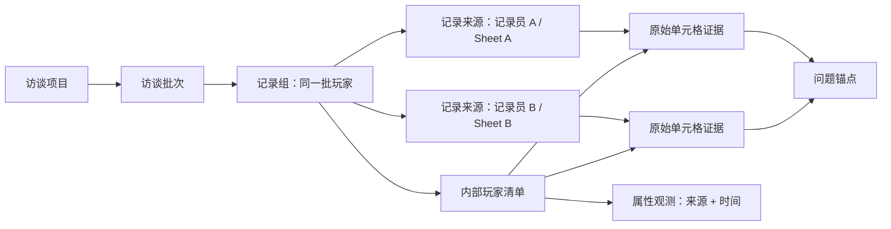

# 访谈记录结构化 MVP 开发计划

> 目标：将“一列一个玩家、可由多位记录员分别记录同一批玩家”的访谈 Excel，可靠还原为可审核、可回溯的玩家记录结构。
>
> 本文档是**开发前计划**，不代表功能已经实现。实施任何代码改动前，仍需按 `harness-workbench/RULES.md` 列出准确文件、改动内容、原因和验证方式，并取得确认。
>
> 编写日期：2026-07-29  
> 规划基线：`b3e9d6b`（实施前需重新核对）

---

## 一、背景与首要问题

1 对 1 访谈业务具有以下稳定特征：

- 每次研究都有访谈提纲和访谈记录；
- 记录表基本采用“一列一个玩家”；
- 同一批玩家可能由多位访谈员分别记录，形成多个 Sheet 或多个文件；
- 提纲、主持提示、正式问题、现场追问、回答和观察备注可能混在同一个工作表中；
- 追问不一定有独立行，问题、追问与回答可能写在同一个玩家单元格中；
- 玩家属性可能来自招募信息、访谈自述、现场记录或后台数据，不同来源描述的状态可以同时成立；
- 测试素材在业务中常见，但 MVP 暂不上传或解析 PPT、图片和视频，先依靠人工记录。

现阶段最大的风险不是报告写得不够好，而是：

- 玩家列识别错误；
- 不同玩家回答串列；
- 多位记录员的内容被覆盖或误合并；
- 回答匹配到错误的问题；
- 复杂单元格被错误拆分或内容丢失；
- 系统把不确定的推测包装成确定结果。

因此，MVP 的第一优先级是：

> **正确读取、正确归人、正确定位来源；不能确定时明确交给人工处理。**

---

## 二、MVP 目标与成功定义

### 2.1 MVP 要解决的问题

MVP 需要完成：

1. 创建一个可持续保存的访谈项目；
2. 上传一份或多份 Excel；
3. 在上传时声明文件、Sheet、记录员和玩家批次的关系；
4. 按“一列一个玩家”的固定输入合同读取记录；
5. 将多个 Sheet 中的玩家列归并到同一个平台内部玩家；
6. 保留每位记录员的独立原始记录；
7. 建立“玩家—问题锚点—原始单元格—记录来源”的可追溯关系；
8. 将不确定内容放入待处理区，由研究员确认；
9. 提供按问题查看的校对矩阵和按玩家查看的完整记录预览。

### 2.2 MVP 的最终输出

MVP 的最终输出是：

- 已确认的玩家清单；
- 已确认的多记录员来源关系；
- 可回溯的结构化访谈记录；
- 待确认问题清单；
- 单玩家记录预览。

### 2.3 MVP 暂不以报告作为终点

第一版不生成完整访谈报告，也不做自动玩家聚类。

只有当结构化结果通过真实文件验收后，后续阶段才依次建设：

1. 单玩家案例整理；
2. 跨玩家比较；
3. 玩家原型或行为机制分组；
4. 洞察卡片；
5. 报告生成；
6. 图片和视频证据。

---

## 三、已确认的产品决策

| 编号 | 决策 | MVP 处理方式 |
|---|---|---|
| D1 | 首要目标 | 正确读取和匹配，不以报告生成速度作为成功标准 |
| D2 | 记录布局 | 强制要求每个记录 Sheet“一列一个玩家” |
| D3 | 多记录员 | 允许多个 Sheet 或文件记录同一批玩家；上传时由用户直接声明 |
| D4 | 玩家归并 | 同批玩家只建立一次内部玩家清单，其他 Sheet 复用或校对映射 |
| D5 | 来源保留 | 同一玩家的不同记录来源分别保存、并列展示，不覆盖、不去重、不直接拼接 |
| D6 | 玩家身份 | 玩家列对应项目内部玩家 ID 或别名，不要求先有玩家属性表 |
| D7 | 玩家属性 | 作为“属性观测 + 来源 + 时间”并列展示，不默认提示冲突或要求裁决 |
| D8 | 复杂单元格 | 不假设追问有独立行；完整原始单元格是不可丢失的证据单元 |
| D9 | 测试素材 | 不是系统必传输入；MVP 不上传、不播放、不解析 PPT、图片和视频 |
| D10 | 不确定结果 | 禁止静默猜测；进入待处理区并保留原始来源 |
| D11 | 真实文件验收 | 使用现有两份真实访谈 Excel 做端到端人工复核，但不把敏感原文复制进仓库 |

---

## 四、输入合同与范围边界

### 4.1 必需输入

- 访谈提纲；
- 访谈记录。

两者可以：

- 位于同一个 Excel 的不同 Sheet；
- 位于同一个 Sheet 的不同区域；
- 分别位于不同 Excel；
- 由不同记录员提供多份记录文件。

### 4.2 可选输入

- 独立玩家属性表。

没有独立属性表时，系统仍可建立玩家，只需用户为每个玩家指定项目内 ID 或别名。记录表内出现的年龄、工作状态、游戏状态等内容，可以作为属性观测挂到对应玩家下。

### 4.3 MVP 固定支持

- `.xlsx`；
- 一个记录 Sheet 中一列只对应一个玩家；
- 多个 Sheet 或文件对应不同记录员；
- 多个记录员记录同一批玩家；
- 提纲列与玩家列共同存在；
- 空行、合并单元格和仅格式化的远端空白区域；
- 回答只集中填写在部分锚点行；
- 问题、追问、回答和记录员观察混在一个玩家单元格中；
- 中文提纲、外语提纲和记录页同时存在，但 Sheet 角色由用户声明。

### 4.4 MVP 明确不支持

- 一个玩家分散在同一 Sheet 的多列；
- 同一玩家列中混入多个玩家；
- 同一 Sheet 内无法区分来源的多记录员混写；
- “一行一个玩家”等其他布局；
- 自动解析 PPT、图片、音频或视频；
- 自动转写和操作行为分析；
- 自动合并不同记录员的观点；
- 自动判定哪个属性来源更正确；
- 完整报告、聚类和研究结论生成；
- 访谈招募、排期和提醒。

### 4.5 素材边界说明

测试素材在真实业务中可能每次都有，但“业务中常见”不等于“系统输入必需”。

MVP 中：

- 不提供测试素材上传入口；
- 不把素材缺失视为错误；
- 访谈员在 Excel 中记录的素材名称、方案编号和玩家反应，仍按普通文本读取；
- Excel 内已有的嵌入图片可以忽略，但不得导致文本解析失败。

---

## 五、核心概念

| 概念 | 定义 |
|---|---|
| 访谈项目 `InterviewProject` | 一次研究工作的持久化工作区 |
| 访谈批次 `InterviewBatch` | 同一轮、同一批玩家的访谈集合 |
| 记录组 `RecordingGroup` | 用户声明为“记录同一批玩家”的一个或多个记录来源 |
| 记录来源 `RecordingSource` | 某个文件中的某个 Sheet |
| 记录员 `Recorder` | 对该记录来源负责的人 |
| 内部玩家 `Participant` | 平台在项目内建立的玩家实体，与属性表是否存在无关 |
| 玩家列绑定 `PlayerColumnBinding` | 某个 Sheet 的某一列与内部玩家的对应关系 |
| 问题锚点 `GuideNode` | 章节、主题、计划问题或提示语形成的提纲节点 |
| 原始单元格 `CellEvidence` | 带文件、Sheet、坐标、玩家和记录员来源的完整文本证据 |
| 记录片段 `CellFragment` | 从复杂单元格中建议拆出的回答、追问、观察或未知片段 |
| 属性观测 `AttributeObservation` | 某一来源在某一时间记录的玩家属性值 |
| 待处理项 `ReviewIssue` | 系统无法确定或需要用户确认的映射问题 |

### 5.1 “玩家列对应谁”的含义

这里不是要求玩家列必须对应玩家属性表。

它表示：

> 不同记录 Sheet 中的某些列，是否属于同一个平台内部玩家。

例如：

```text
内部玩家 P-001
├─ 记录员 A / Sheet A / D 列
├─ 记录员 B / Sheet B / D 列
└─ 可选属性来源 / 属性表 / 第 5 行
```

如果没有外部玩家 ID，用户可以使用脱敏别名，如 `P-001`、`玩家01`。

### 5.2 多记录员不是重复数据

同一玩家的多个记录来源可能体现：

- 不同关注视角；
- 一位记录员记录主线，另一位补充细节；
- 记录员临时离开后的信息接续；
- 玩家口述、操作观察和研究员判断的不同侧面。

因此，多来源是数据模型的一部分，不是导入时需要消除的重复项。

---

## 六、数据关系



核心约束：

- `CellEvidence` 永远指向唯一文件、Sheet 和单元格坐标；
- `CellEvidence` 永远指向唯一记录来源；
- 玩家记录单元格必须指向唯一内部玩家；
- 同一玩家可以拥有多个记录来源；
- 属性值允许一对多并列存在；
- 语义拆分不能覆盖或替换原始单元格。

---

## 七、用户流程

### 7.1 总流程

```text
创建访谈项目
→ 上传 Excel 并声明记录关系
→ 配置 Sheet 角色
→ 建立一次玩家清单
→ 跨 Sheet 归并玩家列
→ 解析问题锚点与记录单元格
→ 处理待确认项
→ 查看校对矩阵
→ 查看单玩家完整记录
```

### 7.2 第一步：创建项目

用户填写：

- 项目名称；
- 可选说明；
- 批次名称；
- 访谈日期或时间范围（可选）。

### 7.3 第二步：上传时声明记录关系

上传区先询问：

**这些记录来自哪种情况？**

- 单一记录来源；
- 多位记录员记录同一批玩家。

若选择“多位记录员记录同一批玩家”，用户为每个文件或 Sheet 填写：

- 记录员名称或代号；
- 所属批次；
- 是否与上一来源使用相同玩家列顺序；
- 是否复用上一来源的玩家映射。

推荐交互：

| 文件 / Sheet | 角色 | 记录员 | 玩家关系 |
|---|---|---|---|
| 文件 A / Sheet 1 | 提纲兼记录 | 记录员 A | 建立玩家清单 |
| 文件 A / Sheet 2 | 访谈记录 | 记录员 B | 同批玩家，复用列顺序 |
| 文件 B / Sheet 1 | 玩家属性 | 招募来源 | 稍后手动关联 |

### 7.4 第三步：配置 Sheet 角色

每个 Sheet 由用户明确选择：

- 提纲；
- 访谈记录；
- 提纲兼记录；
- 玩家属性；
- 忽略。

AI 或规则可以建议，但不能覆盖用户声明。

### 7.5 第四步：建立玩家清单

系统从第一个记录来源中建议玩家列，用户确认：

- 哪些列是玩家列；
- 每列的项目内玩家 ID 或别名；
- 可选外部玩家 ID；
- 哪些非玩家列需要忽略。

该步骤不要求玩家属性表。

### 7.6 第五步：复用或校对多 Sheet 映射

如果用户已声明多个 Sheet 记录同一批玩家：

- 相同列顺序：显式确认后复用一次映射；
- 不同列顺序：根据列头建议对应玩家，由用户校对；
- 无可靠列头：用户手动选择内部玩家；
- 无法确认：该列进入待处理区，不能自动创建重复玩家。

不得仅因为列序相同就默认归并，必须有用户的“复用列顺序”声明。

### 7.7 第六步：结构解析

系统生成：

- 章节和问题锚点；
- 玩家记录单元格；
- 每个单元格的来源；
- 单元格与最近问题锚点的建议关系；
- 需要确认的复杂或不确定内容。

### 7.8 第七步：人工校对

用户可以：

- 修改单元格对应的问题锚点；
- 将一个单元格关联到多个问题；
- 标记为属性、回答、观察、追问混合内容或忽略；
- 合并、拆分问题锚点；
- 修正玩家列绑定；
- 查看同一玩家的不同记录员来源；
- 将待处理项确认或保留为未知。

### 7.9 第八步：结果预览

提供两种视图：

1. **问题矩阵**：行是问题锚点，列是内部玩家；
2. **玩家记录**：按章节展示该玩家全部来源记录。

多记录员内容默认分栏或分标签展示，不自动拼成一段。

---

## 八、解析与匹配原则

### 8.1 优先级

```text
用户上传声明
> 用户确认的 Sheet / 玩家映射
> 确定性表格结构
> AI 或语义规则建议
> 待人工确认
```

### 8.2 两层解析模型

#### 第一层：物理读取与映射

第一层必须确定性完成：

- 文件名；
- Sheet 名；
- 原始单元格坐标；
- 原始完整值；
- 合并单元格信息；
- 所属记录来源；
- 所属记录员；
- 所属内部玩家（玩家记录列）；
- 相邻章节和问题锚点；
- 解析版本。

这一层的目标是“不丢、不串、可回原表”。

#### 第二层：语义建议

一个单元格可能同时包含：

- 对提纲问题的回答；
- 访谈员现场追问；
- 玩家对追问的补充；
- 记录员观察；
- 属性信息；
- 无法分类的备注。

系统可以建议拆成多个 `CellFragment`，但必须：

- 保留完整原始单元格；
- 记录每个片段在原文中的字符范围；
- 允许用户合并、拆分或改标签；
- 无法可靠拆分时只保留整个单元格，不强制生成错误片段；
- 不把“是否成功拆分”作为物理读取完成的前提。

### 8.3 追问处理

MVP 不把“追问必须单独占一行”作为输入假设。

系统允许：

- 提纲中存在计划追问行；
- 追问直接写在回答单元格中；
- 问题和回答交错写在同一单元格；
- 记录员只记录结论，没有记录明确追问；
- 一个单元格关联多个问题锚点。

第一阶段验收首先保证完整单元格正确归属玩家和来源；语义拆分的准确性单独校对。

### 8.4 不确定性处理

以下情况进入待处理区：

- 玩家列身份不确定；
- 单元格可能属于多个问题；
- 提纲行与记录锚点相距较远；
- 同一列存在疑似不同玩家标识；
- 多语言提纲关系未声明；
- 复杂单元格无法可靠拆分；
- 仅依据格式无法判断是说明还是回答。

待处理项必须展示：

- 系统建议；
- 建议理由；
- 原始单元格；
- 文件和 Sheet；
- 坐标；
- 可选处理动作。

### 8.5 空白状态

空白不能统一解释为“玩家没有观点”。人工校对时至少允许区分：

- 未进入该追问路径；
- 已询问但未记录；
- 对该玩家不适用；
- 玩家没有明确观点；
- 尚无法判断。

### 8.6 不支持布局的处理

如果记录 Sheet 不符合“一列一个玩家”，系统必须：

- 明确提示当前 MVP 不支持；
- 允许用户重新指定列角色或更换文件；
- 停止生成后续结构化结果；
- 不得用猜测结果继续分析。

---

## 九、玩家属性模型

### 9.1 属性不是唯一真值

以下信息可以同时保留：

| 属性 | 值 | 来源 | 记录时间 |
|---|---|---|---|
| 当前状态 | 值 A | 招募信息 | 招募阶段 |
| 当前状态 | 值 B | 玩家访谈自述 | 访谈当天 |
| 当前状态 | 值 C | 后台数据 | 数据提取日 |

系统不默认弹出“冲突错误”，也不自动判定哪一项正确。

### 9.2 MVP 展示方式

- 按属性名聚合；
- 每个值显示来源和时间；
- 允许研究员补充说明；
- 可选指定“本次分析采用值”，但不是导入必填项；
- 原值不因选择分析值而被删除。

### 9.3 来源类型

- 招募表；
- 玩家自述；
- 访谈员记录；
- 后台数据；
- 研究员补充；
- 未知来源。

---

## 十、标准化数据结构草案

### 10.1 `InterviewProject`

```json
{
  "project_id": "uuid",
  "title": "项目名称",
  "owner": "owner_key",
  "status": "mapping",
  "created_at": "ISO-8601",
  "updated_at": "ISO-8601",
  "schema_version": 1
}
```

### 10.2 `RecordingGroup`

```json
{
  "group_id": "uuid",
  "project_id": "uuid",
  "batch_name": "批次名称",
  "relationship": "same_participants",
  "alignment_mode": "confirmed_same_order",
  "participant_ids": ["P-001", "P-002"]
}
```

### 10.3 `RecordingSource`

```json
{
  "source_id": "uuid",
  "group_id": "uuid",
  "file_id": "uuid",
  "sheet_name": "Sheet 名称",
  "sheet_role": "guide_and_record",
  "recorder": "记录员代号"
}
```

### 10.4 `PlayerColumnBinding`

```json
{
  "source_id": "uuid",
  "column_index": 4,
  "column_label": "D",
  "participant_id": "P-001",
  "mapping_method": "user_confirmed",
  "confirmed": true
}
```

### 10.5 `CellEvidence`

```json
{
  "evidence_id": "uuid",
  "source_id": "uuid",
  "participant_id": "P-001",
  "cell": "D24",
  "raw_text": "完整原始内容",
  "guide_node_ids": ["Q-012"],
  "mapping_status": "suggested",
  "review_status": "pending"
}
```

### 10.6 `CellFragment`

```json
{
  "fragment_id": "uuid",
  "evidence_id": "uuid",
  "fragment_type": "answer_or_followup",
  "start_offset": 0,
  "end_offset": 20,
  "text": "原始单元格中的片段",
  "confidence": "uncertain",
  "review_status": "pending"
}
```

### 10.7 `AttributeObservation`

```json
{
  "observation_id": "uuid",
  "participant_id": "P-001",
  "attribute_name": "属性名称",
  "value": "属性值",
  "source_type": "self_report",
  "source_ref": "evidence_id",
  "observed_at": "ISO-8601 或空",
  "analysis_default": false
}
```

---

## 十一、技术方案与模块边界

### 11.1 现有能力判断

现有 `app/core/parsing.py` 可以读取活动 Sheet 的二维值，适用于当前问卷/CSV 上传，但不足以直接承担访谈 MVP：

- 只读取活动 Sheet；
- 不保留 Sheet 角色；
- 不保留单元格坐标和合并范围；
- 不保留记录员和玩家列绑定；
- 无法区分“内容范围”和“仅格式化导致的超大范围”；
- 输出是普通二维数组，不能形成证据链。

为避免影响现有问卷分析，MVP 建议新建访谈专用解析模块，而不是直接扩大现有 `_parse_file` 的返回结构。

### 11.2 拟新增后端文件

| 文件 | 职责 |
|---|---|
| `app/core/interview_excel.py` | 无状态读取所有 Sheet、单元格坐标、合并范围和内容边界 |
| `app/schemas/interview.py` | 访谈项目、来源声明、玩家绑定、校对请求和响应结构 |
| `app/storage/interview_projects.py` | 项目元数据、来源文件、结构化结果和校对状态持久化 |
| `app/services/interview_project_service.py` | 创建项目、上传来源、项目状态流转 |
| `app/services/interview_mapping_service.py` | Sheet 角色、记录组和玩家列映射编排 |
| `app/services/interview_parse_service.py` | 问题锚点、证据单元格和待处理项生成 |
| `app/services/interview_review_service.py` | 人工确认、修改映射、生成矩阵和玩家视图 |
| `app/routers/interview.py` | HTTP 参数校验、权限检查、调用 service、返回响应 |

### 11.3 拟新增前端文件

| 文件 | 职责 |
|---|---|
| `static/js/features/interview.js` | 访谈项目、上传声明、映射校对、矩阵和玩家视图交互 |

如果单文件增长过快，实施时再按页面拆为 `interview-project.js`、`interview-mapping.js` 和 `interview-review.js`；MVP 计划阶段不提前拆分。

### 11.4 拟修改文件

| 文件 | 拟修改内容 | 备注 |
|---|---|---|
| `static/index.html` | 增加访谈功能入口和页面容器；加载访谈脚本 | 前端主页面 |
| `static/style.css` | 增加访谈项目、映射表和校对视图样式 | 只新增本功能样式 |
| `static/js/features/nav.js` | 增加访谈一级导航和模式切换 | 不改其他业务流程 |
| `app/main.py` | 注册访谈 router | **部署敏感文件，实施前需单独提醒** |
| `app/core/config.py` | 增加访谈项目存储路径等配置 | **部署敏感文件，实施前需单独提醒** |
| `app/core/security.py` | 如采用独立权限，增加 `interview` 权限项 | **部署敏感文件，实施前需单独提醒** |
| `app/storage/whitelist.py` | 如采用独立权限，兼容新权限结构 | 不破坏旧白名单 |
| `app/core/audit.py` | 增加访谈项目相关审计事件类型 | 不记录玩家原文 |
| `static/js/features/report.js` | 如采用独立权限，增加访谈入口可见性控制 | 当前工作区已有用户改动，实施时需避让并单独核对 |
| `static/js/features/settings.js` | 如采用独立权限，在管理页显示访谈权限 | 与权限方案一起实施 |

### 11.5 分层约束

必须遵循：

```text
routers → services → storage / core
```

- router 不直接读取 Excel 或写项目文件；
- service 不处理 FastAPI 响应对象；
- storage 只负责访谈项目文件读写，不判断玩家归并逻辑；
- core 解析器保持无状态，不读取 `data/`；
- 前端访谈逻辑只操作访谈页面 DOM；
- 第一版不需要新增 integrations，因为不解析测试素材，也不应在物理读取阶段调用外部 AI。

### 11.6 不新增依赖

项目已有 `openpyxl`。MVP Excel 读取优先复用现有依赖，不新增第三方包。

若未来发现必须引入其他依赖，需要重新说明原因、影响并获得确认。

---

## 十二、持久化方案

### 12.1 不复用两小时临时 session

现有 `data/sessions/` 会按两小时 TTL 清理，适合一次性报告流程，不适合需要反复校对的访谈项目。

MVP 建议使用独立持久化目录：

```text
data/interview_projects/<project_id>/
├─ project.json
├─ sources/
│  └─ 原始上传文件
├─ structure.json
├─ participants.json
├─ evidence.json
├─ review_issues.json
└─ review_state.json
```

### 12.2 数据安全要求

- 原始上传文件不可被解析结果覆盖；
- JSON 写入使用临时文件 + 原子替换；
- 所有项目路径必须由服务端生成和校验，防止路径穿越；
- 日志不得输出玩家原文；
- 接口按项目所有者限制访问；
- 删除、清理和保留期限不纳入本轮默认行为；
- 实施和测试不得清理或覆盖现有 `data/` 内容。

### 12.3 项目状态

建议状态：

```text
uploaded
→ source_configured
→ participant_mapped
→ parsed
→ reviewing
→ confirmed
```

任何来源关系或玩家映射变更后：

- 标记下游解析结果需要重新生成；
- 保留旧版本或明确提示影响范围；
- 不静默复用已经失效的确认结果。

---

## 十三、API 草案

| 方法 | 路径 | 用途 |
|---|---|---|
| `POST` | `/api/interview/projects` | 创建项目 |
| `GET` | `/api/interview/projects` | 获取当前用户项目列表 |
| `GET` | `/api/interview/projects/{id}` | 获取项目详情 |
| `POST` | `/api/interview/projects/{id}/files` | 上传一个或多个 Excel |
| `PUT` | `/api/interview/projects/{id}/sources` | 确认 Sheet 角色、记录员和记录组 |
| `GET` | `/api/interview/projects/{id}/sheets` | 获取 Sheet 结构预览 |
| `PUT` | `/api/interview/projects/{id}/participants` | 建立内部玩家和玩家列映射 |
| `POST` | `/api/interview/projects/{id}/parse` | 生成问题锚点、证据和待处理项 |
| `GET` | `/api/interview/projects/{id}/issues` | 获取待处理项 |
| `PUT` | `/api/interview/projects/{id}/issues/{issue_id}` | 提交人工处理结果 |
| `GET` | `/api/interview/projects/{id}/matrix` | 获取问题—玩家矩阵 |
| `GET` | `/api/interview/projects/{id}/participants/{pid}` | 获取单玩家多来源记录 |

API 名称为计划草案，实施时可在不改变职责边界的前提下调整。

---

## 十四、页面与交互草案

### 14.1 项目页

展示：

- 项目名称；
- 批次；
- 文件数；
- 玩家数；
- 记录来源数；
- 待处理项数；
- 当前状态；
- 最近更新时间。

### 14.2 上传与来源声明页

核心控件：

- 单记录来源 / 多记录员同批玩家；
- 文件与 Sheet 列表；
- Sheet 角色选择；
- 记录员输入；
- 同批玩家声明；
- 复用玩家顺序开关。

### 14.3 玩家映射页

左右对照：

- 左侧：Sheet 原始列和表头预览；
- 右侧：内部玩家清单；
- 支持拖选或下拉绑定；
- 支持“一次映射、应用到同序 Sheet”；
- 显示记录员来源；
- 未绑定玩家列不能进入确认状态。

### 14.4 结构校对页

采用“原表证据 + 标准化结果”双栏：

- 点击标准化记录，高亮原文件 Sheet 和坐标；
- 点击原始单元格，查看玩家、记录员和问题映射；
- 待处理项集中筛选；
- 不确定内容可以保留未知，不强制解决成错误答案。

### 14.5 问题矩阵

| 章节 | 问题锚点 | 玩家 P-001 | 玩家 P-002 |
|---|---|---|---|
| 背景 | 问题 A | 2 个来源 | 1 个来源 |
| 方案验证 | 问题 B | 待确认 | 1 个来源 |

点击单元格后展示该玩家的所有记录员来源，不自动合并文本。

### 14.6 单玩家记录页

```text
玩家 P-001

属性观测
├─ 来源 A / 时间 A / 值 A
└─ 来源 B / 时间 B / 值 B

章节 1
└─ 问题锚点
   ├─ 记录员 A：完整原始记录
   └─ 记录员 B：补充记录
```

---

## 十五、分阶段开发计划

### 阶段 0：建立脱敏验收基准

**交付物**

- 两份真实 Excel 的只读结构说明；
- 不包含玩家原文的人工基准清单；
- 一组可提交仓库的合成测试文件，复现相同结构问题。

**重点覆盖**

- 两个 Sheet 记录同一批玩家；
- 不同记录员在不同 Sheet；
- 提纲兼记录；
- 独立记录页；
- 回答集中在锚点行；
- 复杂单元格；
- 合并单元格；
- 仅格式导致的远端空白范围；
- 多语言提纲。

**通过门槛**

- 基准只描述结构和期望映射，不包含敏感原文；
- 每个关键结构问题至少有一个合成用例。

### 阶段 1：Excel 物理读取与证据定位

**交付物**

- 访谈专用 Excel 解析器；
- 所有 Sheet 清单；
- 内容边界；
- 单元格坐标；
- 合并范围；
- 原始值；
- Sheet 预览数据。

**暂不做**

- 玩家归并；
- AI 语义拆分；
- 报告。

**验证**

- 单元测试使用临时目录；
- 对两份真实 Excel 做只读解析；
- 对比人工基准确认内容未丢失；
- 嵌入图片不会使文本解析失败；
- 样式扩展到千行时不生成大量空记录。

### 阶段 2：项目、上传与来源关系声明

**交付物**

- 项目持久化；
- 多文件上传；
- Sheet 角色配置；
- 多记录员同批玩家声明；
- 记录员和记录组保存。

**通过门槛**

- 用户无需 AI 猜测即可声明所有来源关系；
- 原始文件不可变保存；
- 重新打开项目后配置仍存在。

### 阶段 3：内部玩家与跨 Sheet 列归并

**交付物**

- 内部玩家清单；
- 第一来源玩家列映射；
- 同序映射复用；
- 不同顺序人工校对；
- 未绑定列待处理。

**通过门槛**

- 一列只绑定一个玩家；
- 同一玩家可绑定多个记录来源；
- 没有用户声明时不按列序静默归并；
- 不要求玩家属性表；
- 两份真实文件人工逐列核对无串列。

### 阶段 4：问题锚点、复杂单元格与人工校对

**交付物**

- 章节和问题锚点；
- 原始单元格与问题的建议映射；
- 一个单元格关联多个问题；
- 待处理项；
- 可选记录片段建议；
- 修改和确认操作。

**通过门槛**

- 单元格完整原文永不因拆分而丢失；
- 追问没有独立行时仍能正确归属玩家和来源；
- 无法可靠判断时保留未知；
- 每条结果都能回到原始坐标。

### 阶段 5：问题矩阵与单玩家记录预览

**交付物**

- 问题—玩家矩阵；
- 单玩家多来源记录页；
- 属性观测来源展示；
- 待处理状态筛选。

**通过门槛**

- 多记录员记录并列展示，不覆盖、不自动拼接；
- 属性差异只展示来源，不默认报错；
- 用户能从玩家视图回到任一原始单元格；
- 结构未确认时明确阻止进入后续分析。

### 阶段 6：真实文件端到端验收

**交付物**

- 两份真实访谈文件的端到端 QA 报告；
- 根因、修复状态和复测证据；
- 尚不支持的结构清单；
- MVP 上线前确认单。

**通过门槛**

- 玩家不串列；
- 多记录员不覆盖；
- 复杂单元格不丢失；
- 每条证据可追溯；
- 不确定内容显式可见；
- 不以专门整理过的标准表代替真实文件验收。

---

## 十六、真实文件验收矩阵

测试过程中不得在日志、截图或仓库 fixture 中暴露玩家敏感原文。

| 场景 | 来源样本 | 预期 |
|---|---|---|
| 多 Sheet、不同记录密度 | 系统 1 组文件 | 每个 Sheet 独立来源；玩家列准确归并；空白记录不补造回答 |
| 提纲与多人记录同表 | 系统 1 组文件 | 左侧提纲列与右侧玩家列正确分区 |
| 回答集中在部分行 | 两份真实文件 | 只生成真实非空证据，不因其他提纲行为空而判定解析失败 |
| 单元格包含长文本和临时追问 | 两份真实文件 | 完整原文保留；可建议拆分；无法确定时进入待处理 |
| 嵌入图片 | 系统 1 组文件 | MVP 忽略图片内容，但文本读取不失败 |
| 中文、外语提纲和记录页并存 | 系统 3 组文件 | Sheet 角色按用户声明保存，不由 AI 静默猜测 |
| 独立记录页 | 系统 3 组文件 | 记录页玩家列正确绑定到记录组，提纲页不误识别为另一批玩家 |
| 仅格式化导致范围延伸 | 系统 3 组文件 | 按实际非空内容计算解析范围，不产生数百行空问题 |
| 多记录员记录同一批玩家 | 合成 fixture + 真实 Sheet | 玩家映射只建立一次；每位记录员来源分别保存 |
| 玩家列顺序一致 | 合成 fixture | 用户确认后复用映射；复用结果可逐列查看 |
| 玩家列顺序不同 | 合成 fixture | 不按位置强行归并；根据表头建议或人工选择 |
| 属性多来源不同值 | 合成 fixture | 并列显示来源和时间，不自动弹冲突错误 |
| 无属性表 | 两份真实文件 | 仅靠内部玩家 ID 仍能完成记录结构化 |
| 合并单元格与空行 | 两份真实文件 | 章节层级可读，玩家证据坐标不漂移 |
| 条件追问空白 | 合成 fixture | 能区分未进入追问、未记录、不适用、无明确观点和未知 |
| 不支持的记录布局 | 合成 fixture | 明确拦截并停止解析，不用猜测结构继续 |
| 人工修正 | 合成 fixture | 只修改映射和确认状态，不改变原始 Excel |
| 重新解析 | 合成 fixture | 相同输入和相同声明得到稳定结果；人工确认不会被静默覆盖 |

自动识别准确率阈值不在计划阶段凭空设定。阶段 0 先建立人工标注基准，再根据真实误差类型确定指标。

整体验收还必须满足：

1. 所有非空玩家记录只能处于“已匹配”或“待确认”，不允许没有去向；
2. 所有已匹配结果都能回溯到原文件、Sheet 和单元格；
3. 人工确认后玩家零串列；
4. 同一玩家的多记录来源零覆盖。

---

## 十七、测试与验证策略

### 17.1 自动测试

拟新增：

- `tests/test_interview_excel.py`
- `tests/test_interview_mapping.py`
- `tests/test_interview_storage.py`
- `tests/test_interview_review.py`

要求：

- 使用 `tempfile.TemporaryDirectory()`；
- 不读取或写入现有 `data/`；
- 不导入会触发应用启动清理的入口；
- 使用合成的脱敏 Excel fixture；
- 覆盖路径校验、原子写和所有者隔离；
- 覆盖同序复用、异序映射和未绑定列；
- 覆盖复杂单元格完整性。

### 17.2 静态与边界验证

实施后至少运行：

```bash
python -m unittest tests.test_interview_excel -v
python -m unittest tests.test_interview_mapping -v
python -m unittest tests.test_interview_storage -v
python -m unittest tests.test_interview_review -v
python -m compileall app
python scripts/check_boundaries.py
git diff --check
```

### 17.3 前端验证

- 单记录来源上传；
- 多记录员同批玩家上传；
- Sheet 角色配置；
- 映射一次并复用；
- 不同列顺序人工调整；
- 待处理项修改；
- 问题矩阵切换；
- 单玩家多来源查看；
- 浏览器控制台无新增错误；
- 其他问卷、定量、评论和标注入口无回归。

### 17.4 真实文件复测

两份真实文件只用于本地只读端到端验证：

- 不复制到仓库；
- 不输出敏感原文；
- 不写入正式 `data/`；
- QA 报告只记录结构、错误类型、修复状态和复测结果。

---

## 十八、风险与保护措施

| 风险 | 影响 | 保护措施 |
|---|---|---|
| 仅按列位置归并玩家 | 不同玩家串列 | 必须由用户声明同序复用；保留逐列校对 |
| 把多记录员当重复数据 | 证据和视角丢失 | 来源独立保存，不自动去重或拼接 |
| 假设追问有独立行 | 复杂单元格内容误判 | 原始单元格优先；语义拆分可撤销 |
| 样式导致 `max_row` 很大 | 生成大量空记录 | 使用非空内容边界，不直接相信格式范围 |
| 属性值不同被当成错误 | 丢失时间和口径差异 | 使用属性观测模型，只展示来源 |
| AI 静默猜 Sheet 角色 | 提纲、翻译和记录关系错误 | 上传时人工声明优先 |
| 复用临时 session | 校对过程中项目过期 | 使用独立访谈项目持久化 |
| 解析器改坏现有上传 | 其他业务回归 | 新建访谈专用解析器，不改变现有返回合同 |
| 真实访谈内容进入日志 | 隐私泄露 | 日志只记录 ID、坐标和状态，不记录原文 |
| 直接对真实 `data/` 测试 | 运行数据被污染 | 全部自动测试使用临时目录 |

---

## 十九、待实施前确认的事项

以下事项不影响本计划成文，但在进入代码开发前需要确认：

1. 多位记录员的 Sheet 是否通常保持完全相同的玩家列顺序；
2. 玩家列头是否通常存在稳定 ID，还是主要使用玩家序号或昵称；
3. MVP 是先复用现有 `survey` 权限做内部试用，还是立即增加独立 `interview` 权限；
4. 访谈项目默认保留多久，是否需要用户主动删除；
5. 第一版复杂单元格仅提供“整格证据 + 人工标记”，还是同时加入 AI 片段建议；
6. 合并了提纲和记录的工作表，提纲列数量是否通常固定；
7. 是否允许同一项目后续追加新的记录员 Sheet。

默认推荐：

- 同序映射必须由用户显式确认；
- 玩家使用项目内脱敏 ID；
- 内部试用阶段可先复用现有权限，稳定后再拆独立权限；
- 第一版先保证整格证据正确，AI 片段建议不作为通过门槛；
- 项目允许追加记录来源，但追加后需重新确认受影响映射。

---

## 二十、开发前确认清单

开始阶段 0 或任何代码改动前，逐项确认：

- [ ] MVP 终点是结构化结果和单玩家记录预览，不是完整报告；
- [ ] 固定输入合同为“一个记录 Sheet 一列一个玩家”；
- [ ] 多记录员在上传时声明为同一批玩家；
- [ ] 同一玩家的多来源记录不得覆盖、去重或直接拼接；
- [ ] 玩家身份不依赖玩家属性表；
- [ ] 属性只展示来源和时间，不默认判定冲突；
- [ ] 追问可能存在于同一个玩家单元格内；
- [ ] 原始单元格是不可丢失的证据单元；
- [ ] 测试素材不属于 MVP 输入；
- [ ] 不确定内容进入待处理区；
- [ ] 两份真实 Excel 是最终端到端验收样本；
- [ ] 自动测试不触碰正式 `data/`；
- [ ] 实施前重新列出准确修改文件并获得确认。
